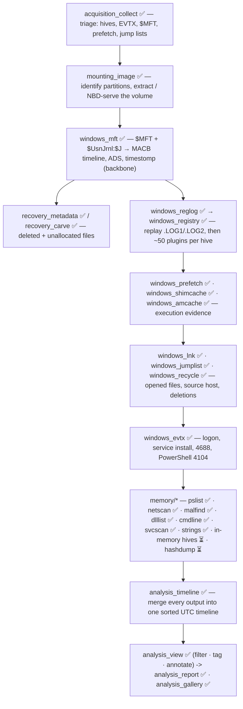
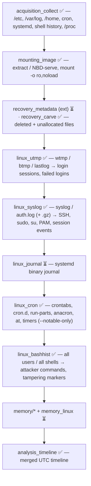
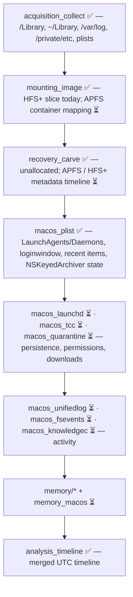

# Forensics Tools

An open-source, cross-platform suite of DFIR command-line tools — written in
Python (3.11+, standard library only) and built to run on Windows, Linux and
macOS.


Each tool is self-contained, each with its own tests and
documentation. Tools are organised into categories.

| Category | What it covers |
|---|---|
| [`acquisition/`](acquisition/) | collecting evidence — triage, disk imaging, memory |
| [`mounting/`](mounting/) | mounting / exposing images, partitions and shadow copies |
| [`recovery/`](recovery/) | getting files back — signature carving and file-system metadata |
| [`windows/`](windows/) | Windows artefact parsers |
| [`linux/`](linux/) | Linux artefact parsers |
| [`macos/`](macos/) | macOS artefact parsers |
| [`browser/`](browser/) | web browser artefacts — history, downloads, cookies, extensions |
| [`network/`](network/) | packet captures — flows, DNS, HTTP, suspicious traffic |
| [`memory/`](memory/) | RAM-image analysis — processes, network, injection, in-memory hives |
| [`analysis/`](analysis/) | timeline building, indexing, correlation, reporting |
| [`utilities/`](utilities/) | strings, hashing, hex / file viewers |
| [`cloud/`](cloud/) | cloud & SaaS logs — OneDrive, Dropbox, M365 / Entra, CloudTrail, Workspace |
| [`mobile/`](mobile/) | logical mobile extractions — iOS backups, Android `adb` backups |
| [`apps/`](apps/) | chat & collaboration apps — Teams, Slack, Signal, Discord, Telegram |

The tables below list every tool, built (✅) and planned (📋). Each planned
tool already has a spec-stub `README.md` in its own directory describing what
it will do. The full roadmap is tracked privately.

---

## Tools

✅ built and tested · 📋 planned (every planned tool has a spec-stub README in its directory — click its name)

### `acquisition/`

| Tool | Status | Purpose |
|---|---|---|
| [**acquisition_collect**](acquisition/acquisition_collect/) | ✅ v0.1 | Targeted artefact acquisition from a live system or mounted image — locked-file handling, Volume Shadow Copy, streaming hashes, chain-of-custody manifest (Windows / Linux / macOS) |
| [**acquisition_image**](acquisition/acquisition_image/) | ✅ v0.1 | Create + verify forensic images — **raw / split / EWF `E01`** write, streaming MD5+SHA-1+SHA-256, bad-sector zero-fill + logging, acquisition log / manifest / HTML report; CLI + `tkinter` wizard |
| [**acquisition_ram**](acquisition/acquisition_ram/) | ✅ v0.1 | Live memory acquisition — Linux physical RAM via `/proc/kcore` → **LiME / raw / padded** with streaming hashing; Windows / macOS collect the memory-bearing files (page file, `hiberfil.sys`, crash dumps) |

### `mounting/`

| Tool | Status | Purpose |
|---|---|---|
| [**mounting_image**](mounting/mounting_image/) | ✅ v0.1 | Read-only access to raw / split / **E01** / **VHD** / **VMDK** images — container + MBR/GPT inspection, raw export, **built-in NBD server + client** (no `nbd-client`), **`mount` as a real read-only drive** (Windows drive letter, macOS volume, Linux mount); CLI + `tkinter` GUI |
| [**mounting_vsc**](mounting/mounting_vsc/) | 📋 planned | Enumerate and mount every Volume Shadow Copy on a volume · GUI |
| [**mounting_partitions**](mounting/mounting_partitions/) | 📋 planned | Map the partition layout of a disk image (no mounting) |
| [**mounting_bitlocker**](mounting/mounting_bitlocker/) | 📋 planned | Unlock a BitLocker volume with a supplied key |
| [**mounting_luks**](mounting/mounting_luks/) | 📋 planned | Unlock a LUKS1 / LUKS2 volume with a passphrase or keyfile |
| [**mounting_veracrypt**](mounting/mounting_veracrypt/) | 📋 planned | Unlock a TrueCrypt / VeraCrypt container or partition with a password |
| [**mounting_fvde**](mounting/mounting_fvde/) | 📋 planned | Unlock an APFS / CoreStorage FileVault volume with a password or recovery key |

### `recovery/`

| Tool | Status | Purpose |
|---|---|---|
| [**recovery_carve**](recovery/recovery_carve/) | ✅ v0.1 | Signature carving — recover files by magic bytes + structural validators, no file system needed |
| [**recovery_metadata**](recovery/recovery_metadata/) | ✅ v0.1 | Metadata recovery — walk the NTFS `$MFT`, list allocated + deleted entries with paths and `MACB` times, extract content (incl. deleted files), `cat` one entry by number |
| [**recovery_fs**](recovery/recovery_fs/) | 📋 planned | Generic read-only file-system walker (NTFS / FAT / exFAT / ext / HFS+ / APFS) |

### `windows/`

| Tool | Status | Purpose |
|---|---|---|
| [**windows_jumplist**](windows/windows_jumplist/) | ✅ v0.1 | `automaticDestinations-ms` jump lists — OLE2 + `DestList` MRU + embedded `.lnk` per target; AppID resolution |
| [**windows_lnk**](windows/windows_lnk/) | ✅ v0.1 | Shell Link (`.lnk`) — target path + MAC times, **creating machine name + MAC**, `$MFT` refs from shell items; CSV / JSON, `tkinter` viewer |
| [**windows_amcache**](windows/windows_amcache/) | ✅ v0.1 | `Amcache.hve` — executables (with **SHA-1**), installed programs and drivers |
| [**windows_shimcache**](windows/windows_shimcache/) | ✅ v0.1 | AppCompatCache / ShimCache — program presence + (Win7/8) execution evidence, from a `SYSTEM` hive or the live registry |
| [**windows_registry**](windows/windows_registry/) | ✅ v0.1 | Offline hive (`regf`) parser — dump / search / deleted-key recovery, ~50 built-in RegRipper-style plugins auto-selected by hive kind + external `--plugin-dir` loader, `tkinter` browser |
| [**windows_reglog**](windows/windows_reglog/) | ✅ v0.1 | Replay registry transaction logs (`.LOG1` / `.LOG2`) into a dirty hive — `HvLE` entries + Marvin32 verification — so parsers see a clean, current hive |
| [**windows_evtx**](windows/windows_evtx/) | ✅ v0.1 | Event logs (`.evtx`) — from-scratch binary + BinXml parser → standardised CSV / JSON / JSONL / XML with event-ID, provider, level and time filters |
| [**windows_mft**](windows/windows_mft/) | ✅ v0.1 | NTFS `$MFT` + `$UsnJrnl:$J` — full timeline, ADS listing, `$SI`/`$FN` timestomp detection; CSV / JSON / bodyfile; `tkinter` `$MFT` browser (`windows_mft gui`) |
| [**windows_recycle**](windows/windows_recycle/) | ✅ v0.1 | Recycle Bin — Vista+ `$I` / `$R` and legacy `INFO2` / `INFO`; content matching; CSV / JSON |
| [**windows_prefetch**](windows/windows_prefetch/) | ✅ v0.1 | Prefetch `.pf` v17-31, including the Windows 10/11 `MAM` / XPRESS-Huffman compressed format (pure-Python decompressor) |
| [**windows_recentfilecache**](windows/windows_recentfilecache/) | 📋 planned | Parse RecentFileCache.bcf |
| [**windows_shellbags**](windows/windows_shellbags/) | 📋 planned | Reconstruct the ShellBags folder-access tree · GUI |
| [**windows_srum**](windows/windows_srum/) | 📋 planned | Parse SRUDB.dat (System Resource Usage Monitor) |
| [**windows_sum**](windows/windows_sum/) | 📋 planned | Parse the Microsoft User Access Logs (SUM) |
| [**windows_timeline**](windows/windows_timeline/) | 📋 planned | Parse the Windows 10/11 Timeline (ActivitiesCache.db) |
| [**windows_sqlmap**](windows/windows_sqlmap/) | 📋 planned | Locate SQLite databases in a target and process them with named maps |
| [**windows_esedb**](windows/windows_esedb/) | 📋 planned | Generic ESE / JET (.edb) database reader |
| [**windows_usn**](windows/windows_usn/) | 📋 planned | Standalone $UsnJrnl:$J parser / carver |
| [**windows_sdb**](windows/windows_sdb/) | 📋 planned | Parse application shim databases (.sdb) · GUI |
| [**windows_wer**](windows/windows_wer/) | 📋 planned | Parse Windows Error Reporting (.wer) reports |
| [**windows_bits**](windows/windows_bits/) | 📋 planned | Parse the BITS transfer history (qmgr.db / qmgr*.dat) |
| [**windows_tasks**](windows/windows_tasks/) | 📋 planned | Parse Scheduled Tasks (Tasks XML + TaskCache registry) |
| [**windows_wmi**](windows/windows_wmi/) | 📋 planned | Parse the WMI repository for persistence (OBJECTS.DATA / INDEX.BTR) |
| [**windows_defender**](windows/windows_defender/) | 📋 planned | Parse Microsoft Defender logs, detection history and quarantine |
| [**windows_pslogging**](windows/windows_pslogging/) | 📋 planned | PowerShell forensics: ScriptBlock, Module logging and transcripts |
| [**windows_usbdevices**](windows/windows_usbdevices/) | 📋 planned | Reconstruct removable-device history |
| [**windows_webcache**](windows/windows_webcache/) | 📋 planned | Parse WebCacheV01.dat (WinINET history / cookies / cache) |
| [**windows_thumbcache**](windows/windows_thumbcache/) | 📋 planned | Extract thumbnails from thumbcache_*.db and map them to paths |
| [**windows_notifications**](windows/windows_notifications/) | 📋 planned | Parse the notification history (wpndatabase.db / appdb.dat) |
| [**windows_bam**](windows/windows_bam/) | 📋 planned | Parse Background Activity Moderator / DAM last-execution data |
| [**windows_spooler**](windows/windows_spooler/) | 📋 planned | Parse print-spool artefacts (.spl / .shd) |
| [**windows_logfile**](windows/windows_logfile/) | 📋 planned | Analyse the NTFS $LogFile transaction log |
| [**windows_sigma**](windows/windows_sigma/) | 📋 planned | Lightweight detection-rules engine over parsed event data |

### `analysis/`

| Tool | Status | Purpose |
|---|---|---|
| [**analysis_timeline**](analysis/analysis_timeline/) | ✅ v0.1 | Merge every tool's output into one sorted UTC super-timeline. Console, self-contained **HTML viewer**, and a `tkinter` **desktop window** (`analysis_timeline gui`) |
| [**analysis_report**](analysis/analysis_report/) | ✅ v0.1 | Bundle tool CSV/JSON + Markdown notes into one **self-contained HTML** case report (+ JSON bundle) — tool auto-detect, alert-row highlighting, SHA-256 input manifest |
| [**analysis_email**](analysis/analysis_email/) | ✅ v0.1 | Inventory **MBOX / EML / Outlook MSG** — headers, addresses, times, attachments (SHA-256), Received chain, spoofing / SPF-DKIM-DMARC-fail flags |
| [**analysis_encryption**](analysis/analysis_encryption/) | ✅ v0.1 | Detect encrypted / password-protected files — PGP, age, Office, PDF, ZIP/RAR/7z, BitLocker, LUKS, DMG, KeePass, SQLCipher + entropy fallback (**report only**) |
| [**analysis_dedupe**](analysis/analysis_dedupe/) | ✅ v0.1 | Hash-based deduplication — content grouping, reclaimable bytes, distinct-file list, `--against` baseline diff |
| [**analysis_kff**](analysis/analysis_kff/) | ✅ v0.1 | Known File Filter — import NSRL / Project VIC / HashKeeper / plain hash sets into a local SQLite index; classify files or hashes as **known-good / known-bad / notable / unknown** |
| [**analysis_index**](analysis/analysis_index/) | ✅ v0.1 | Full-text index + search over a collection — text / markup / OOXML / email / string-carving extraction; **boolean / phrase / `NEAR` / prefix / regex** queries with snippets; SQLite, no FTS extension |
| [**analysis_gallery**](analysis/analysis_gallery/) | ✅ v0.1 | Picture + video gallery — find media by content signature, extract **EXIF / QuickTime metadata + GPS**, group visually near-identical images by **perceptual hash**, build a self-contained **HTML contact sheet**; in-tree JPEG / PNG / GIF / BMP decoders |
| [**analysis_view**](analysis/analysis_view/) | ✅ v0.1 | Review any table (CSV / TSV / JSON / **XLSX**) — merge sources, per-column filters, sort, conditional row colouring, and **tags + a notes column + a reviewed flag** saved to a sidecar; exports a self-contained interactive **HTML review page**. Where the reconstruction gets annotated |
| [**analysis_dpapi**](analysis/analysis_dpapi/) | 📋 planned | Decrypt Windows DPAPI blobs with supplied secrets (reporting for IR) |
| [**analysis_antiforensics**](analysis/analysis_antiforensics/) | 📋 planned | Correlate anti-forensic and tampering indicators into one report |
| [**analysis_fuzzyhash**](analysis/analysis_fuzzyhash/) | 📋 planned | Similarity hashing and clustering (CTPH + locality hashes) |
| [**analysis_enrich**](analysis/analysis_enrich/) | 📋 planned | Post-process a timeline bundle: IOC match, ATT&CK tags, geo, known-file |

### `linux/`

| Tool | Status | Purpose |
|---|---|---|
| [**linux_utmp**](linux/linux_utmp/) | ✅ v0.1 | `wtmp` / `btmp` / `utmp` / `lastlog` login records → record timeline + paired login/logout **sessions** |
| [**linux_cron**](linux/linux_cron/) | ✅ v0.1 | Scheduled-execution inventory — crontabs, `cron.d`, run-parts, anacron, `at` jobs, systemd timers → normalised rows with plain-language schedules + suspicious-entry flags |
| [**linux_syslog**](linux/linux_syslog/) | ✅ v0.1 | `syslog` / `messages` / `auth.log` / `secure` (+ rotated / `.gz`), BSD + RFC 5424 → record timeline or **structured security events** (SSH, sudo, su, PAM, session, cron, account) |
| [**linux_bashhist**](linux/linux_bashhist/) | ✅ v0.1 | Shell / REPL history for all users (bash, zsh, fish, sh, python, mysql, psql, sqlite, node, redis) → merged timeline, tampering markers, attacker-command flags |
| [**linux_journal**](linux/linux_journal/) | 📋 planned | Read the systemd journal (.journal) binary format |
| [**linux_audit**](linux/linux_audit/) | 📋 planned | Normalise auditd audit.log records |
| [**linux_units**](linux/linux_units/) | 📋 planned | Inventory systemd unit files and review persistence |
| [**linux_packages**](linux/linux_packages/) | 📋 planned | Reconstruct package install / upgrade / remove history |
| [**linux_sshkeys**](linux/linux_sshkeys/) | 📋 planned | Review SSH keys, known hosts and sshd configuration |
| [**linux_persistence**](linux/linux_persistence/) | 📋 planned | One sweep for every userland persistence vector on Linux |
| [**linux_containers**](linux/linux_containers/) | 📋 planned | Parse Docker / containerd / Podman on-disk state |
| [**linux_networkmgr**](linux/linux_networkmgr/) | 📋 planned | Parse NetworkManager profiles, wpa_supplicant and network config |

### `macos/`

| Tool | Status | Purpose |
|---|---|---|
| [**macos_plist**](macos/macos_plist/) | ✅ v0.1 | Binary + XML property lists → CSV / JSON; **unwraps `NSKeyedArchiver`**; Apple timestamp conversion |
| [**macos_unifiedlog**](macos/macos_unifiedlog/) | 📋 planned | Parse the macOS unified log (.tracev3) |
| [**macos_fsevents**](macos/macos_fsevents/) | 📋 planned | Parse /.fseventsd file-system change records |
| [**macos_knowledgec**](macos/macos_knowledgec/) | 📋 planned | Parse knowledgeC.db / CoreDuet app-usage and device state |
| [**macos_quarantine**](macos/macos_quarantine/) | 📋 planned | Parse LaunchServices quarantine events (downloads) |
| [**macos_spotlight**](macos/macos_spotlight/) | 📋 planned | Parse the Spotlight metadata store (.spotlight-V100 store.db) |
| [**macos_launchd**](macos/macos_launchd/) | 📋 planned | Review LaunchAgents / LaunchDaemons persistence |
| [**macos_installhistory**](macos/macos_installhistory/) | 📋 planned | Parse InstallHistory.plist and /var/db/receipts |
| [**macos_tcc**](macos/macos_tcc/) | 📋 planned | Parse the TCC.db privacy-permission database |
| [**macos_dslocal**](macos/macos_dslocal/) | 📋 planned | Parse local account records from /var/db/dslocal |
| [**macos_coreanalytics**](macos/macos_coreanalytics/) | 📋 planned | Parse CoreAnalytics (.core_analytics) app-usage aggregates |
| [**macos_powerlog**](macos/macos_powerlog/) | 📋 planned | Parse the macOS PowerLog (CurrentPowerlog.PLSQL) |
| [**macos_netusage**](macos/macos_netusage/) | 📋 planned | Parse netusage.sqlite per-process network usage |
| [**macos_bt**](macos/macos_bt/) | 📋 planned | Parse Bluetooth paired-device history |
| [**macos_screentime**](macos/macos_screentime/) | 📋 planned | Parse Screen Time app-usage data (RMAdminStore / knowledgeC) |

### `browser/`

| Tool | Status | Purpose |
|---|---|---|
| [**browser_history**](browser/browser_history/) | ✅ v0.1 | Web history, downloads and typed URLs from **Chrome / Edge / Brave / Opera / Firefox / Tor / Safari** — read-only + WAL-safe `sqlite3` parse, one normalised timeline; flags IP-literal hosts, punycode, paste / anonymiser / tunnel sites, `.exe` / `.ps1` downloads, `file://` access |
| [**browser_cookies**](browser/browser_cookies/) | ✅ v0.1 | Cookies from the same browsers (Safari `Cookies.binarycookies` included) — host, expiry, `Secure` / `HttpOnly` / `SameSite`, session vs persistent; **detects session / auth cookies** (proof a user was logged in) and flags IP-literal / tunnel hosts and `__Host-` / `__Secure-` prefix violations; values are metadata-only unless `--with-values` |
| [**browser_extensions**](browser/browser_extensions/) | ✅ v0.1 | Installed extensions from Chromium `Preferences` / Firefox `extensions.json` — id, version, install source, enabled state, **host + API permissions**; risk-scores each and flags **sideloaded**, **unsigned** (Firefox), developer-mode, policy-installed, `debugger` / `nativeMessaging` / `management` / `<all_urls>`+`webRequest`, and custom update URLs (Google / Mozilla first-party components recognised) |
| [**browser_downloads**](browser/browser_downloads/) | ✅ v0.1 | **Download history cross-referenced to disk** — Chromium `History.downloads` (+ URL chains) and Firefox `places.sqlite` / legacy `downloads.sqlite`, merged with `.crdownload` / `.part` leftovers and the NTFS `:Zone.Identifier` (MOTW `ZoneId` / `HostUrl` / `ReferrerUrl`); per-download present/missing/partial + size + optional SHA-256; flags double extensions, MIME/extension mismatch, raw-IP sources, MOTW executables, redirected downloads |
| [**browser_cache**](browser/browser_cache/) | 📋 planned | List and extract cached HTTP responses |
| [**browser_autofill**](browser/browser_autofill/) | ✅ v0.1 | **Form-field history + saved profiles + card metadata** from Chromium `Web Data` (`autofill`, `autofill_profiles` / `contact_info`, `credit_cards`) and Firefox `formhistory.sqlite` — one row per field with first/last use + count; CVV / SSN / password-shaped values masked, card numbers never read; flags sensitive fields, search-box queries, emails / phones, saved-address contact details |
| [**browser_logins**](browser/browser_logins/) | ✅ v0.1 | **Saved-login metadata only** from Chromium `Login Data` and Firefox `logins.json` (+ `key4.db`) — origin, realm, username, created / last-used / password-changed times, use count, never-save list; the encrypted password is never decrypted or emitted; flags `http://` origins, bare-IP / non-FQDN hosts, primary-password-protected stores; per-host credential counts |
| [**browser_sessions**](browser/browser_sessions/) | 📋 planned | Open windows / tabs / form data at last close |
| [**browser_bookmarks**](browser/browser_bookmarks/) | 📋 planned | Bookmarks with added / modified times |
| [**browser_shortcuts**](browser/browser_shortcuts/) | 📋 planned | Omnibox typed-text → URL shortcuts and site-engagement data |
| [**browser_localstorage**](browser/browser_localstorage/) | 📋 planned | Per-origin Local Storage and IndexedDB key/value data |
| [**browser_favicons**](browser/browser_favicons/) | 📋 planned | Favicons DB — sites visited even after history was cleared |

### `network/`

| Tool | Status | Purpose |
|---|---|---|
| [**network_pcap**](network/network_pcap/) | ✅ v0.1 | Pure-Python `pcap` / `pcapng` reader — decodes Ethernet / SLL / raw-IP down to IPv4 / IPv6 + TCP / UDP / ICMP, reassembles **bidirectional flows**, extracts **DNS** queries/answers and **HTTP** requests (response merged in); flags cleartext creds, plaintext protocols to the internet, DNS tunnelling / DGA names, port scans, `.exe` downloads, high-egress flows |
| [**network_http**](network/network_http/) | ✅ v0.1 | **Carve HTTP transfers out of a capture** — TCP reassembly (out-of-order, retransmits), HTTP/1.x parsing (`chunked` + `gzip` / `deflate` decoded), request↔response pairing; hashes every transferred body, `--extract` writes them to disk (name from `Content-Disposition` / URL / magic bytes), carves **uploads** too; flags PE / ELF / script / archive bodies, content-type mismatches, credentials in uploads, non-browser user-agents, IP-literal hosts |
| [**network_dns**](network/network_dns/) | ✅ v0.1 | One DNS timeline from a `pcap` (self-contained UDP/TCP DNS parser), the Windows `ipconfig /displaydns` cache, `systemd-resolved` dumps and `hosts` files — per-name first/last seen, query types, answers + TTLs, resolvers, clients; flags encoded / high-entropy labels (tunnelling / DGA), large `TXT` / `NULL` answers, `AXFR`, NXDOMAIN bursts, fast-flux, and `hosts`-file redirects of real domains |
| [**network_flows**](network/network_flows/) | ✅ v0.1 | **NetFlow v5 / v9 / IPFIX / sFlow reader** — parses the wire record formats (v9 / IPFIX templates cached and reused across messages; sFlow raw-header flow samples), reassembles unidirectional flows into `proto · client · server · port` conversations with bytes / packets each way; top-talker / server-port / protocol summaries; flags bulk exfil (outbound-heavy), regular beacons, scan fan-out, SYN-only probes, long-lived flows |
| [**network_logs**](network/network_logs/) | ✅ v0.1 | **Normalise firewall / proxy / IDS text logs** — iptables / nftables, `pflog` (tcpdump text), Windows Firewall `pfirewall.log`, Squid `access.log`, Zeek `conn.log` (TSV) and Suricata `eve.json` → one flow / event schema; per-event flags (IDS alerts, blocked inbound, abused ports, credentials in proxied URLs, raw-IP requests) plus cross-log findings (blocked-event bursts, port sweeps) |
| [**network_arp**](network/network_arp/) | ✅ v0.1 | **IP ↔ MAC ↔ hostname ↔ time mapping** from ISC `dhcpd.leases`, the Windows DHCP audit CSV, `arp -a` / `ip neigh` dumps and ARP frames (+ passive src bindings) in a `pcap`; one row per binding with first/last seen, hostnames, sources and OUI vendor; flags time-overlapping IP conflicts (ARP spoofing), one MAC on many IPs, gratuitous ARP and locally-administered MACs |

### `memory/`

| Tool | Status | Purpose |
|---|---|---|
| [**memory_image**](memory/memory_image/) | ✅ v0.1 | Identify / map / convert RAM dumps — raw / **LiME** / ELF core / **Windows crash dump**; physical range map, OS hints, `raw`↔`lime`↔`padded`, carve a region. The shared loader for the `memory_*` tools |
| [**memory_strings**](memory/memory_strings/) | ✅ v0.1 | Address-aware string extraction from a RAM dump — ASCII + UTF-16LE runs tagged with the physical address, built-in IOC pattern library (url / registry / powershell / keys / wallets / cards …) |
| [**memory_pslist**](memory/memory_pslist/) | ✅ v0.1 | Windows process enumeration by **pool-tag scanning** — profile-independent `_EPROCESS` heuristic; finds **hidden and exited** processes; confidence-scored |
| [**memory_netscan**](memory/memory_netscan/) | ✅ v0.1 | Network connections + sockets from a Windows RAM dump — pool-tag scan for TCP/UDP endpoints and listeners, **x64 page-table translation** (self-referential PML4, no profile) to resolve the owning process and addresses; finds **hidden / closed** connections |
| [**memory_malfind**](memory/memory_malfind/) | ✅ v0.1 | Injected / unbacked executable memory — pool-tag scan for private (`VadS`) regions that are **executable**: reflectively-loaded DLLs, hollowed sections, shellcode; classifies each (PE / shellcode prologue / RWX high-entropy), attributes it to a process, dumps the region start |
| [**memory_dlllist**](memory/memory_dlllist/) | ✅ v0.1 | Loaded modules per process — pool-tag scan for image VADs, recovers each module's full path via `_MMVAD → Subsection → ControlArea → FileObject`, flags **user-writable load paths**, mislocated system DLLs, and executable image regions with **no backing file** (manual maps) |
| [**memory_cmdline**](memory/memory_cmdline/) | ✅ v0.1 | Process command lines — walks `_EPROCESS → PEB → RTL_USER_PROCESS_PARAMETERS` for the full command line, image path, working directory, window title and environment; flags **LOLBins** (`powershell -enc`, `certutil -urlcache`, `regsvr32 /i:http`, …) and argv[0] masquerading |
| [**memory_svcscan**](memory/memory_svcscan/) | ✅ v0.1 | Windows services — scans `services.exe` memory for `_SERVICE_RECORD` (`sErv`) structures to rebuild the service list **without the registry** (finds services deleted from `HKLM\…\Services`); name, display name, type, state, PID, binary path; flags user-writable / LOLBin / driver-from-temp binaries |
| [**memory_handles**](memory/memory_handles/) | 📋 planned | List open handles per process and the kernel object table |
| [**memory_registry**](memory/memory_registry/) | 📋 planned | Locate registry hives in memory and read keys only present in RAM |
| [**memory_hashdump**](memory/memory_hashdump/) | 📋 planned | Extract local NT password hashes from a memory image (reporting only) |
| [**memory_lsasecrets**](memory/memory_lsasecrets/) | 📋 planned | Extract LSA secrets and cached domain credentials (reporting only) |
| [**memory_filescan**](memory/memory_filescan/) | 📋 planned | Scan for _FILE_OBJECT structures in a memory image |
| [**memory_dumpfiles**](memory/memory_dumpfiles/) | 📋 planned | Reconstruct file contents from the memory cache manager |
| [**memory_consoles**](memory/memory_consoles/) | 📋 planned | Reconstruct console / conhost screen and command history buffers |
| [**memory_timers**](memory/memory_timers/) | 📋 planned | Enumerate kernel timers (KTIMER) from a memory image |
| [**memory_callbacks**](memory/memory_callbacks/) | 📋 planned | Enumerate kernel notification callbacks |
| [**memory_ssdt**](memory/memory_ssdt/) | 📋 planned | Inspect the SSDT / IDT and driver IRP tables for hooks |
| [**memory_linux**](memory/memory_linux/) | 📋 planned | Linux memory-image analysis (process list, modules, network, history) |
| [**memory_macos**](memory/memory_macos/) | 📋 planned | macOS memory-image analysis (best-effort, version-gated) |
| [**memory_yara**](memory/memory_yara/) | 📋 planned | Scan process and kernel memory with YARA-style rules |

### `utilities/`

| Tool | Status | Purpose |
|---|---|---|
| [**utilities_strings**](utilities/utilities_strings/) | 📋 planned | String extraction with a built-in forensic regex library |
| [**utilities_hash**](utilities/utilities_hash/) | 📋 planned | Hash a file set / tree / image's files into a manifest |
| [**utilities_ole**](utilities/utilities_ole/) | 📋 planned | OLE2 / compound-file and Office metadata extraction |
| [**utilities_hex**](utilities/utilities_hex/) | 📋 planned | Hex viewer and data interpreter · GUI |
| [**utilities_ezview**](utilities/utilities_ezview/) | 📋 planned | Zero-dependency viewer for common document and text formats · GUI |

### `cloud/`

| Tool | Status | Purpose |
|---|---|---|
| [**cloud_onedrive**](cloud/cloud_onedrive/) | 📋 planned | Parse OneDrive sync metadata and ODL logs |
| [**cloud_dropbox**](cloud/cloud_dropbox/) | 📋 planned | Parse Dropbox sync databases |
| [**cloud_gdrive**](cloud/cloud_gdrive/) | 📋 planned | Parse Google Drive / Backup & Sync metadata |
| [**cloud_box**](cloud/cloud_box/) | 📋 planned | Parse the Box Drive metadata database |
| [**cloud_m365ual**](cloud/cloud_m365ual/) | 📋 planned | Normalise the Microsoft 365 Unified Audit Log |
| [**cloud_azuread**](cloud/cloud_azuread/) | 📋 planned | Parse Entra ID (Azure AD) sign-in and audit logs |
| [**cloud_cloudtrail**](cloud/cloud_cloudtrail/) | 📋 planned | Normalise AWS CloudTrail logs into events and summaries |
| [**cloud_gws**](cloud/cloud_gws/) | 📋 planned | Parse Google Workspace admin / login / Drive audit activity |

### `mobile/`

| Tool | Status | Purpose |
|---|---|---|
| [**mobile_iosbackup**](mobile/mobile_iosbackup/) | 📋 planned | Read iTunes / Finder iOS backups |
| [**mobile_android**](mobile/mobile_android/) | 📋 planned | Read adb backups and logical Android copies |
| [**mobile_appcommon**](mobile/mobile_appcommon/) | 📋 planned | Shared SQLite / plist / protobuf helpers for mobile-extraction parsers |

### `apps/`

| Tool | Status | Purpose |
|---|---|---|
| [**app_chat**](apps/app_chat/) | 📋 planned | Chat / collaboration app forensics with per-application adapters |

### next up

`browser_cache` / `browser_autofill` / `browser_sessions` / `browser_logins` ·
`memory_handles` / `memory_hashdump` (reporting only) ·
`recovery_metadata` FAT / ext4 / APFS support ·
`linux_journal` (systemd binary journal) · `linux_audit` ·
`macos_quarantine` / `macos_knowledgec` (build on `macos_plist` + SQLite).

The `network/` category is complete for v0.1: `network_pcap`,
`network_http`, `network_dns`, `network_flows`, `network_logs`, `network_arp`.

---

## Investigation workflow

How the tools fit together. **✅ available now · ⏳ planned**

Every case runs through the same seven phases — only phase ④ is
OS-specific.


| Phase | Goal |
|---|---|
| ① Preserve & acquire | Never touch originals. Capture a triage set or a full disk/RAM image; hash everything; keep a manifest. |
| ② Open the image | Turn the `E01` / `VHD` / `VMDK` container into readable bytes and locate the partitions. |
| ③ File-system timeline | Build the MACB backbone from file-system metadata; recover deleted + unallocated content. |
| ④ OS artefacts | Parse the registry / logs / execution / user-activity artefacts for that OS. |
| ⑤ Memory | Capture RAM with `acquisition_ram` (or collect the page file / `hiberfil.sys`); then processes, network, injected code, in-memory secrets. |
| ⑥ Correlate | Merge every tool's CSV/JSON into one UTC super-timeline; pivot on the window of interest. |
| ⑦ Report | Package findings, tagged rows and the timeline into a shareable bundle. |

---

### Windows



1. **Acquire.** On a live host, `acquisition_collect` with the Windows target
   set grabs the registry hives (+ transaction logs), `Security` / `System` /
   application `.evtx`, `$MFT`, `$UsnJrnl`, Prefetch, `Amcache.hve`, jump
   lists, `.lnk` files and the Recycle Bin — using Volume Shadow Copy for
   locked files — and writes a hash manifest. For a full disk image,
   `acquisition_image` writes a verified raw / split / `E01`.

   ```bash
   acquisition_collect --os windows --backend vss -d case01/
   acquisition_image acquire \\.\PhysicalDrive0 case01.E01 --format ewf --verify
   ```

2. **Open the image.** Identify the layout, then pull the Windows partition
   (or, on a Linux analysis box, mount it read-only via the built-in NBD
   client — `mounting_image serve disk.E01 --partition 2 --attach --run
   --mountpoint /mnt/evidence`).

   ```bash
   mounting_image info    disk.E01
   mounting_image extract disk.E01 --partition 2 --out c_volume.raw
   ```

3. **File-system timeline — the backbone.** `windows_mft` turns `$MFT`
   (+ `$UsnJrnl:$J`) into a complete MACB timeline with ADS enumeration and
   `$SI` / `$FN` timestomp detection. Everything else hangs off these times.
   Then `recovery_metadata` lists / extracts deleted MFT entries, and
   `recovery_carve` recovers files from unallocated space with no MFT record.
   With the volume mounted read-only, run `analysis_kff scan --ignore-known`
   over it first to drop the OS / application noise and surface unknown +
   known-bad files.

   ```bash
   windows_mft mft '$MFT' --csv mft.csv
   windows_mft usn '$J'   --csv usn.csv
   analysis_kff scan /mnt/evidence --ignore-known --csv unknown_files.csv
   ```

4. **Registry.** Dirty hives first: `windows_reglog` replays `.LOG1` / `.LOG2`
   so you analyse the *current* state. Then `windows_registry` auto-selects
   the right plugin set per hive.

   ```bash
   windows_reglog SYSTEM -o SYSTEM.clean
   windows_registry plugin SYSTEM.clean --csv sys       # services, USB, network, BAM
   windows_registry plugin NTUSER.DAT   --csv user      # UserAssist, RecentDocs, RunMRU
   windows_registry plugin Amcache.hve  --csv amcache
   ```

5. **Execution evidence — corroborate.** No single source is complete; agree
   three ways. `windows_prefetch` (`.pf`: run count, last-run times, files
   loaded), `windows_shimcache` (AppCompatCache from `SYSTEM`),
   `windows_amcache` (`Amcache.hve`, with SHA-1), plus UserAssist / BAM from
   step 4.

6. **User activity & anti-forensics.** `windows_lnk` on `Recent\*.lnk`
   (opened files, their original full paths, target MAC times, and the
   *creating machine's* NetBIOS name + MAC — lateral-movement gold);
   `windows_jumplist` on `automaticDestinations-ms` (per-app MRU with
   timestamps); `windows_recycle` (deleted file's original path, size,
   deletion time, and the recoverable `$R` content).

7. **Event logs.** `windows_evtx` normalises `.evtx` to CSV / JSON with
   filters — logon / logoff (4624 / 4625 / 4634), service install (7045),
   process creation (4688), PowerShell script block (4104), RDP.

   ```bash
   windows_evtx Security.evtx --event-id 4624,4625,4688 --csv logons.csv
   ```

8. **Memory** — if RAM was captured: `memory_pslist` ✅ (pool-tag process
   scan), `memory_netscan` ✅ (connections + sockets), `memory_malfind` ✅
   (injected / RWX code), `memory_dlllist` ✅ (loaded modules + load-path
   anomalies), `memory_cmdline` ✅ (command lines + LOLBins),
   `memory_svcscan` ✅ (services, incl. ones missing from the registry),
   `memory_strings` ✅ (address-tagged IOCs); `memory_registry` (hives live
   in RAM) and `memory_hashdump` are ⏳.

   ```bash
   memory_pslist  MEMORY.DMP --terminated-only --csv procs.csv
   memory_netscan MEMORY.DMP --established --csv connections.csv
   memory_malfind MEMORY.DMP --min-confidence medium --csv injected.csv
   memory_dlllist MEMORY.DMP --notable-only --csv modules.csv
   memory_cmdline MEMORY.DMP --notable-only --csv cmdlines.csv
   memory_svcscan MEMORY.DMP --notable-only --csv services.csv
   ```

9. **Correlate, review & report.** Feed every CSV / JSON to
   `analysis_timeline` for one sorted UTC view; then `analysis_view` to
   filter it down, **tag the rows that matter, note why, and mark the rest
   reviewed** (saved to a sidecar), and `analysis_report` to package the
   result.

   ```bash
   analysis_timeline mft.csv sys_*.csv user_*.csv logons.csv \
       --from 2026-08-01 --to 2026-08-07 --html case01_timeline.html
   analysis_view timeline.csv --rule 'severity~high=#fdd' \
       --review case01.review.json --html case01_review.html
   ```

---

### Linux



1. **Acquire.** `acquisition_collect --os linux` pulls `/etc`, `/var/log`
   (incl. rotated), `/home/*` dotfiles, crontabs and `cron.d`, systemd units,
   every shell's history, and a `/proc` process snapshot, with hashes +
   manifest.
2. **Open the image.** `mounting_image extract` / `serve`; on Linux mount the
   ext volume `-o ro,noload` (never replay the journal).
3. **File-system timeline.** `recovery_carve` on unallocated space today; a
   native ext2-4 metadata timeline is ⏳ (`recovery_metadata` currently covers
   NTFS).
4. **Logins.** `linux_utmp` → paired login/logout **sessions** with
   durations, plus brute-force attempts from `btmp`.

   ```bash
   linux_utmp /mnt/evidence/var/log/wtmp --sessions --csv sessions.csv
   linux_utmp /mnt/evidence/var/log/btmp --csv failed.csv
   ```

5. **System logs.** `linux_syslog --events` turns `auth.log` / `secure` /
   `syslog` (and `.gz` rotations) into structured SSH / sudo / su / PAM /
   session / cron / account events. The systemd binary journal
   (`linux_journal`) is ⏳.

   ```bash
   linux_syslog /mnt/evidence/var/log --root --events \
       --category ssh,sudo,su --csv auth_events.csv
   ```

6. **Persistence.** `linux_cron` inventories *every* scheduling mechanism and
   flags download-and-run, `@reboot`, world-writable paths.

   ```bash
   linux_cron /mnt/evidence --notable-only --csv cron.csv
   ```

7. **User activity.** `linux_bashhist` merges every user's shell + REPL
   history, parses `HISTTIMEFORMAT` / zsh / fish timestamps, and flags
   attacker commands and history tampering (`history -c`, emptied files,
   out-of-order timestamps).

   ```bash
   linux_bashhist /mnt/evidence --notable-only --with-notes --csv history.csv
   ```

8. **Memory** (⏳) — `memory_linux` for the task list, `lsmod`, `netstat`,
   injected VMAs, `bash` history from RAM.
9. **Correlate.**

   ```bash
   analysis_timeline sessions.csv auth_events.csv cron.csv history.csv \
       --html linux_timeline.html
   ```

---

### macOS

> macOS coverage is the newest in the suite — `macos_plist` is the workhorse
> today; the log and database parsers below are ⏳.



1. **Acquire.** `acquisition_collect --os macos` collects
   `/Library/LaunchDaemons`, `~/Library/LaunchAgents`,
   `/System/Library/LaunchDaemons`, `com.apple.*` preference plists,
   `/var/log`, `/private/etc`, `InstallHistory.plist`, and browser data.
2. **Open the image.** `mounting_image` exposes HFS+ partitions as slices
   today; APFS container / volume mapping is ⏳ (interim: mount on a Mac
   read-only, or carve).
3. **File-system timeline.** `recovery_carve` on unallocated space; native
   APFS / HFS+ metadata timelining is ⏳.
4. **Property lists — everything.** `macos_plist` reads binary + XML plists
   and unwraps `NSKeyedArchiver` object graphs. Point it at persistence and
   activity plists:

   ```bash
   macos_plist '/mnt/evidence/Library/LaunchDaemons/*.plist' --csv launchdaemons.csv
   macos_plist /mnt/evidence/Users/*/Library/Preferences/com.apple.loginwindow.plist --json loginwindow.json
   macos_plist /mnt/evidence/Users/*/Library/Preferences/com.apple.recentitems.plist
   ```

5. **Persistence & permissions.** Review the LaunchAgents / Daemons plists
   from step 4 for `ProgramArguments`, `RunAtLoad`, `StartInterval`; login
   items. Dedicated wrappers — `macos_launchd`, `macos_tcc` (privacy DB),
   `macos_quarantine` (`LSQuarantineEvent` downloads) — are ⏳.
6. **Logs & activity** (⏳) — `macos_unifiedlog` (`.tracev3`),
   `macos_fsevents` (file-system change log), `macos_knowledgec` /
   `macos_spotlight`. Interim: `macos_plist` on `InstallHistory.plist` and
   `/var/db/receipts`.
7. **Memory** (⏳) — `memory_macos`.
8. **Correlate.**

   ```bash
   analysis_timeline launchdaemons.csv loginwindow.json --html macos_timeline.html
   ```

---

### Output that chains

Every tool writes UTC ISO-8601 **CSV** (UTF-8-BOM, formula-injection-safe) and
**JSON** on a stable schema, so any tool's output drops straight into
`analysis_timeline` — or into a spreadsheet, `jq`, or a SIEM.

---

## Design principles

- **Zero runtime dependencies** — drops onto an unknown host with just Python.
- **UTC everywhere** — ISO-8601 with a `Z` suffix, no local-time ambiguity.
- **Cross-platform** — analysis runs anywhere; collection targets are per-OS.
- **Long paths & Unicode** — `\\?\` extended paths on Windows, UTF-8(-BOM) CSV.
- **Never crash on bad input** — malformed artefacts produce an error row, not
  a traceback.
- **Forensically sound output** — deterministic, hashed, with a machine- and
  human-readable manifest for chain of custody.
- **GUI where it helps** — GUI-bearing tools ship a stdlib `tkinter` window
  *and* a self-contained HTML view; the CLI always works headless.

---

## Getting started

```bash
git clone https://github.com/mostafaimam/Forensics-Tools
cd Forensics-Tools

# each tool installs independently
pip install -e ./windows/windows_prefetch
windows_prefetch --help

# or run in place without installing
python -m windows_prefetch --help
```

See each tool's own `README.md` for full usage and internals.

## License

MIT — see [LICENSE](LICENSE).
