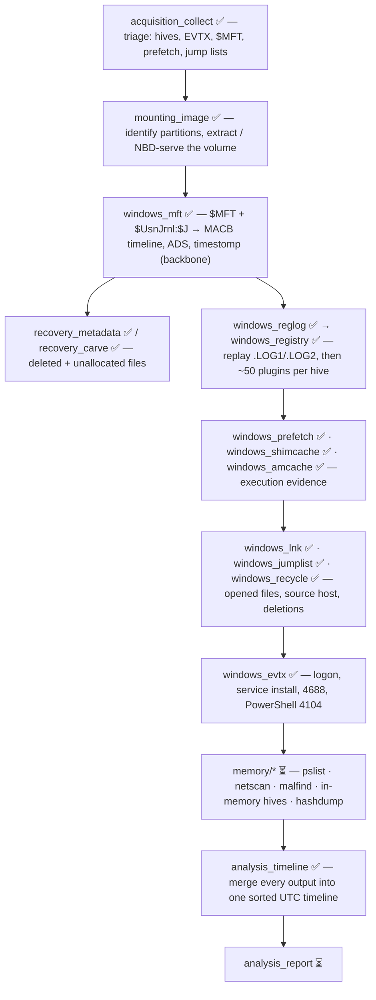
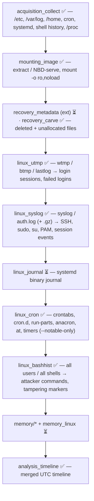
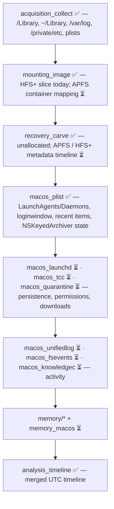

# Forensics Tools

An open-source, cross-platform suite of DFIR command-line tools — written in
Python (3.11+, standard library only) and built to run on Windows, Linux and
macOS.


Each tool is self-contained, each with its own tests and
documentation. Tools are organised into categories.

| Category | What it covers |
|---|---|
| [`acquisition/`](acquisition/) | collecting evidence — triage, disk imaging, memory |
| [`mounting/`](mounting/) | mounting / exposing images, partitions and shadow copies |
| [`recovery/`](recovery/) | getting files back — signature carving and file-system metadata |
| [`windows/`](windows/) | Windows artefact parsers |
| [`linux/`](linux/) | Linux artefact parsers |
| [`macos/`](macos/) | macOS artefact parsers |
| [`memory/`](memory/) | RAM-image analysis — processes, network, injection, in-memory hives |
| [`analysis/`](analysis/) | timeline building, indexing, correlation, reporting |
| [`utilities/`](utilities/) | strings, hashing, hex / file viewers |

Full roadmap and every planned tool: **[BACKLOG.md](BACKLOG.md)**.

---

## Tools available now

### `acquisition/`

| Tool | Status | Purpose |
|---|---|---|
| [**acquisition_collect**](acquisition/acquisition_collect/) | ✅ v0.1 | Targeted artefact acquisition from a live system or mounted image — locked-file handling, Volume Shadow Copy, streaming hashes, chain-of-custody manifest (Windows / Linux / macOS) |
| [**acquisition_image**](acquisition/acquisition_image/) | ✅ v0.1 | Create + verify forensic images — **raw / split / EWF `E01`** write, streaming MD5+SHA-1+SHA-256, bad-sector zero-fill + logging, acquisition log / manifest / HTML report; CLI + `tkinter` wizard |
| [**acquisition_ram**](acquisition/acquisition_ram/) | ✅ v0.1 | Live memory acquisition — Linux physical RAM via `/proc/kcore` → **LiME / raw / padded** with streaming hashing; Windows / macOS collect the memory-bearing files (page file, `hiberfil.sys`, crash dumps) |

### `mounting/`

| Tool | Status | Purpose |
|---|---|---|
| [**mounting_image**](mounting/mounting_image/) | ✅ v0.1 | Read-only access to raw / split / **E01** / **VHD** / **VMDK** images — container + MBR/GPT inspection, raw export, **built-in NBD server + client** (no `nbd-client`), **`mount` as a real read-only drive** (Windows drive letter, macOS volume, Linux mount); CLI + `tkinter` GUI |

### `recovery/`

| Tool | Status | Purpose |
|---|---|---|
| [**recovery_carve**](recovery/recovery_carve/) | ✅ v0.1 | Signature carving — recover files by magic bytes + structural validators, no file system needed |
| [**recovery_metadata**](recovery/recovery_metadata/) | ✅ v0.1 | Metadata recovery — walk the NTFS `$MFT`, list allocated + deleted entries with paths and `MACB` times, extract content (incl. deleted files), `cat` one entry by number |

### `windows/`

| Tool | Status | Purpose |
|---|---|---|
| [**windows_jumplist**](windows/windows_jumplist/) | ✅ v0.1 | `automaticDestinations-ms` jump lists — OLE2 + `DestList` MRU + embedded `.lnk` per target; AppID resolution |
| [**windows_lnk**](windows/windows_lnk/) | ✅ v0.1 | Shell Link (`.lnk`) — target path + MAC times, **creating machine name + MAC**, `$MFT` refs from shell items; CSV / JSON, `tkinter` viewer |
| [**windows_amcache**](windows/windows_amcache/) | ✅ v0.1 | `Amcache.hve` — executables (with **SHA-1**), installed programs and drivers |
| [**windows_shimcache**](windows/windows_shimcache/) | ✅ v0.1 | AppCompatCache / ShimCache — program presence + (Win7/8) execution evidence, from a `SYSTEM` hive or the live registry |
| [**windows_registry**](windows/windows_registry/) | ✅ v0.1 | Offline hive (`regf`) parser — dump / search / deleted-key recovery, ~50 built-in RegRipper-style plugins auto-selected by hive kind + external `--plugin-dir` loader, `tkinter` browser |
| [**windows_reglog**](windows/windows_reglog/) | ✅ v0.1 | Replay registry transaction logs (`.LOG1` / `.LOG2`) into a dirty hive — `HvLE` entries + Marvin32 verification — so parsers see a clean, current hive |
| [**windows_evtx**](windows/windows_evtx/) | ✅ v0.1 | Event logs (`.evtx`) — from-scratch binary + BinXml parser → standardised CSV / JSON / JSONL / XML with event-ID, provider, level and time filters |
| [**windows_mft**](windows/windows_mft/) | ✅ v0.1 | NTFS `$MFT` + `$UsnJrnl:$J` — full timeline, ADS listing, `$SI`/`$FN` timestomp detection; CSV / JSON / bodyfile; `tkinter` `$MFT` browser (`windows_mft gui`) |
| [**windows_recycle**](windows/windows_recycle/) | ✅ v0.1 | Recycle Bin — Vista+ `$I` / `$R` and legacy `INFO2` / `INFO`; content matching; CSV / JSON |
| [**windows_prefetch**](windows/windows_prefetch/) | ✅ v0.1 | Prefetch `.pf` v17-31, including the Windows 10/11 `MAM` / XPRESS-Huffman compressed format (pure-Python decompressor) |

### `analysis/`

| Tool | Status | Purpose |
|---|---|---|
| [**analysis_timeline**](analysis/analysis_timeline/) | ✅ v0.1 | Merge every tool's output into one sorted UTC super-timeline. Console, self-contained **HTML viewer**, and a `tkinter` **desktop window** (`analysis_timeline gui`) |
| [**analysis_encryption**](analysis/analysis_encryption/) | ✅ v0.1 | Detect encrypted / password-protected files — PGP, age, Office, PDF, ZIP/RAR/7z, BitLocker, LUKS, DMG, KeePass, SQLCipher + entropy fallback (**report only**) |
| [**analysis_dedupe**](analysis/analysis_dedupe/) | ✅ v0.1 | Hash-based deduplication — content grouping, reclaimable bytes, distinct-file list, `--against` baseline diff |
| [**analysis_kff**](analysis/analysis_kff/) | ✅ v0.1 | Known File Filter — import NSRL / Project VIC / HashKeeper / plain hash sets into a local SQLite index; classify files or hashes as **known-good / known-bad / notable / unknown** |
| [**analysis_index**](analysis/analysis_index/) | ✅ v0.1 | Full-text index + search over a collection — text / markup / OOXML / email / string-carving extraction; **boolean / phrase / `NEAR` / prefix / regex** queries with snippets; SQLite, no FTS extension |

### `linux/`

| Tool | Status | Purpose |
|---|---|---|
| [**linux_utmp**](linux/linux_utmp/) | ✅ v0.1 | `wtmp` / `btmp` / `utmp` / `lastlog` login records → record timeline + paired login/logout **sessions** |
| [**linux_cron**](linux/linux_cron/) | ✅ v0.1 | Scheduled-execution inventory — crontabs, `cron.d`, run-parts, anacron, `at` jobs, systemd timers → normalised rows with plain-language schedules + suspicious-entry flags |
| [**linux_syslog**](linux/linux_syslog/) | ✅ v0.1 | `syslog` / `messages` / `auth.log` / `secure` (+ rotated / `.gz`), BSD + RFC 5424 → record timeline or **structured security events** (SSH, sudo, su, PAM, session, cron, account) |
| [**linux_bashhist**](linux/linux_bashhist/) | ✅ v0.1 | Shell / REPL history for all users (bash, zsh, fish, sh, python, mysql, psql, sqlite, node, redis) → merged timeline, tampering markers, attacker-command flags |

### `macos/`

| Tool | Status | Purpose |
|---|---|---|
| [**macos_plist**](macos/macos_plist/) | ✅ v0.1 | Binary + XML property lists → CSV / JSON; **unwraps `NSKeyedArchiver`**; Apple timestamp conversion |

### `memory/`

| Tool | Status | Purpose |
|---|---|---|
| [**memory_image**](memory/memory_image/) | ✅ v0.1 | Identify / map / convert RAM dumps — raw / **LiME** / ELF core / **Windows crash dump**; physical range map, OS hints, `raw`↔`lime`↔`padded`, carve a region. The shared loader for the `memory_*` tools |
| [**memory_strings**](memory/memory_strings/) | ✅ v0.1 | Address-aware string extraction from a RAM dump — ASCII + UTF-16LE runs tagged with the physical address, built-in IOC pattern library (url / registry / powershell / keys / wallets / cards …) |
| [**memory_pslist**](memory/memory_pslist/) | ✅ v0.1 | Windows process enumeration by **pool-tag scanning** — profile-independent `_EPROCESS` heuristic; finds **hidden and exited** processes; confidence-scored |

### next up

`analysis_email` (PST/MBOX) · `analysis_gallery` · `analysis_report` — FTK-parity ·
`memory_netscan` / `memory_malfind` (RAM analysis) ·
`recovery_metadata` FAT / ext4 / APFS support ·
`linux_journal` (systemd binary journal) · `macos_quarantine` / `macos_knowledgec` (build on `macos_plist` + SQLite).

---

## Investigation workflow

How the tools fit together. **✅ available now · ⏳ planned ([BACKLOG](BACKLOG.md))**

Every case runs through the same seven phases — only phase ④ is
OS-specific.


| Phase | Goal |
|---|---|
| ① Preserve & acquire | Never touch originals. Capture a triage set or a full disk/RAM image; hash everything; keep a manifest. |
| ② Open the image | Turn the `E01` / `VHD` / `VMDK` container into readable bytes and locate the partitions. |
| ③ File-system timeline | Build the MACB backbone from file-system metadata; recover deleted + unallocated content. |
| ④ OS artefacts | Parse the registry / logs / execution / user-activity artefacts for that OS. |
| ⑤ Memory | Capture RAM with `acquisition_ram` (or collect the page file / `hiberfil.sys`); then processes, network, injected code, in-memory secrets. |
| ⑥ Correlate | Merge every tool's CSV/JSON into one UTC super-timeline; pivot on the window of interest. |
| ⑦ Report | Package findings, tagged rows and the timeline into a shareable bundle. |

---

### Windows



1. **Acquire.** On a live host, `acquisition_collect` with the Windows target
   set grabs the registry hives (+ transaction logs), `Security` / `System` /
   application `.evtx`, `$MFT`, `$UsnJrnl`, Prefetch, `Amcache.hve`, jump
   lists, `.lnk` files and the Recycle Bin — using Volume Shadow Copy for
   locked files — and writes a hash manifest. For a full disk image,
   `acquisition_image` writes a verified raw / split / `E01`.

   ```bash
   acquisition_collect --os windows --backend vss -d case01/
   acquisition_image acquire \\.\PhysicalDrive0 case01.E01 --format ewf --verify
   ```

2. **Open the image.** Identify the layout, then pull the Windows partition
   (or, on a Linux analysis box, mount it read-only via the built-in NBD
   client — `mounting_image serve disk.E01 --partition 2 --attach --run
   --mountpoint /mnt/evidence`).

   ```bash
   mounting_image info    disk.E01
   mounting_image extract disk.E01 --partition 2 --out c_volume.raw
   ```

3. **File-system timeline — the backbone.** `windows_mft` turns `$MFT`
   (+ `$UsnJrnl:$J`) into a complete MACB timeline with ADS enumeration and
   `$SI` / `$FN` timestomp detection. Everything else hangs off these times.
   Then `recovery_metadata` lists / extracts deleted MFT entries, and
   `recovery_carve` recovers files from unallocated space with no MFT record.
   With the volume mounted read-only, run `analysis_kff scan --ignore-known`
   over it first to drop the OS / application noise and surface unknown +
   known-bad files.

   ```bash
   windows_mft mft '$MFT' --csv mft.csv
   windows_mft usn '$J'   --csv usn.csv
   analysis_kff scan /mnt/evidence --ignore-known --csv unknown_files.csv
   ```

4. **Registry.** Dirty hives first: `windows_reglog` replays `.LOG1` / `.LOG2`
   so you analyse the *current* state. Then `windows_registry` auto-selects
   the right plugin set per hive.

   ```bash
   windows_reglog SYSTEM -o SYSTEM.clean
   windows_registry plugin SYSTEM.clean --csv sys       # services, USB, network, BAM
   windows_registry plugin NTUSER.DAT   --csv user      # UserAssist, RecentDocs, RunMRU
   windows_registry plugin Amcache.hve  --csv amcache
   ```

5. **Execution evidence — corroborate.** No single source is complete; agree
   three ways. `windows_prefetch` (`.pf`: run count, last-run times, files
   loaded), `windows_shimcache` (AppCompatCache from `SYSTEM`),
   `windows_amcache` (`Amcache.hve`, with SHA-1), plus UserAssist / BAM from
   step 4.

6. **User activity & anti-forensics.** `windows_lnk` on `Recent\*.lnk`
   (opened files, their original full paths, target MAC times, and the
   *creating machine's* NetBIOS name + MAC — lateral-movement gold);
   `windows_jumplist` on `automaticDestinations-ms` (per-app MRU with
   timestamps); `windows_recycle` (deleted file's original path, size,
   deletion time, and the recoverable `$R` content).

7. **Event logs.** `windows_evtx` normalises `.evtx` to CSV / JSON with
   filters — logon / logoff (4624 / 4625 / 4634), service install (7045),
   process creation (4688), PowerShell script block (4104), RDP.

   ```bash
   windows_evtx Security.evtx --event-id 4624,4625,4688 --csv logons.csv
   ```

8. **Memory** (⏳) — if RAM was captured: `memory_pslist`, `memory_netscan`,
   `memory_malfind`, `memory_registry` (hives live in RAM), `memory_hashdump`.

9. **Correlate & report.** Feed every CSV / JSON to `analysis_timeline` for
   one sorted UTC view (console, HTML, or `tkinter`); narrow to the window,
   tag rows, and (⏳ `analysis_report`) package the result.

   ```bash
   analysis_timeline mft.csv sys_*.csv user_*.csv logons.csv \
       --from 2026-08-01 --to 2026-08-07 --html case01_timeline.html
   ```

---

### Linux



1. **Acquire.** `acquisition_collect --os linux` pulls `/etc`, `/var/log`
   (incl. rotated), `/home/*` dotfiles, crontabs and `cron.d`, systemd units,
   every shell's history, and a `/proc` process snapshot, with hashes +
   manifest.
2. **Open the image.** `mounting_image extract` / `serve`; on Linux mount the
   ext volume `-o ro,noload` (never replay the journal).
3. **File-system timeline.** `recovery_carve` on unallocated space today; a
   native ext2-4 metadata timeline is ⏳ (`recovery_metadata` currently covers
   NTFS).
4. **Logins.** `linux_utmp` → paired login/logout **sessions** with
   durations, plus brute-force attempts from `btmp`.

   ```bash
   linux_utmp /mnt/evidence/var/log/wtmp --sessions --csv sessions.csv
   linux_utmp /mnt/evidence/var/log/btmp --csv failed.csv
   ```

5. **System logs.** `linux_syslog --events` turns `auth.log` / `secure` /
   `syslog` (and `.gz` rotations) into structured SSH / sudo / su / PAM /
   session / cron / account events. The systemd binary journal
   (`linux_journal`) is ⏳.

   ```bash
   linux_syslog /mnt/evidence/var/log --root --events \
       --category ssh,sudo,su --csv auth_events.csv
   ```

6. **Persistence.** `linux_cron` inventories *every* scheduling mechanism and
   flags download-and-run, `@reboot`, world-writable paths.

   ```bash
   linux_cron /mnt/evidence --notable-only --csv cron.csv
   ```

7. **User activity.** `linux_bashhist` merges every user's shell + REPL
   history, parses `HISTTIMEFORMAT` / zsh / fish timestamps, and flags
   attacker commands and history tampering (`history -c`, emptied files,
   out-of-order timestamps).

   ```bash
   linux_bashhist /mnt/evidence --notable-only --with-notes --csv history.csv
   ```

8. **Memory** (⏳) — `memory_linux` for the task list, `lsmod`, `netstat`,
   injected VMAs, `bash` history from RAM.
9. **Correlate.**

   ```bash
   analysis_timeline sessions.csv auth_events.csv cron.csv history.csv \
       --html linux_timeline.html
   ```

---

### macOS

> macOS coverage is the newest in the suite — `macos_plist` is the workhorse
> today; the log and database parsers below are ⏳.



1. **Acquire.** `acquisition_collect --os macos` collects
   `/Library/LaunchDaemons`, `~/Library/LaunchAgents`,
   `/System/Library/LaunchDaemons`, `com.apple.*` preference plists,
   `/var/log`, `/private/etc`, `InstallHistory.plist`, and browser data.
2. **Open the image.** `mounting_image` exposes HFS+ partitions as slices
   today; APFS container / volume mapping is ⏳ (interim: mount on a Mac
   read-only, or carve).
3. **File-system timeline.** `recovery_carve` on unallocated space; native
   APFS / HFS+ metadata timelining is ⏳.
4. **Property lists — everything.** `macos_plist` reads binary + XML plists
   and unwraps `NSKeyedArchiver` object graphs. Point it at persistence and
   activity plists:

   ```bash
   macos_plist '/mnt/evidence/Library/LaunchDaemons/*.plist' --csv launchdaemons.csv
   macos_plist /mnt/evidence/Users/*/Library/Preferences/com.apple.loginwindow.plist --json loginwindow.json
   macos_plist /mnt/evidence/Users/*/Library/Preferences/com.apple.recentitems.plist
   ```

5. **Persistence & permissions.** Review the LaunchAgents / Daemons plists
   from step 4 for `ProgramArguments`, `RunAtLoad`, `StartInterval`; login
   items. Dedicated wrappers — `macos_launchd`, `macos_tcc` (privacy DB),
   `macos_quarantine` (`LSQuarantineEvent` downloads) — are ⏳.
6. **Logs & activity** (⏳) — `macos_unifiedlog` (`.tracev3`),
   `macos_fsevents` (file-system change log), `macos_knowledgec` /
   `macos_spotlight`. Interim: `macos_plist` on `InstallHistory.plist` and
   `/var/db/receipts`.
7. **Memory** (⏳) — `memory_macos`.
8. **Correlate.**

   ```bash
   analysis_timeline launchdaemons.csv loginwindow.json --html macos_timeline.html
   ```

---

### Output that chains

Every tool writes UTC ISO-8601 **CSV** (UTF-8-BOM, formula-injection-safe) and
**JSON** on a stable schema, so any tool's output drops straight into
`analysis_timeline` — or into a spreadsheet, `jq`, or a SIEM.

---

## Design principles

- **Zero runtime dependencies** — drops onto an unknown host with just Python.
- **UTC everywhere** — ISO-8601 with a `Z` suffix, no local-time ambiguity.
- **Cross-platform** — analysis runs anywhere; collection targets are per-OS.
- **Long paths & Unicode** — `\\?\` extended paths on Windows, UTF-8(-BOM) CSV.
- **Never crash on bad input** — malformed artefacts produce an error row, not
  a traceback.
- **Forensically sound output** — deterministic, hashed, with a machine- and
  human-readable manifest for chain of custody.
- **GUI where it helps** — GUI-bearing tools ship a stdlib `tkinter` window
  *and* a self-contained HTML view; the CLI always works headless.

---

## Getting started

```bash
git clone https://github.com/mostafaimam/Forensics-Tools
cd Forensics-Tools

# each tool installs independently
pip install -e ./windows/windows_prefetch
windows_prefetch --help

# or run in place without installing
python -m windows_prefetch --help
```

See each tool's own `README.md` for full usage and internals.

## License

MIT — see [LICENSE](LICENSE).
