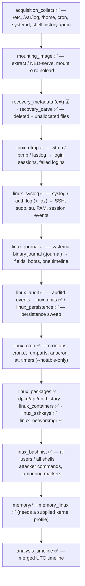
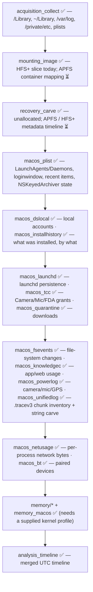

# Forensics Tools

An open-source, cross-platform suite of DFIR command-line tools — written in
Python (3.11+, standard library only) and built to run on Windows, Linux and
macOS.

These tools are meant to help anyone working in digital forensics and incident
response. If you have a question, spot a problem, or want to suggest an
enhancement, please reach out — see [Questions & contributions](#questions--contributions).


Each tool is self-contained, each with its own tests and
documentation. Tools are organised into categories.

| Category | What it covers |
|---|---|
| [`acquisition/`](acquisition/) | collecting evidence — triage, disk imaging, memory |
| [`mounting/`](mounting/) | mounting / exposing images, partitions and shadow copies |
| [`recovery/`](recovery/) | getting files back — signature carving and file-system metadata |
| [`windows/`](windows/) | Windows artefact parsers |
| [`linux/`](linux/) | Linux artefact parsers |
| [`macos/`](macos/) | macOS artefact parsers |
| [`browser/`](browser/) | web browser artefacts — history, downloads, cookies, extensions |
| [`network/`](network/) | packet captures — flows, DNS, HTTP, suspicious traffic |
| [`memory/`](memory/) | RAM-image analysis — processes, network, injection, in-memory hives |
| [`analysis/`](analysis/) | timeline building, indexing, correlation, reporting |
| [`utilities/`](utilities/) | strings, hashing, hex / file viewers |
| [`cloud/`](cloud/) | cloud & SaaS logs — OneDrive, Dropbox, M365 / Entra, CloudTrail, Workspace |
| [`mobile/`](mobile/) | logical mobile extractions — iOS backups, Android `adb` backups |
| [`apps/`](apps/) | chat & collaboration apps — Teams, Slack, Signal, Discord, Telegram |

The tables below list every tool, built (✅) and planned (📋). Each planned
tool already has a spec-stub `README.md` in its own directory describing what
it will do. The full roadmap is tracked privately.

---

## Tools

✅ built and tested — every tool in the suite (142/142). A 📋 planned marker would appear here for a tool not yet built (with a spec-stub README in its directory); none remain.

### `acquisition/`

| Tool | Status | Purpose |
|---|---|---|
| [**acquisition_collect**](acquisition/acquisition_collect/) | ✅ v0.1 | Targeted artefact acquisition from a live system or mounted image — locked-file handling, Volume Shadow Copy, streaming hashes, chain-of-custody manifest (Windows / Linux / macOS) |
| [**acquisition_image**](acquisition/acquisition_image/) | ✅ v0.1 | Create + verify forensic images — **raw / split / EWF `E01`** write, streaming MD5+SHA-1+SHA-256, bad-sector zero-fill + logging, acquisition log / manifest / HTML report; CLI + `tkinter` wizard |
| [**acquisition_ram**](acquisition/acquisition_ram/) | ✅ v0.1 | Live memory acquisition — Linux physical RAM via `/proc/kcore` → **LiME / raw / padded** with streaming hashing; Windows / macOS collect the memory-bearing files (page file, `hiberfil.sys`, crash dumps) |

### `mounting/`

| Tool | Status | Purpose |
|---|---|---|
| [**mounting_image**](mounting/mounting_image/) | ✅ v0.1 | Read-only access to raw / split / **E01** / **VHD** / **VMDK** images — container + MBR/GPT inspection, raw export, **built-in NBD server + client** (no `nbd-client`), **`mount` as a real read-only drive** (Windows drive letter, macOS volume, Linux mount); CLI + `tkinter` GUI |
| [**mounting_vsc**](mounting/mounting_vsc/) | ✅ v0.1 | Best-effort VSS discovery: identifier-GUID scan + candidate FILETIME/GUID fields nearby. No block-remapping/snapshot mounting — VSS's overlay format is RE-only and unverified here, and getting it wrong risks serving corrupted bytes as real content · GUI |
| [**mounting_partitions**](mounting/mounting_partitions/) | ✅ v0.1 | Map the MBR / GPT partition layout of a raw / EWF / VHD / VMDK image and identify the filesystem in each slice (NTFS / FAT / ext / XFS / Btrfs / APFS / HFS+ / LVM2 / LUKS / BitLocker / swap); gaps + overlaps; no mounting |
| [**mounting_bitlocker**](mounting/mounting_bitlocker/) | ✅ v0.1 | Unlock a BitLocker volume with a supplied 48-digit recovery password (key-stretch + AES-CCM VMK/FVEK unwrap), then decrypt sectors with AES-XTS / AES-CBC; bundled AES, nothing brute forced |
| [**mounting_luks**](mounting/mounting_luks/) | ✅ v0.1 | Unlock a LUKS1 volume with a supplied passphrase (PBKDF2 key-slot + AES-CBC-ESSIV + anti-forensic key-material recovery, master-key digest verification), then decrypt sectors; `cbc-essiv:<hash>` cipher mode; LUKS2 detected, not unlockable |
| [**mounting_veracrypt**](mounting/mounting_veracrypt/) | ✅ v0.1 | Unlock a VeraCrypt/TrueCrypt volume with a supplied password (PBKDF2 header-key + AES-XTS header decrypt/CRC validation, master-key extraction), then decrypt sectors; single-cipher AES-256-XTS volumes only, no PIM/keyfiles |
| [**mounting_fvde**](mounting/mounting_fvde/) | ✅ v0.1 | Best-effort legacy CoreStorage FileVault2 unlock — exact/standard PBKDF2 + RFC 3394 key unwrap (verified against the official test vector) + AES-XTS-128, examiner-supplied salt/iterations/wrapped-key rather than an assumed plist layout; APFS FileVault out of scope |

### `recovery/`

| Tool | Status | Purpose |
|---|---|---|
| [**recovery_carve**](recovery/recovery_carve/) | ✅ v0.1 | Signature carving — recover files by magic bytes + structural validators, no file system needed |
| [**recovery_metadata**](recovery/recovery_metadata/) | ✅ v0.1 | Metadata recovery — walk the NTFS `$MFT`, list allocated + deleted entries with paths and `MACB` times, extract content (incl. deleted files), `cat` one entry by number |
| [**recovery_fs**](recovery/recovery_fs/) | ✅ v0.1 | One read-only file-system walker — **NTFS** (vendored `recovery_metadata` engine), **FAT12/16/32** (LFN, `0xE5` deleted, cluster chains) and **exFAT** (entry sets, `NoFatChain`, bitmap allocation); ext / HFS+ / APFS detected only. Detects the FS at `--offset` or the first MBR/GPT partition; `list` (allocated + deleted), `extract` by glob / inode, `cat`, 3.x `bodyfile` · GUI |

### `windows/`

| Tool | Status | Purpose |
|---|---|---|
| [**windows_jumplist**](windows/windows_jumplist/) | ✅ v0.1 | `automaticDestinations-ms` jump lists — OLE2 + `DestList` MRU + embedded `.lnk` per target; AppID resolution |
| [**windows_lnk**](windows/windows_lnk/) | ✅ v0.1 | Shell Link (`.lnk`) — target path + MAC times, **creating machine name + MAC**, `$MFT` refs from shell items; CSV / JSON, `tkinter` viewer |
| [**windows_amcache**](windows/windows_amcache/) | ✅ v0.1 | `Amcache.hve` — executables (with **SHA-1**), installed programs and drivers |
| [**windows_shimcache**](windows/windows_shimcache/) | ✅ v0.1 | AppCompatCache / ShimCache — program presence + (Win7/8) execution evidence, from a `SYSTEM` hive or the live registry |
| [**windows_registry**](windows/windows_registry/) | ✅ v0.1 | Offline hive (`regf`) parser — dump / search / deleted-key recovery, ~50 built-in artefact plugins auto-selected by hive kind + external `--plugin-dir` loader, `tkinter` browser |
| [**windows_reglog**](windows/windows_reglog/) | ✅ v0.1 | Replay registry transaction logs (`.LOG1` / `.LOG2`) into a dirty hive — `HvLE` entries + Marvin32 verification — so parsers see a clean, current hive |
| [**windows_evtx**](windows/windows_evtx/) | ✅ v0.1 | Event logs (`.evtx`) — from-scratch binary + BinXml parser → standardised CSV / JSON / JSONL / XML with event-ID, provider, level and time filters |
| [**windows_mft**](windows/windows_mft/) | ✅ v0.1 | NTFS `$MFT` + `$UsnJrnl:$J` — full timeline, ADS listing, `$SI`/`$FN` timestomp detection; CSV / JSON / bodyfile; `tkinter` `$MFT` browser (`windows_mft gui`) |
| [**windows_recycle**](windows/windows_recycle/) | ✅ v0.1 | Recycle Bin — Vista+ `$I` / `$R` and legacy `INFO2` / `INFO`; content matching; CSV / JSON |
| [**windows_prefetch**](windows/windows_prefetch/) | ✅ v0.1 | Prefetch `.pf` v17-31, including the Windows 10/11 `MAM` / XPRESS-Huffman compressed format (pure-Python decompressor) |
| [**windows_recentfilecache**](windows/windows_recentfilecache/) | ✅ v0.1 | `RecentFileCache.bcf` (Win7 pre-Amcache) — length-prefixed UTF-16 executable paths with the file's own mtime as bound; flags writable-path / double-extension / script-type / LOLBin / UNC paths |
| [**windows_shellbags**](windows/windows_shellbags/) | ✅ v0.1 | Reconstruct the shellbag folder-access tree from `BagMRU` / `Bags` (`UsrClass.dat` / `NTUSER.DAT`) — full paths, last-interacted times, `$MFT` refs, `MRUListEx` order; flags removable / network / archive / other-profile paths · GUI |
| [**windows_srum**](windows/windows_srum/) | ✅ v0.1 | `SRUDB.dat` → per-app hourly timeline: network bytes sent / received per interface, connected time, CPU cycle time + disk bytes, energy, push notifications; resolves `AppId` / `UserId` via `SruDbIdMapTable` to the exe path + user SID |
| [**windows_sum**](windows/windows_sum/) | ✅ v0.1 | Microsoft User Access Logging (SUM) — `SystemIdentity.mdb` role-GUID map + `Current.mdb` / `{GUID}.mdb` role databases → one row per (user, client, role) access: authenticated user, client name / decoded IP, first / last seen, totals and the `DayN` columns expanded to a per-day date histogram; flags public-IP access, RDP-from-internet, single-day spikes |
| [**windows_timeline**](windows/windows_timeline/) | ✅ v0.1 | Windows 10/11 Timeline (`ActivitiesCache.db`) — app / file / clipboard / copy-paste / notification activity with UTC times, resolved app, **decoded clipboard payloads** and `ActivityOperation` (removed-activity) rows |
| [**windows_sqlmap**](windows/windows_sqlmap/) | ✅ v0.1 | Find every SQLite database in a target by header magic (not extension), match each against declarative named-map JSON profiles (tables required, SQL, columns, time format) into normalised rows; unmatched databases still listed with full table/row-count schema · GUI |
| [**windows_esedb**](windows/windows_esedb/) | ✅ v0.1 | From-scratch ESE / JET (`.edb`) reader — header, catalog (`MSysObjects`), B-trees, long values, fixed / variable / tagged records (Vista+ extended tagged, 7-bit compression); the engine behind `windows_srum` / `windows_webcache` |
| [**windows_usn**](windows/windows_usn/) | ✅ v0.1 | Standalone `$UsnJrnl:$J` parser **and carver** — sequential walk + `USN_RECORD` carving from unallocated space, folded into create / rename / delete / data-write operations; `--mft` resolves paths |
| [**windows_sdb**](windows/windows_sdb/) | ✅ v0.1 | Application Compatibility shim databases (`.sdb`) — tag-tree parse listing the database (name, GUID, time), shims, patches and every EXE entry with its matching files / shim / patch refs; flags `InjectDll` / `RedirectEXE` / `CorrectFilePaths` / custom-patch persistence and shims aimed at system binaries · GUI |
| [**windows_wer**](windows/windows_wer/) | ✅ v0.1 | Windows Error Reporting `.wer` reports → one row per crash / hang: faulting application + full path + version, faulting module, exception code / offset, event time, signature; flags faults in binaries / modules under writable paths, LOLBin crashes and BEX / DEP / exploit-shaped codes |
| [**windows_bits**](windows/windows_bits/) | ✅ v0.1 | BITS transfer history — carves download / upload jobs (URL, local path, scratch file, owner SID, type / state, byte counts, create / modify FILETIMEs) from legacy `qmgr0/1.dat` and the ESE `qmgr.db`; flags raw-IP URLs, executable payloads, system-dir destinations, upload jobs and updater-mimic job names |
| [**windows_tasks**](windows/windows_tasks/) | ✅ v0.1 | Scheduled Tasks — Tasks XML joined with the `TaskCache\{Tree,Tasks}` registry: triggers (plain language), actions, principal, hidden flag, `DynamicInfo` registered / last-run times; flags LOLBins, writable / UNC action paths, encoded PowerShell, hidden and registry-only tasks |
| [**windows_wmi**](windows/windows_wmi/) | ✅ v0.1 | WMI repository persistence — string-level scan of `OBJECTS.DATA` for the `__EventFilter` / `*EventConsumer` / `__FilterToConsumerBinding` triad (WQL query, consumer action, namespace), using `MAPPING*.MAP` to tell live pages from stale; flags LOLBin / encoded / writable-path consumers, in-memory script consumers and non-default namespaces |
| [**windows_defender**](windows/windows_defender/) | ✅ v0.1 | Microsoft Defender — one detection timeline from MPLog, the Windows Defender Operational log (1116/1117, 1006-1011, 5001/5004/5007/5010 tamper), the RC4-obfuscated Quarantine store (threat, original path, time, hash; `--extract` unwraps `ResourceData`) and `SOFTWARE`-hive exclusions + protection switches; flags whole-drive / writable-path / LOLBin exclusions and RTP tampering |
| [**windows_pslogging**](windows/windows_pslogging/) | ✅ v0.1 | PowerShell forensics — reassembles Script Block Logging (4104) across its multi-part records, pulls Module logging (4103) + classic 400/500/600 events + `PowerShell_transcript.*`; recursively decodes `-EncodedCommand` / `FromBase64String` / gzip+base64 payloads; flags download cradles, AMSI / ETW bypass, reflective load, reverse shells, credential access, obfuscation |
| [**windows_usbdevices**](windows/windows_usbdevices/) | ✅ v0.1 | Removable-device history correlated across `SYSTEM` (`USBSTOR` / `USB` / `MountedDevices` + install / arrival / removal FILETIMEs), `SOFTWARE` (friendly volume name) and `setupapi.dev.log` (first-seen) — one row per device |
| [**windows_webcache**](windows/windows_webcache/) | ✅ v0.1 | `WebCacheV01.dat` (the WinINET store) — history / cookies / cached content / downloads / DOM storage with un-prefixed URLs and modified / accessed / expiry FILETIMEs; flags exe fetches, IP-literal / punycode hosts, paste / tunnel sites |
| [**windows_thumbcache**](windows/windows_thumbcache/) | ✅ v0.1 | `thumbcache_*.db` + `thumbcache_idx.db` — list every cached thumbnail (id, identifier, format, dimensions, source last-modified) and `--extract` them all as image files: evidence of pictures no longer on disk |
| [**windows_notifications**](windows/windows_notifications/) | ✅ v0.1 | `wpndatabase.db` — toast / tile / badge / raw notification history joined to the raising application, with arrival / expiry times and the notification text extracted from the payload XML |
| [**windows_bam**](windows/windows_bam/) | ✅ v0.1 | Background / Desktop Activity Moderator — per-user last-execution time for every program from `SYSTEM\…\bam` / `dam` `UserSettings\<SID>`; flags writable-path / LOLBin / masquerade binaries |
| [**windows_spooler**](windows/windows_spooler/) | ✅ v0.1 | Print-spool artefacts — pairs `.shd` job headers with `.spl` spool data → owner, source machine, document name, printer, driver, submit time (offset table + `SYSTEMTIME` scan) and the `.spl` payload format (EMF / XPS / PostScript / PCL / PDF / raw) with a page count; `--extract` copies payloads out; flags sensitive document names and owner/machine mismatch |
| [**windows_logfile**](windows/windows_logfile/) | ✅ v0.1 | NTFS `$LogFile` — reads RSTR / RCRD pages (applying the USA), decodes the redo/undo operations and pulls the `FILE_NAME` attribute out of index-entry ops to reconstruct file created / deleted / renamed, MFT record init / free and resident-value updates with parent MFT ref, `$FILE_NAME` timestamps and size; flags create+delete twins, `$FILE_NAME` timestomping, executable deletions, ADS names |
| [**windows_sigma**](windows/windows_sigma/) | ✅ v0.1 | Self-contained Sigma-style detection-rules engine — hand-rolled YAML reader, evaluates rules against `windows_evtx` / `windows_pslogging` normalised CSV/JSON into a prioritised hit list |

### `analysis/`

| Tool | Status | Purpose |
|---|---|---|
| [**analysis_timeline**](analysis/analysis_timeline/) | ✅ v0.1 | Merge every tool's output into one sorted UTC super-timeline. Console, self-contained **HTML viewer**, and a `tkinter` **desktop window** (`analysis_timeline gui`) |
| [**analysis_report**](analysis/analysis_report/) | ✅ v0.1 | Bundle tool CSV/JSON + Markdown notes into one **self-contained HTML** case report (+ JSON bundle) — tool auto-detect, alert-row highlighting, SHA-256 input manifest |
| [**analysis_email**](analysis/analysis_email/) | ✅ v0.1 | Inventory **MBOX / EML / Outlook MSG** — headers, addresses, times, attachments (SHA-256), Received chain, spoofing / SPF-DKIM-DMARC-fail flags |
| [**analysis_encryption**](analysis/analysis_encryption/) | ✅ v0.1 | Detect encrypted / password-protected files — PGP, age, Office, PDF, ZIP/RAR/7z, BitLocker, LUKS, DMG, KeePass, SQLCipher + entropy fallback (**report only**) |
| [**analysis_dedupe**](analysis/analysis_dedupe/) | ✅ v0.1 | Hash-based deduplication — content grouping, reclaimable bytes, distinct-file list, `--against` baseline diff |
| [**analysis_kff**](analysis/analysis_kff/) | ✅ v0.1 | Known File Filter — import NSRL / Project VIC / HashKeeper / plain hash sets into a local SQLite index; classify files or hashes as **known-good / known-bad / notable / unknown** |
| [**analysis_index**](analysis/analysis_index/) | ✅ v0.1 | Full-text index + search over a collection — text / markup / OOXML / email / string-carving extraction; **boolean / phrase / `NEAR` / prefix / regex** queries with snippets; SQLite, no FTS extension |
| [**analysis_gallery**](analysis/analysis_gallery/) | ✅ v0.1 | Picture + video gallery — find media by content signature, extract **EXIF / QuickTime metadata + GPS**, group visually near-identical images by **perceptual hash**, build a self-contained **HTML contact sheet**; in-tree JPEG / PNG / GIF / BMP decoders |
| [**analysis_view**](analysis/analysis_view/) | ✅ v0.1 | Review any table (CSV / TSV / JSON / **XLSX**) — merge sources, per-column filters, sort, conditional row colouring, and **tags + a notes column + a reviewed flag** saved to a sidecar; exports a self-contained interactive **HTML review page**. Where the reconstruction gets annotated |
| [**analysis_dpapi**](analysis/analysis_dpapi/) | ✅ v0.1 | Decrypt Windows DPAPI **master keys** (Win7+ SHA-512 / AES-256 scheme, HMAC-verified so a wrong secret is rejected) and **data blobs** (session-key derivation + entropy + signature check + type guess) given a supplied password + SID or SHA-1 hash; `scan` a Protect dir + blob folder. Bundled pure-Python AES. IR-scoped, no brute forcing |
| [**analysis_antiforensics**](analysis/analysis_antiforensics/) | ✅ v0.1 | Correlate the other tools' CSV / JSON into one findings list: event-log clearing (1102 / 104) + record-sequence gaps, `$SI`-vs-`$FN` timestomping, wiping-tool execution, log / history / journal clearing commands, disabled Prefetch / SysMain / Defender, `$UsnJrnl` truncation, deletion bursts, timeline gaps — with evidence + severity + a self-contained HTML report |
| [**analysis_fuzzyhash**](analysis/analysis_fuzzyhash/) | ✅ v0.1 | CTPH (ssdeep-style piecewise hash), a TLSH-style byte-trigram locality digest, and PE imphash + Rich-header hash; `scan` clusters a file set (union-find at `--threshold`) so near-duplicates and variant families group; `hash` / `compare` subcommands |
| [**analysis_enrich**](analysis/analysis_enrich/) | ✅ v0.1 | Append columns to an `analysis_timeline` bundle without touching rows: IOC feed matches (plain list / CSV / STIX-lite), MITRE ATT&CK technique ids from a bundled ~30-entry map keyed by the suite's patterns, a coarse RIR region for public IPs, and good/bad hash labels from `--known-csv` |

### `linux/`

| Tool | Status | Purpose |
|---|---|---|
| [**linux_utmp**](linux/linux_utmp/) | ✅ v0.1 | `wtmp` / `btmp` / `utmp` / `lastlog` login records → record timeline + paired login/logout **sessions** |
| [**linux_cron**](linux/linux_cron/) | ✅ v0.1 | Scheduled-execution inventory — crontabs, `cron.d`, run-parts, anacron, `at` jobs, systemd timers → normalised rows with plain-language schedules + suspicious-entry flags |
| [**linux_syslog**](linux/linux_syslog/) | ✅ v0.1 | `syslog` / `messages` / `auth.log` / `secure` (+ rotated / `.gz`), BSD + RFC 5424 → record timeline or **structured security events** (SSH, sudo, su, PAM, session, cron, account) |
| [**linux_bashhist**](linux/linux_bashhist/) | ✅ v0.1 | Shell / REPL history for all users (bash, zsh, fish, sh, python, mysql, psql, sqlite, node, redis) → merged timeline, tampering markers, attacker-command flags |
| [**linux_journal**](linux/linux_journal/) | ✅ v0.1 | From-scratch reader for the systemd journal (`.journal`) binary format — linear arena walk, `FIELD=value` resolution, realtime (UTC) + monotonic + boot id, one merged timeline, XZ data objects; flags priority / coredump / cradle / SSH-sudo auth-fail / segfault |
| [**linux_audit**](linux/linux_audit/) | ✅ v0.1 | Normalise `auditd` `audit.log` — reassemble records by `msg=audit()` id into one event (syscall + outcome, reconstructed `EXECVE`, `PROCTITLE`, paths, uid/auid, `USER_*` / `AVC`), decode hex + `SOCKADDR`; flags privilege / auth / account / rule-tampering / SELinux events |
| [**linux_units**](linux/linux_units/) | ✅ v0.1 | Inventory systemd unit files — merge drop-ins, resolve enable state from the `.wants` / `.requires` symlinks, list `ExecStart` / `Type` / `User` / restart policy; flags writable `ExecStart`, inline cradles, encoded payloads, tight respawners, enabled-without-`[Install]` |
| [**linux_packages**](linux/linux_packages/) | ✅ v0.1 | Package install / upgrade / remove timeline from `dpkg.log`, apt `history.log`, the dnf / yum text logs and the dnf `history.sqlite`; flags build toolchains, recon / tunnel / anti-forensic tooling, downgrades, manual `.deb`s, download-pipe installs |
| [**linux_sshkeys**](linux/linux_sshkeys/) | ✅ v0.1 | Review `authorized_keys` (system + per-user), host keys + private-key format / encryption, `known_hosts`, and `sshd_config` (+ `sshd_config.d` / `Match`); fingerprints every key; flags wildcard `from=`, forced `command=`, weak keys, CA trust, permissive settings |
| [**linux_persistence**](linux/linux_persistence/) | ✅ v0.1 | One sweep for every userland persistence vector — shell rc / `profile.d` / `environment`, `ld.so.preload`, `rc.local`, `update-motd.d`, xinetd, PAM, modprobe, udev, sudoers, systemd generators → one finding list with `info`/`low`/`medium`/`high` verdicts |
| [**linux_containers**](linux/linux_containers/) | ✅ v0.1 | Reconstruct Docker / Podman / containerd containers from on-disk state — engine, image, command, mounts, ports, created / started / finished, and the full security posture; flags privileged, mounted runtime socket, host namespaces, dangerous caps, secret env, cradle entrypoints |
| [**linux_networkmgr**](linux/linux_networkmgr/) | ✅ v0.1 | Saved network config + joined networks — NetworkManager keyfiles, `wpa_supplicant`, systemd-networkd, a best-effort netplan read, `/etc/hosts`, `resolv.conf`; secret values never printed; flags plaintext Wi-Fi / VPN secrets, open-Wi-Fi autoconnect, spoofed MAC, proxies, `hosts` overrides |

### `macos/`

| Tool | Status | Purpose |
|---|---|---|
| [**macos_plist**](macos/macos_plist/) | ✅ v0.1 | Binary + XML property lists → CSV / JSON; **unwraps `NSKeyedArchiver`**; Apple timestamp conversion |
| [**macos_unifiedlog**](macos/macos_unifiedlog/) | ✅ v0.1 | Best-effort .tracev3 chunk reader: chunk inventory + self-verified LZ4 ChunkSet decompression + printable-string carving. Not a `log show` replacement — no Firehose record decode or uuidtext/dsc format-string resolution |
| [**macos_fsevents**](macos/macos_fsevents/) | ✅ v0.1 | Parse the gzip `/.fseventsd` change log (DLS1/2/3 pages) → per-path Created / Removed / Renamed / Modified records with decoded flags + node ids; flags deletion of `TCC.db` / shell history / LaunchAgents / `/var/log` |
| [**macos_knowledgec**](macos/macos_knowledgec/) | ✅ v0.1 | `knowledgeC.db` (CoreDuet) — `/app/usage` · `/app/inFocus` · `/app/webUsage` · `/safari/history` · `/display/isBacklit` · `/app/intents` timeline with durations, resolved app, device id, all UTC |
| [**macos_quarantine**](macos/macos_quarantine/) | ✅ v0.1 | `com.apple.LaunchServices.QuarantineEventsV2` — download provenance: agent, data URL, origin URL, sender, timestamp; flags `.dmg`/`.pkg`/script fetches, IP-literal hosts, downloads by `Terminal` / `curl` |
| [**macos_spotlight**](macos/macos_spotlight/) | ✅ v0.1 | Classified string carving from the Spotlight metadata store (`.spotlight-V100/Store-V2/**/store.db`) — `kMDItem*` attribute names, UTIs, `kMDItemWhereFroms` download URLs, bundle identifiers, paths; the undocumented block/record format is not decoded · GUI |
| [**macos_launchd**](macos/macos_launchd/) | ✅ v0.1 | Review every `launchd` job plist — resolved program / argv, run-as, triggers in plain language, `Disabled`; flags writable-path programs, cradles, `DYLD_INSERT_LIBRARIES`, label / filename mismatch, `com.apple.*` masquerades |
| [**macos_installhistory**](macos/macos_installhistory/) | ✅ v0.1 | `InstallHistory.plist` + `/var/db/receipts` correlated — install events and per-package receipts with the installing process; flags installs by `bash` / `curl`, `.pkg`s from `~/Downloads`, config profiles |
| [**macos_tcc**](macos/macos_tcc/) | ✅ v0.1 | `TCC.db` (system + per-user) — who was granted Camera / Mic / Accessibility / Screen Recording / Full Disk Access / Automation, with `last_modified`; flags high-impact grants to CLI / scripting tools; **no cracking** |
| [**macos_dslocal**](macos/macos_dslocal/) | ✅ v0.1 | `/var/db/dslocal` local accounts — uid / shell / home / hint / auth mechanisms / PBKDF2 iterations, `accountPolicyData` timestamps, group membership; flags passwordless / hidden-interactive / uid-0 accounts; **no hash output** |
| [**macos_coreanalytics**](macos/macos_coreanalytics/) | ✅ v0.1 | `.core_analytics` diagnostics bundles (`/Library/Logs/DiagnosticReports/Analytics-*`) — per-day app launch / foreground / active-time aggregates spanning weeks per file; schema-tolerant plist reader · GUI |
| [**macos_powerlog**](macos/macos_powerlog/) | ✅ v0.1 | `CurrentPowerlog.PLSQL` — normalises the `PL*Agent*` tables into an app-usage / process / **camera / microphone** / **location (lat-lon)** / battery timeline; `--list-tables` / `--table` for the raw ~200 |
| [**macos_netusage**](macos/macos_netusage/) | ✅ v0.1 | `netusage.sqlite` — per-process network bytes in / out by interface class (Wi-Fi / WWAN / wired) with first / last seen; the macOS SRUM-network equivalent; flags large / upload-heavy egress by LOLBins |
| [**macos_bt**](macos/macos_bt/) | ✅ v0.1 | `com.apple.Bluetooth.plist` — paired-device history: name, vendor, class-of-device decoded, last-seen times; flags paired **input devices** (keystroke injection) and audio-input devices |
| [**macos_screentime**](macos/macos_screentime/) | ✅ v0.1 | `RMAdminStore-Local.sqlite` (Screen Time's Core Data store) — per-app / per-category daily usage totals by device, including usage synced in from the user's other Apple devices; schema read generically, no hard-coded Core Data entity IDs · GUI |

### `browser/`

| Tool | Status | Purpose |
|---|---|---|
| [**browser_history**](browser/browser_history/) | ✅ v0.1 | Web history, downloads and typed URLs from **Chrome / Edge / Brave / Opera / Firefox / Tor / Safari** — read-only + WAL-safe `sqlite3` parse, one normalised timeline; flags IP-literal hosts, punycode, paste / anonymiser / tunnel sites, `.exe` / `.ps1` downloads, `file://` access |
| [**browser_cookies**](browser/browser_cookies/) | ✅ v0.1 | Cookies from the same browsers (Safari `Cookies.binarycookies` included) — host, expiry, `Secure` / `HttpOnly` / `SameSite`, session vs persistent; **detects session / auth cookies** (proof a user was logged in) and flags IP-literal / tunnel hosts and `__Host-` / `__Secure-` prefix violations; values are metadata-only unless `--with-values` |
| [**browser_extensions**](browser/browser_extensions/) | ✅ v0.1 | Installed extensions from Chromium `Preferences` / Firefox `extensions.json` — id, version, install source, enabled state, **host + API permissions**; risk-scores each and flags **sideloaded**, **unsigned** (Firefox), developer-mode, policy-installed, `debugger` / `nativeMessaging` / `management` / `<all_urls>`+`webRequest`, and custom update URLs (Google / Mozilla first-party components recognised) |
| [**browser_downloads**](browser/browser_downloads/) | ✅ v0.1 | **Download history cross-referenced to disk** — Chromium `History.downloads` (+ URL chains) and Firefox `places.sqlite` / legacy `downloads.sqlite`, merged with `.crdownload` / `.part` leftovers and the NTFS `:Zone.Identifier` (MOTW `ZoneId` / `HostUrl` / `ReferrerUrl`); per-download present/missing/partial + size + optional SHA-256; flags double extensions, MIME/extension mismatch, raw-IP sources, MOTW executables, redirected downloads |
| [**browser_cache**](browser/browser_cache/) | ✅ v0.1 | **List + extract cached HTTP responses** — Chromium **Simple Cache** (`SimpleFileHeader` / `SimpleFileEOF` + `HttpResponseInfo` pickle, from scratch) and Firefox **cache2** (data + metadata: hash chunks, header, key, `response-head`); per-object URL / status / content-type / size / timestamps; `--extract` writes bodies (`gzip` / `deflate` decoded) with SHA-256; flags executable bodies, type/body mismatch, raw-IP hosts, partial caches |
| [**browser_autofill**](browser/browser_autofill/) | ✅ v0.1 | **Form-field history + saved profiles + card metadata** from Chromium `Web Data` (`autofill`, `autofill_profiles` / `contact_info`, `credit_cards`) and Firefox `formhistory.sqlite` — one row per field with first/last use + count; CVV / SSN / password-shaped values masked, card numbers never read; flags sensitive fields, search-box queries, emails / phones, saved-address contact details |
| [**browser_logins**](browser/browser_logins/) | ✅ v0.1 | **Saved-login metadata only** from Chromium `Login Data` and Firefox `logins.json` (+ `key4.db`) — origin, realm, username, created / last-used / password-changed times, use count, never-save list; the encrypted password is never decrypted or emitted; flags `http://` origins, bare-IP / non-FQDN hosts, primary-password-protected stores; per-host credential counts |
| [**browser_sessions**](browser/browser_sessions/) | ✅ v0.1 | **Tabs / windows open at last close** — Chromium SNSS command stream (`Session_*` / `Last Session`, from-scratch `base::Pickle` reader) and Firefox `sessionstore.jsonlz4` (**bundled `mozLz4` + LZ4 block decoder**, no `lz4` package); per-tab window / position / pinned / current URL+title / history depth / last-accessed / recently-closed; flags restored form data, sign-in pages, `file://` and raw-IP tabs |
| [**browser_bookmarks**](browser/browser_bookmarks/) | ✅ v0.1 | **Bookmark tree with added / modified times** from Chromium `Bookmarks` JSON (diffed against `Bookmarks.bak` to surface deleted entries) and Firefox `moz_bookmarks`; full folder path per entry; flags bookmarklets (`javascript:`), `file://` / `ftp://` targets, raw-IP hosts, browser-internal pages and `.bak`-only survivors |
| [**browser_shortcuts**](browser/browser_shortcuts/) | ✅ v0.1 | Chromium `Shortcuts` (typed text → URL, hit counts), `Top Sites` (frequency tiles) and `Network Action Predictor` (typed-prefix hit/miss) — omnibox intent that survives a history clear |
| [**browser_localstorage**](browser/browser_localstorage/) | ✅ v0.1 | From-scratch LevelDB reader (WAL log + SSTable + pure-Python Snappy) for Local Storage / IndexedDB — recovers every key/value ever written, including overwritten/deleted entries |
| [**browser_favicons**](browser/browser_favicons/) | ✅ v0.1 | Chromium `Favicons` / Firefox `favicons.sqlite` icon-to-page-URL map — `--history` cross-reference flags pages cleared from history but still cached; `--extract-dir` for the icon images |

### `network/`

| Tool | Status | Purpose |
|---|---|---|
| [**network_pcap**](network/network_pcap/) | ✅ v0.1 | Pure-Python `pcap` / `pcapng` reader — decodes Ethernet / SLL / raw-IP down to IPv4 / IPv6 + TCP / UDP / ICMP, reassembles **bidirectional flows**, extracts **DNS** queries/answers and **HTTP** requests (response merged in); flags cleartext creds, plaintext protocols to the internet, DNS tunnelling / DGA names, port scans, `.exe` downloads, high-egress flows |
| [**network_http**](network/network_http/) | ✅ v0.1 | **Carve HTTP transfers out of a capture** — TCP reassembly (out-of-order, retransmits), HTTP/1.x parsing (`chunked` + `gzip` / `deflate` decoded), request↔response pairing; hashes every transferred body, `--extract` writes them to disk (name from `Content-Disposition` / URL / magic bytes), carves **uploads** too; flags PE / ELF / script / archive bodies, content-type mismatches, credentials in uploads, non-browser user-agents, IP-literal hosts |
| [**network_dns**](network/network_dns/) | ✅ v0.1 | One DNS timeline from a `pcap` (self-contained UDP/TCP DNS parser), the Windows `ipconfig /displaydns` cache, `systemd-resolved` dumps and `hosts` files — per-name first/last seen, query types, answers + TTLs, resolvers, clients; flags encoded / high-entropy labels (tunnelling / DGA), large `TXT` / `NULL` answers, `AXFR`, NXDOMAIN bursts, fast-flux, and `hosts`-file redirects of real domains |
| [**network_flows**](network/network_flows/) | ✅ v0.1 | **NetFlow v5 / v9 / IPFIX / sFlow reader** — parses the wire record formats (v9 / IPFIX templates cached and reused across messages; sFlow raw-header flow samples), reassembles unidirectional flows into `proto · client · server · port` conversations with bytes / packets each way; top-talker / server-port / protocol summaries; flags bulk exfil (outbound-heavy), regular beacons, scan fan-out, SYN-only probes, long-lived flows |
| [**network_logs**](network/network_logs/) | ✅ v0.1 | **Normalise firewall / proxy / IDS text logs** — iptables / nftables, `pflog` (tcpdump text), Windows Firewall `pfirewall.log`, Squid `access.log`, Zeek `conn.log` (TSV) and Suricata `eve.json` → one flow / event schema; per-event flags (IDS alerts, blocked inbound, abused ports, credentials in proxied URLs, raw-IP requests) plus cross-log findings (blocked-event bursts, port sweeps) |
| [**network_arp**](network/network_arp/) | ✅ v0.1 | **IP ↔ MAC ↔ hostname ↔ time mapping** from ISC `dhcpd.leases`, the Windows DHCP audit CSV, `arp -a` / `ip neigh` dumps and ARP frames (+ passive src bindings) in a `pcap`; one row per binding with first/last seen, hostnames, sources and OUI vendor; flags time-overlapping IP conflicts (ARP spoofing), one MAC on many IPs, gratuitous ARP and locally-administered MACs |

### `memory/`

| Tool | Status | Purpose |
|---|---|---|
| [**memory_image**](memory/memory_image/) | ✅ v0.1 | Identify / map / convert RAM dumps — raw / **LiME** / ELF core / **Windows crash dump**; physical range map, OS hints, `raw`↔`lime`↔`padded`, carve a region. The shared loader for the `memory_*` tools |
| [**memory_strings**](memory/memory_strings/) | ✅ v0.1 | Address-aware string extraction from a RAM dump — ASCII + UTF-16LE runs tagged with the physical address, built-in IOC pattern library (url / registry / powershell / keys / wallets / cards …) |
| [**memory_pslist**](memory/memory_pslist/) | ✅ v0.1 | Windows process enumeration by **pool-tag scanning** — profile-independent `_EPROCESS` heuristic; finds **hidden and exited** processes; confidence-scored |
| [**memory_netscan**](memory/memory_netscan/) | ✅ v0.1 | Network connections + sockets from a Windows RAM dump — pool-tag scan for TCP/UDP endpoints and listeners, **x64 page-table translation** (self-referential PML4, no profile) to resolve the owning process and addresses; finds **hidden / closed** connections |
| [**memory_malfind**](memory/memory_malfind/) | ✅ v0.1 | Injected / unbacked executable memory — pool-tag scan for private (`VadS`) regions that are **executable**: reflectively-loaded DLLs, hollowed sections, shellcode; classifies each (PE / shellcode prologue / RWX high-entropy), attributes it to a process, dumps the region start |
| [**memory_dlllist**](memory/memory_dlllist/) | ✅ v0.1 | Loaded modules per process — pool-tag scan for image VADs, recovers each module's full path via `_MMVAD → Subsection → ControlArea → FileObject`, flags **user-writable load paths**, mislocated system DLLs, and executable image regions with **no backing file** (manual maps) |
| [**memory_cmdline**](memory/memory_cmdline/) | ✅ v0.1 | Process command lines — walks `_EPROCESS → PEB → RTL_USER_PROCESS_PARAMETERS` for the full command line, image path, working directory, window title and environment; flags **LOLBins** (`powershell -enc`, `certutil -urlcache`, `regsvr32 /i:http`, …) and argv[0] masquerading |
| [**memory_svcscan**](memory/memory_svcscan/) | ✅ v0.1 | Windows services — scans `services.exe` memory for `_SERVICE_RECORD` (`sErv`) structures to rebuild the service list **without the registry** (finds services deleted from `HKLM\…\Services`); name, display name, type, state, PID, binary path; flags user-writable / LOLBin / driver-from-temp binaries |
| [**memory_handles**](memory/memory_handles/) | ✅ v0.1 | Per-process open file handles — structurally-validated `_HANDLE_TABLE` walk (object-table offset and pointer-shift both auto-detected across Windows-version drift) reusing `memory_filescan`'s `_FILE_OBJECT` shape check; v0.1 recovers file handles only (Key/Process/Thread typing deferred) |
| [**memory_registry**](memory/memory_registry/) | ✅ v0.1 | Locate registry hives resident in memory — scans for the `regf` base-block magic directly in physical memory, decodes dirty flag, last-written FILETIME and hive filename; v0.1 is a hive inventory, not full hive-body reconstruction |
| [**memory_hashdump**](memory/memory_hashdump/) | ✅ v0.1 | Extract local NT/LM hashes from a SYSTEM+SAM hive pair — SYSTEM boot-key derivation, legacy RC4/RID-DES and modern AES SAM schemes; from-scratch DES verified against the FIPS 46-3 test vector. Reporting only |
| [**memory_lsasecrets**](memory/memory_lsasecrets/) | ✅ v0.1 | Decrypt LSA secrets (service-account passwords, DPAPI machine key) from a SYSTEM+SECURITY hive pair via the SYSTEM boot key → LSA key → per-secret AES-CBC chain. Reporting only |
| [**memory_filescan**](memory/memory_filescan/) | ✅ v0.1 | Pool-tag scan for `_FILE_OBJECT` structures — recovers open/cached file paths (including from **exited processes**) via kernel-DTB paged-pool resolution, no per-process attribution needed |
| [**memory_dumpfiles**](memory/memory_dumpfiles/) | ✅ v0.1 | Recover cache-resident file content via a self-verifying VACB chain walk (SectionObjectPointer→SharedCacheMap→VACB) — field offsets found by scanning a plausible window, kept only if the VACB's own back-pointer confirms it |
| [**memory_consoles**](memory/memory_consoles/) | ✅ v0.1 | Console-host process discovery (exact-name EPROCESS match) + generic command-line-shaped string carving. No CONSOLE_INFORMATION decode — undocumented, version-drifted user-mode structure with no reliable offset reference |
| [**memory_timers**](memory/memory_timers/) | ✅ v0.1 | Enumerate Windows kernel timers (KTIMER, x64) via structural validation of the documented DISPATCHER_HEADER layout — no symbol server needed; type/size/canonical-pointer checks, not a pool tag |
| [**memory_callbacks**](memory/memory_callbacks/) | ✅ v0.1 | Candidate kernel-callback-array scan: small mostly-NULL clustered-pointer tables (no symbol resolution) with outlier entries flagged as possible-hook leads |
| [**memory_ssdt**](memory/memory_ssdt/) | ✅ v0.1 | Candidate SSDT-shaped function-pointer table scan via VA clustering (no symbol, no hardcoded offset) — expect little/nothing on PatchGuard-protected modern x64 Windows; that's the correct outcome |
| [**memory_linux**](memory/memory_linux/) | ✅ v0.1 | Process list only — a supplied kernel profile drives a genuine `tasks`-list walk (direct-map arithmetic); without one, falls back to weak heuristic comm-string carving |
| [**memory_macos**](memory/memory_macos/) | ✅ v0.1 | Process list only — a supplied kernel profile drives a genuine `allproc` BSD-LIST walk (NULL-terminated, unlike Linux's circular list); this suite's lowest-confidence memory/ tool |
| [**memory_yara**](memory/memory_yara/) | ✅ v0.1 | Scan a memory image with YARA-style rules — bundled from-scratch matcher (text/hex/regex strings, boolean/counting conditions), no `yara-python`; bundled starter ruleset; physical memory only |

### `utilities/`

| Tool | Status | Purpose |
|---|---|---|
| [**utilities_strings**](utilities/utilities_strings/) | ✅ v0.1 | ASCII + UTF-16 LE/BE string runs (byte offsets) from any file / image / device, chunked with an overlap window; classifies each against ~35 built-in patterns (URLs, emails, IPs, paths, registry, tokens, wallet addresses, Luhn-checked cards, SSNs, IBANs, mimikatz / Cobalt Strike markers, …); `--category` / `--pattern` / `--grep` / `--start` / `--end` filters |
| [**utilities_hash**](utilities/utilities_hash/) | ✅ v0.1 | Hash a tree / file list / mounted image in one streaming pass (MD5 / SHA-1 / SHA-256 / SHA-512 / SHA3-256 / BLAKE2b) → CSV / JSON / `*sum` manifest with paths relative to each root; `--verify` diffs a fresh scan (CHANGED / MOVED / ADDED / REMOVED) and exits non-zero on any difference |
| [**utilities_ole**](utilities/utilities_ole/) | ✅ v0.1 | OLE2 (MS-CFB) + OOXML reader: stream tree, SummaryInformation / DocumentSummaryInformation + OOXML core/app/custom properties, **VBA macro source** (MS-OVBA decompression) in both container types, embedded objects, external relationship targets; flags weaponised-macro constructs, remote / UNC templates, author vs last-saver mismatch. Ships the `OleFile` library the other tools import |
| [**utilities_hex**](utilities/utilities_hex/) | ✅ v0.1 | Hex viewer + data interpreter: pages any file / image / device, hex / text / UTF-16 / regex search (overlap window), and interprets the bytes at an offset as signed/unsigned ints (8-64, LE+BE), float/double, GUID, RGB/RGBA and every common timestamp encoding (Unix s/ms/µs, FILETIME, WebKit, DOS, OLE, Cocoa, HFS+); ships `interpret()` + a `tkinter` widget for the other GUIs to embed · GUI |
| [**utilities_ezview**](utilities/utilities_ezview/) | ✅ v0.1 | Content-sniffing viewer: text / logs (encoding detection incl. no-BOM UTF-16), CSV / TSV, HTML / MHTML (tag-stripped), RTF, and best-effort text from docx / xlsx / pptx (OOXML), doc / xls (printable runs) and pdf (Flate stream text operators); unrenderable files fall back to the hex view · GUI |

### `cloud/`

| Tool | Status | Purpose |
|---|---|---|
| [**cloud_onedrive**](cloud/cloud_onedrive/) | ✅ v0.1 | Locate + generically inspect OneDrive sync metadata (settings/*.ini parsed directly, SyncEngineDatabase.db dumped table-by-table); proprietary undocumented format, no false-precision schema claims |
| [**cloud_dropbox**](cloud/cloud_dropbox/) | ✅ v0.1 | Locate + generically dump Dropbox's config.dbx/filecache.dbx when unencrypted; every recent client SQLCipher-encrypts these, detected and reported rather than guessed at |
| [**cloud_gdrive**](cloud/cloud_gdrive/) | ✅ v0.1 | Locate + generically dump Google Drive for Desktop's metadata_sqlite_db/snapshot.db (typically unencrypted, unlike Dropbox) |
| [**cloud_box**](cloud/cloud_box/) | ✅ v0.1 | Locate + generically dump Box Drive's local database — no confident specific filename known, so searches broadly under any Box-named path and verifies by magic bytes |
| [**cloud_m365ual**](cloud/cloud_m365ual/) | ✅ v0.1 | Normalise the Microsoft 365 Unified Audit Log (CSV/JSON, nested `AuditData`) across Exchange/SharePoint/Entra ID/Teams; flags mail-forwarding rules, app consent, role grants, mass downloads |
| [**cloud_azuread**](cloud/cloud_azuread/) | ✅ v0.1 | Normalise Entra ID sign-in + directory-audit log JSON exports into one timeline; flags legacy auth, risky sign-ins, CA failures, new-country, sensitive audit activities |
| [**cloud_cloudtrail**](cloud/cloud_cloudtrail/) | ✅ v0.1 | Normalise AWS CloudTrail `.json`/`.json.gz` into one row per API call; flags IAM changes, ConsoleLogin without MFA, secrets access, public-ACL changes, root usage, Delete* bursts |
| [**cloud_gws**](cloud/cloud_gws/) | ✅ v0.1 | Normalise Google Workspace audit activity (Admin SDK Reports API JSON) across login/admin/drive/token categories; flags suspicious logins, admin role changes, OAuth grants, external Drive sharing |

### `mobile/`

| Tool | Status | Purpose |
|---|---|---|
| [**mobile_iosbackup**](mobile/mobile_iosbackup/) | ✅ v0.1 | Read a modern (iOS 10+) local iTunes/Finder backup's Manifest.db, joined against its hashed on-disk storage; `--extract-dir` reconstructs the real domain/relativePath folder tree. Unencrypted backups only |
| [**mobile_android**](mobile/mobile_android/) | ✅ v0.1 | Read an `adb backup` (.ab) archive — header parse, zlib decompression, tar-member inventory via the standard library's `tarfile`; `--extract-dir` rebuilds the real tree. Unencrypted backups only |
| [**mobile_appcommon**](mobile/mobile_appcommon/) | ✅ v0.1 | Generic blob inspector: binary plists (NSKeyedArchiver-aware) and schemaless Protocol Buffers (exact wire-format decode, no `.proto` needed) — reframed from a helper library into its own CLI tool |

### `apps/`

| Tool | Status | Purpose |
|---|---|---|
| [**app_chat**](apps/app_chat/) | ✅ v0.1 | Recover Slack/Discord messages from their local Electron/LevelDB cache by recognising each vendor's documented public API message JSON shape; classic Teams carved as raw text. Signal/WhatsApp/Telegram out of scope |

### status: all 142 planned tools built

Every category — `linux/`, `network/`, `browser/`, `utilities/`,
`analysis/`, `cloud/`, `mobile/`, `apps/`, `mounting/`, `macos/`,
`memory/` — is now complete for v0.1. The last nine were the hardest
remaining ones, each held back earlier specifically because this
project lacked a confident, verifiable technique — not because they
were low priority. Rather than guess at exact undocumented byte
layouts, each found a *different* way to stay honest about that
uncertainty:

- **`mounting_fvde`, `mounting_vsc`** — CoreStorage FileVault2 and VSS
  are genuinely undocumented, community-reverse-engineered-only
  formats (unlike BitLocker/LUKS/VeraCrypt, where the crypto itself is
  standardized). `mounting_fvde` separates its exact/standard crypto
  (PBKDF2, RFC 3394 key unwrap, AES-XTS) from the uncertain plist
  layout by taking salt/iterations/wrapped-key as explicit parameters
  rather than auto-parsing them. `mounting_vsc` stops at identifier
  -scan-plus-candidate-fields rather than attempting full block
  -remapping, since a wrong block-remap would silently serve corrupted
  bytes as real file content.
- **`macos_unifiedlog`** — a chunk inventory with self-verified LZ4
  decompression (try a few candidate framings, keep only the one that
  parses as a valid nested-chunk sequence) and string carving; not a
  `log show` replacement.
- **`memory_dumpfiles`** — the four kernel-internals tools
  (`dumpfiles`, `ssdt`, `callbacks`, `consoles`) all lack the pool tag
  this suite's other `memory_*` tools rely on. `dumpfiles` bounds that
  with the same self-referential-pointer trick `pagemap.py` already
  uses for directory-table-base confirmation (a VACB is only trusted
  once its own back-pointer confirms it).
- **`memory_ssdt`, `memory_callbacks`** — no symbol server to resolve
  `KeServiceDescriptorTable` or the notification-callback globals, and
  PatchGuard means genuine SSDT hooks don't really exist on modern
  64-bit Windows anyway — both scan for the *structural shape* a
  legitimate table has (clustered canonical pointers) and flag
  entries that don't fit, as leads, never as confirmed findings.
- **`memory_consoles`** — `CONSOLE_INFORMATION` is a user-mode
  (conhost.exe), not kernel, structure with no public documentation at
  all; reports console-host process discovery and command-shaped
  string carving as two separate, uncorrelated signals instead.
- **`memory_linux`, `memory_macos`** — `task_struct`/`proc` have no
  cross-version signature of any kind. Both follow the same
  examiner-supplies-the-missing-piece pattern `memory_hashdump`/
  `memory_lsasecrets` use for a SYSTEM/SAM hive pair: a supplied
  kernel profile drives a genuine linked-list walk (BSD's
  NULL-terminated `LIST` for macOS, correctly implemented as
  structurally different from Linux's circular list, not a renamed
  copy); without one, both fall back to the same weak heuristic
  string-carve, clearly labeled as such.

The **`cloud/`**, **`mobile/`**, and **`apps/`** categories completed
just before this batch — `cloud_cloudtrail` · `azuread` · `m365ual` ·
`gws` (audit-log normalisers, publicly documented schemas) plus
`cloud_onedrive` · `dropbox` · `gdrive` · `box` (generic sync-database
inspection — none of these four have a published schema, so every one
is honest about dumping tables/rows generically rather than claiming
understood semantics); `mobile_iosbackup` · `mobile_android` ·
`mobile_appcommon`; `app_chat`.

The **`linux/`** category is now complete for v0.1 (`linux_utmp` · `cron` ·
`syslog` · `bashhist` · `journal` · `audit` · `units` · `packages` ·
`sshkeys` · `persistence` · `containers` · `networkmgr`).
A big **`windows/`** artefact push landed the ESE stack (`windows_esedb`
→ `windows_srum` · `windows_webcache`), `windows_usn`, `windows_bam`,
`windows_usbdevices`, `windows_timeline`, `windows_thumbcache` and
`windows_notifications`; `mounting_partitions` maps disk layouts.
The **`macos/`** category filled out: `macos_quarantine` · `tcc` ·
`launchd` · `installhistory` · `knowledgec` · `fsevents` · `dslocal` ·
`powerlog` · `bt` · `netusage` · `coreanalytics` · `screentime` ·
`spotlight` (only the `.tracev3` unified log is still to come).
**`mounting/`** now covers BitLocker, LUKS1 and VeraCrypt/TrueCrypt
unlock-with-supplied-key (`mounting_bitlocker` / `mounting_luks` /
`mounting_veracrypt`), alongside image access and partition mapping —
only Volume Shadow Copy mounting and FileVault2/APFS unlock (both
undocumented-format-limited, deferred like `.tracev3`) remain.
The **`network/`** and **`browser/`** categories are both complete for
v0.1 — `network_pcap` · `http` · `dns` · `flows` · `logs` · `arp`;
`browser_history` · `cookies` · `extensions` · `downloads` · `cache` ·
`autofill` · `logins` · `sessions` · `bookmarks` · `shortcuts` ·
`localstorage` (a from-scratch LevelDB reader) · `favicons`.
The **`cloud/`** and **`mobile/`** categories got their first tools:
`cloud_cloudtrail` / `cloud_azuread` / `cloud_m365ual` (audit-log
normalisers — no undocumented-format risk, these are all publicly
specified schemas) and `mobile_iosbackup` (reconstructs a real file
tree from an unencrypted local iOS backup's hashed on-disk storage).
Also new: `memory_hashdump` / `memory_lsasecrets` (SYSTEM boot-key
-derived SAM hash and LSA secret decryption, reporting only, given
hive files rather than a raw memory image).

---

## Investigation workflow

How the tools fit together. **✅ available now · ⏳ planned**

Every case runs through the same seven phases — only phase ④ is
OS-specific.


| Phase | Goal |
|---|---|
| ① Preserve & acquire | Never touch originals. Capture a triage set or a full disk/RAM image; hash everything; keep a manifest. |
| ② Open the image | Turn the `E01` / `VHD` / `VMDK` container into readable bytes and locate the partitions. |
| ③ File-system timeline | Build the MACB backbone from file-system metadata; recover deleted + unallocated content. |
| ④ OS artefacts | Parse the registry / logs / execution / user-activity artefacts for that OS. |
| ⑤ Memory | Capture RAM with `acquisition_ram` (or collect the page file / `hiberfil.sys`); then processes, network, injected code, in-memory secrets. |
| ⑥ Correlate | Merge every tool's CSV/JSON into one UTC super-timeline; pivot on the window of interest. |
| ⑦ Report | Package findings, tagged rows and the timeline into a shareable bundle. |

---

### Windows

```mermaid
flowchart TD
    A["acquisition_collect ✅ — triage: hives, EVTX, $MFT, prefetch, jump lists"] --> B["mounting_image ✅ — identify partitions, extract / NBD-serve the volume"]
    B --> MP["mounting_partitions ✅ — MBR/GPT + per-slice filesystem, gaps"]
    MP --> C["windows_mft ✅ — $MFT + $UsnJrnl:$J → MACB timeline, ADS, timestomp (backbone) · windows_usn ✅ — carve the journal from unallocated"]
    C --> RC["recovery_metadata ✅ / recovery_carve ✅ — deleted + unallocated files"]
    C --> D["windows_reglog ✅ → windows_registry ✅ — replay .LOG1/.LOG2, then ~50 plugins per hive"]
    D --> E["windows_prefetch ✅ · windows_shimcache ✅ · windows_amcache ✅ — execution evidence"]
    E --> BAM["windows_bam ✅ — per-user last-run · windows_usbdevices ✅ — USB history · windows_srum ✅ — per-app network bytes / hour"]
    BAM --> TS["windows_tasks ✅ — Tasks XML + TaskCache → triggers, actions, last-run · windows_shellbags ✅ — folders browsed"]
    TS --> WMI["windows_wmi ✅ — __EventFilter/__Consumer/__Binding triad · windows_sdb ✅ — InjectDll / RedirectEXE / custom-patch shims · windows_bits ✅ — download / upload jobs"]
    WMI --> F["windows_lnk ✅ · windows_jumplist ✅ · windows_recycle ✅ · windows_timeline ✅ · windows_thumbcache ✅ · windows_recentfilecache ✅ · windows_spooler ✅ — opened files, activity, pictures, print jobs"]
    F --> G["windows_evtx ✅ — logon, service install, 4688 · windows_pslogging ✅ — reassembled + decoded 4104/4103/transcripts · windows_defender ✅ — MPLog + detections + quarantine + exclusions · windows_wer ✅ — crash = execution evidence · windows_webcache ✅"]
    G --> LF["windows_logfile ✅ — $LogFile redo/undo → create / delete / rename / timestomp · windows_sum ✅ — server-role access by user + client IP"]
    LF --> H["memory/* — pslist ✅ · netscan ✅ · malfind ✅ · dlllist ✅ · cmdline ✅ · svcscan ✅ · strings ✅ · in-memory hives ✅ · hashdump ✅ · timers ✅ · dumpfiles ✅ · ssdt/callbacks/consoles ✅ (leads) · yara ✅"]
    H --> I["analysis_timeline ✅ — merge every output into one sorted UTC timeline"]
    I --> EN["analysis_enrich ✅ — IOC / ATT&CK / geo / known-file columns · analysis_antiforensics ✅ — evidence-destruction indicators · analysis_fuzzyhash ✅ — cluster variant families"]
    EN --> J["analysis_view ✅ (filter · tag · annotate) -> analysis_report ✅ · analysis_gallery ✅"]
```



1. **Acquire.** On a live host, `acquisition_collect` with the Windows target
   set grabs the registry hives (+ transaction logs), `Security` / `System` /
   application `.evtx`, `$MFT`, `$UsnJrnl`, Prefetch, `Amcache.hve`, jump
   lists, `.lnk` files and the Recycle Bin — using Volume Shadow Copy for
   locked files — and writes a hash manifest. For a full disk image,
   `acquisition_image` writes a verified raw / split / `E01`.

   ```bash
   acquisition_collect --os windows --backend vss -d case01/
   acquisition_image acquire \\.\PhysicalDrive0 case01.E01 --format ewf --verify
   ```

2. **Open the image.** Identify the layout, then pull the Windows partition
   (or, on a Linux analysis box, mount it read-only via the built-in NBD
   client — `mounting_image serve disk.E01 --partition 2 --attach --run
   --mountpoint /mnt/evidence`).

   ```bash
   mounting_image info    disk.E01
   mounting_image extract disk.E01 --partition 2 --out c_volume.raw
   ```

3. **File-system timeline — the backbone.** `windows_mft` turns `$MFT`
   (+ `$UsnJrnl:$J`) into a complete MACB timeline with ADS enumeration and
   `$SI` / `$FN` timestomp detection. Everything else hangs off these times.
   Then `recovery_metadata` lists / extracts deleted MFT entries, and
   `recovery_carve` recovers files from unallocated space with no MFT record.
   With the volume mounted read-only, run `analysis_kff scan --ignore-known`
   over it first to drop the OS / application noise and surface unknown +
   known-bad files.

   ```bash
   windows_mft mft '$MFT' --csv mft.csv
   windows_mft usn '$J'   --csv usn.csv
   analysis_kff scan /mnt/evidence --ignore-known --csv unknown_files.csv
   ```

4. **Registry.** Dirty hives first: `windows_reglog` replays `.LOG1` / `.LOG2`
   so you analyse the *current* state. Then `windows_registry` auto-selects
   the right plugin set per hive.

   ```bash
   windows_reglog SYSTEM -o SYSTEM.clean
   windows_registry plugin SYSTEM.clean --csv sys       # services, USB, network, BAM
   windows_registry plugin NTUSER.DAT   --csv user      # UserAssist, RecentDocs, RunMRU
   windows_registry plugin Amcache.hve  --csv amcache
   ```

5. **Execution evidence — corroborate.** No single source is complete; agree
   three ways. `windows_prefetch` (`.pf`: run count, last-run times, files
   loaded), `windows_shimcache` (AppCompatCache from `SYSTEM`),
   `windows_amcache` (`Amcache.hve`, with SHA-1), plus UserAssist / BAM from
   step 4.

6. **User activity & anti-forensics.** `windows_lnk` on `Recent\*.lnk`
   (opened files, their original full paths, target MAC times, and the
   *creating machine's* NetBIOS name + MAC — lateral-movement gold);
   `windows_jumplist` on `automaticDestinations-ms` (per-app MRU with
   timestamps); `windows_recycle` (deleted file's original path, size,
   deletion time, and the recoverable `$R` content).

7. **Persistence & tradecraft.** `windows_tasks` (Scheduled Tasks),
   `windows_wmi` (permanent WMI event subscriptions — the fileless triad),
   `windows_sdb` (shim-database `InjectDll` / `RedirectEXE` / custom
   patches), `windows_bits` (jobs that pulled tooling in or pushed data
   out). `windows_defender` merges MPLog, the Operational log, the
   Quarantine store and the exclusion list into one timeline — an
   attacker-added exclusion is often the first move.

   ```bash
   windows_wmi C:/Windows/System32/wbem/Repository --notable-only --csv wmi.csv
   windows_defender "C:/ProgramData/Microsoft/Windows Defender" --min-severity high
   windows_bits C:/ProgramData/Microsoft/Network/Downloader --notable-only
   ```

8. **Event logs & scripting.** `windows_evtx` normalises `.evtx` to CSV /
   JSON with filters — logon / logoff (4624 / 4625 / 4634), service install
   (7045), process creation (4688), RDP. `windows_pslogging` reassembles
   Script Block Logging (4104) across its fragments and decodes the encoded
   payloads; `windows_wer` treats every `.wer` crash report as execution
   evidence that outlives the binary.

   ```bash
   windows_evtx Security.evtx --event-id 4624,4625,4688 --csv logons.csv
   windows_pslogging E:/Windows/System32/winevt/Logs --min-severity high --csv ps.csv
   ```

9. **Fine-grained file activity.** `windows_logfile` decodes the `$LogFile`
   redo/undo stream into create / delete / rename / timestomp events —
   finer-grained than `$UsnJrnl` and often catching files that were created
   and deleted inside one log window. On a server, `windows_sum` shows
   which accounts used which roles, from which client IPs.

10. **Memory** — if RAM was captured: `memory_pslist` ✅ (pool-tag process
   scan), `memory_netscan` ✅ (connections + sockets), `memory_malfind` ✅
   (injected / RWX code), `memory_dlllist` ✅ (loaded modules + load-path
   anomalies), `memory_cmdline` ✅ (command lines + LOLBins),
   `memory_svcscan` ✅ (services, incl. ones missing from the registry),
   `memory_strings` ✅ (address-tagged IOCs), `memory_filescan` ✅
   (`_FILE_OBJECT` scan, incl. exited processes), `memory_handles` ✅
   (per-process open file handles), `memory_registry` ✅ (hives resident
   in RAM), `memory_timers` ✅ (KTIMER structural scan, x64, no symbol
   server needed), `memory_dumpfiles` ✅ (self-verifying VACB chain walk
   for cache-resident file content), `memory_ssdt` / `memory_callbacks` ✅
   (candidate function-pointer-table scans, no symbol resolution —
   flagged leads, not confirmed hooks), `memory_consoles` ✅
   (console-host process discovery + command-text carving). Given a
   SYSTEM+SAM/SECURITY hive pair (extracted separately, not from the
   raw image itself): `memory_hashdump` ✅ (local NT/LM hashes) and
   `memory_lsasecrets` ✅ (service-account passwords, DPAPI machine
   key) — both reporting only, no cracking. Against any memory image
   plus a rules file: `memory_yara` ✅ (bundled YARA-style matcher, no
   `yara-python`). Given a supplied kernel profile for the exact build:
   `memory_linux` / `memory_macos` ✅ (genuine linked-list process-list
   walk); without one, both fall back to a weaker heuristic carve.

   ```bash
   memory_pslist  MEMORY.DMP --terminated-only --csv procs.csv
   memory_netscan MEMORY.DMP --established --csv connections.csv
   memory_malfind MEMORY.DMP --min-confidence medium --csv injected.csv
   memory_dlllist MEMORY.DMP --notable-only --csv modules.csv
   memory_cmdline MEMORY.DMP --notable-only --csv cmdlines.csv
   memory_svcscan MEMORY.DMP --notable-only --csv services.csv
   ```

11. **Correlate, enrich, review & report.** Feed every CSV / JSON to
   `analysis_timeline` for one sorted UTC view; `analysis_enrich` to add
   IOC / ATT&CK / geo / known-file columns; `analysis_antiforensics` to
   check for evidence destruction; then `analysis_view` to filter it down,
   **tag the rows that matter, note why, and mark the rest reviewed**
   (saved to a sidecar), and `analysis_report` to package the result.

   ```bash
   analysis_timeline mft.csv sys_*.csv user_*.csv logons.csv \
       --from 2026-08-01 --to 2026-08-07 --html case01_timeline.html
   analysis_enrich case01_timeline.csv --feed iocs.txt --known-csv kff.csv \
       -o case01_enriched.csv
   analysis_antiforensics ./case01_outputs --html case01_antiforensics.html
   analysis_view case01_enriched.csv --rule 'attack~T10=#fdd' \
       --review case01.review.json --html case01_review.html
   ```

---

### Linux



1. **Acquire.** `acquisition_collect --os linux` pulls `/etc`, `/var/log`
   (incl. rotated), `/home/*` dotfiles, crontabs and `cron.d`, systemd units,
   every shell's history, and a `/proc` process snapshot, with hashes +
   manifest.
2. **Open the image.** `mounting_image extract` / `serve`; on Linux mount the
   ext volume `-o ro,noload` (never replay the journal).
3. **File-system timeline.** `recovery_carve` on unallocated space today; a
   native ext2-4 metadata timeline is ⏳ (`recovery_metadata` currently covers
   NTFS).
4. **Logins.** `linux_utmp` → paired login/logout **sessions** with
   durations, plus brute-force attempts from `btmp`.

   ```bash
   linux_utmp /mnt/evidence/var/log/wtmp --sessions --csv sessions.csv
   linux_utmp /mnt/evidence/var/log/btmp --csv failed.csv
   ```

5. **System logs.** `linux_syslog --events` turns `auth.log` / `secure` /
   `syslog` (and `.gz` rotations) into structured SSH / sudo / su / PAM /
   session / cron / account events; `linux_journal` reads the systemd binary
   journal off the image, and `linux_audit` reassembles the `auditd` records.

   ```bash
   linux_syslog /mnt/evidence/var/log --root --events \
       --category ssh,sudo,su --csv auth_events.csv
   ```

6. **Persistence.** `linux_cron` inventories *every* scheduling mechanism and
   flags download-and-run, `@reboot`, world-writable paths.

   ```bash
   linux_cron /mnt/evidence --notable-only --csv cron.csv
   ```

7. **User activity.** `linux_bashhist` merges every user's shell + REPL
   history, parses `HISTTIMEFORMAT` / zsh / fish timestamps, and flags
   attacker commands and history tampering (`history -c`, emptied files,
   out-of-order timestamps).

   ```bash
   linux_bashhist /mnt/evidence --notable-only --with-notes --csv history.csv
   ```

8. **Memory** — `memory_linux` ✅ recovers the process list given a
   supplied kernel profile for this exact build (a genuine `tasks`-list
   walk; no profile means a much weaker heuristic carve instead —
   `task_struct` has no cross-version signature to scan for the way
   Windows kernel objects have a pool tag). `lsmod`/`netstat`/injected
   -VMA recovery remain out of scope for v0.1.
9. **Correlate.**

   ```bash
   analysis_timeline sessions.csv auth_events.csv cron.csv history.csv \
       --html linux_timeline.html
   ```

---

### macOS

> macOS coverage is the newest in the suite — `macos_plist` is the workhorse
> today; the log and database parsers below are ⏳.



1. **Acquire.** `acquisition_collect --os macos` collects
   `/Library/LaunchDaemons`, `~/Library/LaunchAgents`,
   `/System/Library/LaunchDaemons`, `com.apple.*` preference plists,
   `/var/log`, `/private/etc`, `InstallHistory.plist`, and browser data.
2. **Open the image.** `mounting_image` exposes HFS+ partitions as slices
   today; APFS container / volume mapping is ⏳ (interim: mount on a Mac
   read-only, or carve).
3. **File-system timeline.** `recovery_carve` on unallocated space; native
   APFS / HFS+ metadata timelining is ⏳.
4. **Property lists — everything.** `macos_plist` reads binary + XML plists
   and unwraps `NSKeyedArchiver` object graphs. Point it at persistence and
   activity plists:

   ```bash
   macos_plist '/mnt/evidence/Library/LaunchDaemons/*.plist' --csv launchdaemons.csv
   macos_plist /mnt/evidence/Users/*/Library/Preferences/com.apple.loginwindow.plist --json loginwindow.json
   macos_plist /mnt/evidence/Users/*/Library/Preferences/com.apple.recentitems.plist
   ```

5. **Accounts & installs.** `macos_dslocal` reads `/var/db/dslocal` for
   every local user (uid / shell / hint / auth mechanism / `accountPolicyData`
   timestamps / admin membership); `macos_installhistory` correlates
   `InstallHistory.plist` with `/var/db/receipts` and flags installs run by
   `bash` / `curl`.
6. **Persistence & permissions.** `macos_launchd` reviews every job plist
   (resolved program, triggers in plain language, `DYLD_` injection, label
   masquerades); `macos_tcc` lists the Camera / Mic / Accessibility / Screen
   Recording / Full Disk Access grants; `macos_quarantine` gives the
   download provenance (`LSQuarantineEvent`).
7. **Logs & activity.** `macos_fsevents` parses the `/.fseventsd` change log;
   `macos_knowledgec` gives the app / web-usage timeline with durations;
   `macos_powerlog` adds camera / microphone activation and GPS fixes;
   `macos_netusage` attributes network bytes to a process; `macos_bt` lists
   paired Bluetooth devices. `macos_unifiedlog` reads `.tracev3` chunk
   -by-chunk (best-effort LZ4 decompression, self-verified) and carves
   printable strings — not a full `log show` replacement; no format
   -string resolution against `uuidtext`/`dsc`.
8. **Memory.** `memory_macos` recovers the process list given a
   supplied kernel profile for this exact build (a genuine `allproc`
   BSD-LIST walk); without one, a much weaker heuristic carve — this
   suite's lowest-confidence memory/ tool, since `proc` has no
   cross-version signature at all.
9. **Correlate.**

   ```bash
   analysis_timeline launchdaemons.csv loginwindow.json --html macos_timeline.html
   ```

---

### Output that chains

Every tool writes UTC ISO-8601 **CSV** (UTF-8-BOM, formula-injection-safe) and
**JSON** on a stable schema, so any tool's output drops straight into
`analysis_timeline` — or into a spreadsheet, `jq`, or a SIEM.

---

## Design principles

- **Zero runtime dependencies** — drops onto an unknown host with just Python.
- **UTC everywhere** — ISO-8601 with a `Z` suffix, no local-time ambiguity.
- **Cross-platform** — analysis runs anywhere; collection targets are per-OS.
- **Long paths & Unicode** — `\\?\` extended paths on Windows, UTF-8(-BOM) CSV.
- **Never crash on bad input** — malformed artefacts produce an error row, not
  a traceback.
- **Forensically sound output** — deterministic, hashed, with a machine- and
  human-readable manifest for chain of custody.
- **GUI where it helps** — GUI-bearing tools ship a stdlib `tkinter` window
  *and* a self-contained HTML view; the CLI always works headless.

### Chain of custody ([`shared/tracelib`](shared/))

Tools that have adopted `tracelib` (all of `network/` and `browser/` so far)
write a `<output>.manifest.json` sidecar on every run — tool version, exact
command line, `--case-id` / `--examiner` / `--evidence-id`, start/finish time
in UTC, host, and the **SHA-256 of every input and output file**. Their CSV
rows carry `evidence_source` / `parser_confidence` / `tz_provenance` columns,
and each JSON record carries the same provenance fields (the manifest is the
sidecar).
`--max-input-bytes` / `--max-records` / `--wall-seconds` bound a run against
hostile or oversized evidence. `--no-provenance` opts out.
[`shared/fuzzlib`](shared/) mutation-fuzzes the binary parsers.

---

## Getting started

```bash
git clone https://github.com/mostafaimam/Forensics-Tools
cd Forensics-Tools

# each tool installs independently
pip install -e ./windows/windows_prefetch
windows_prefetch --help

# or run in place without installing
python -m windows_prefetch --help
```

See each tool's own `README.md` for full usage and internals.

## Questions & contributions

This project is for the DFIR community — practitioners, responders, students
and researchers. If it helps your work, or if something is missing or wrong,
please get in touch:

- **Questions & bug reports** — open an [issue](https://github.com/mostafaimam/Forensics-Tools/issues).
- **Enhancements & new tool ideas** — open an issue describing the artefact or
  capability, or send a pull request.
- Or reach the maintainer directly on GitHub ([@mostafaimam](https://github.com/mostafaimam)).

Feedback from real casework is especially welcome — it drives what gets built
next.

## License

MIT — see [LICENSE](LICENSE).
