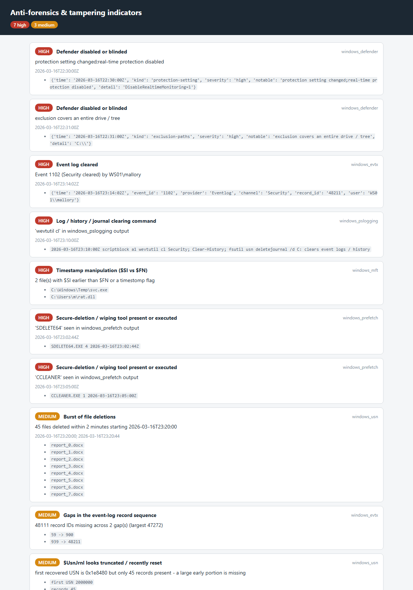

# analysis_antiforensics

**One report for "did someone try to destroy the evidence?"**

`analysis_antiforensics` reads the CSV / JSON output of the other tools —
it does **not** re-parse artefacts — recognises which tool produced each
file (by name and columns), and correlates the anti-forensic indicators
into a single findings list plus a self-contained HTML report.



## Indicators

| finding | detected from | severity |
|---------|---------------|----------|
| **Event log cleared** | `windows_evtx` events 1102 / 104 / 517 | high |
| **Gaps in the event-log record sequence** | missing `EventRecordID`s in `windows_evtx` | medium |
| **Timestamp manipulation** | `$SI` earlier than `$FN`, or a timestomp flag, in `windows_mft` | high |
| **Wiping tool present / executed** | `sdelete`, `cipher /w`, `bleachbit`, `ccleaner`, `eraser`, `killdisk`, … in prefetch / amcache / mft / pslogging | high |
| **Log / history / journal clearing command** | `wevtutil cl`, `Clear-EventLog`, `Clear-History`, `fsutil usn deletejournal`, `auditpol /clear`, `Clear-RecycleBin` in any dataset | high |
| **Forensic telemetry disabled** | `EnablePrefetcher = 0`, SysMain `Start = 4`, `DisableAntiSpyware`, … in `windows_registry` | medium |
| **Defender disabled or blinded** | tamper / disabled / whole-tree-exclusion flags in `windows_defender` | high |
| **`$UsnJrnl` truncated / recently reset** | first recovered USN far from 0 with few records | medium |
| **Burst of file deletions** | ≥ 30 delete operations within 2 minutes in `windows_usn` / `windows_logfile` | medium |
| **Activity gap** | a > 36-hour hole in a tool's timeline | low |

## Usage

```
analysis_antiforensics ./case_outputs --html af.html
analysis_antiforensics evtx.csv mft.json usn.csv --json af.json
analysis_antiforensics ./out --min-severity medium
```

Point it at the folder where you saved the other tools' `--csv` / `--json`
files, or list the files. Exit code is non-zero when any `medium` or
`high` finding is present.

| flag | effect |
|------|--------|
| `--min-severity info\|low\|medium\|high` | drop findings below this level |
| `--html PATH` | self-contained report (the deliverable) |
| `--csv PATH` / `--json PATH` | `id, severity, title, detail, tool, times, evidence` |

## Why it matters

Anti-forensics is rarely one loud act — it is a cleared Security log *and*
a `$UsnJrnl` reset *and* `sdelete` in prefetch *and* a 40-hour gap in
Amcache, each individually explainable, together a pattern. Pulling them
onto one page, with the supporting rows and timestamps, is what turns
"the timeline looks thin" into a defensible finding. It also tells you
*where* to look harder — a cleared log at 23:14 says recover records from
`$LogFile` / VSS around then.

## Limitations (v0.1)

- It only sees what you feed it. No `windows_evtx` output → no
  log-clearing detection. Run the relevant parsers first and save their
  `--csv` / `--json`.
- Tool detection is by filename and column signature; a heavily filtered
  or renamed export may be classed `unknown` and skipped by the
  tool-specific detectors (the generic string detectors still run).
- Findings are **heuristic and correlative** — each is a prompt to
  investigate, not a conclusion. A `ccleaner.exe` in prefetch might be
  routine user hygiene; a deletion burst might be an installer.
- Timestamps are used as supplied (the `tz` provenance column says so);
  cross-source correlation assumes they are all UTC.
- No VSS / `$LogFile` gap-vs-content analysis yet, and no direct artefact
  reading — that stays in the individual parsers.

## Tests

`tests/test_analysis_antiforensics.py` builds synthetic tool outputs (an
`event_id` 1102, an `EventRecordID` gap, a `$SI`/`$FN` timestomp, an
`SDELETE64.EXE` prefetch row, a 40-file deletion burst, a Defender
"real-time protection disabled" row, a `wevtutil cl` PowerShell script)
and checks tool detection, each detector, the HTML + JSON output and the
non-zero exit on medium/high findings.

```
cd analysis/analysis_antiforensics && python -m pytest -q
```
