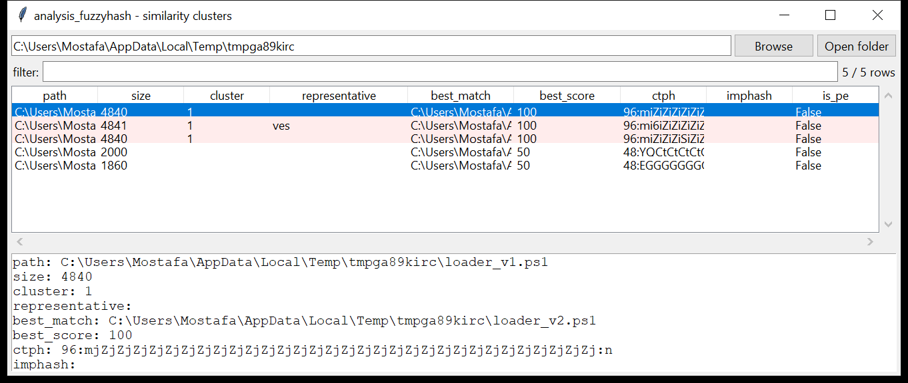

# analysis_fuzzyhash

**Group the files that exact hashing keeps apart.**

`analysis_fuzzyhash` computes three similarity digests over a file set and
clusters them, so near-duplicates and variant families land together even
when every SHA-256 differs.



## The digests

| digest | what it is | compared by |
|--------|-----------|-------------|
| **CTPH** | context-triggered piecewise hash — the ssdeep construction: a rolling window picks reset points, each piece is FNV-hashed to one base64 character, at two block sizes | normalised edit distance → 0-100 |
| **locality** | a byte-trigram histogram (Pearson-bucketed) folded to per-bucket "vs. mean" bits — a TLSH-style whole-file digest that, unlike CTPH, tolerates size differences | L1 distance → 0-100 |
| **imphash** | MD5 of a PE's ordered `dll.function` import list | equality |
| **rich_hash** | MD5 of the decoded PE Rich header (toolchain fingerprint) | equality |

## Usage

```
analysis_fuzzyhash scan /samples --threshold 70 --csv fh.csv
analysis_fuzzyhash scan /new --against baseline.txt --clustered-only
analysis_fuzzyhash hash suspicious.exe
analysis_fuzzyhash compare a.bin b.bin
analysis_fuzzyhash scan /cases/exports gui
```

**scan** — hashes the tree, scores every pair, and unions pairs at or above
`--threshold` into clusters (union-find). Each cluster reports its members
and a representative (largest file). `--against FILE` scores each file
against a list of baseline CTPH digests. `--clustered-only` drops the
singletons.

**hash** — print all digests for one or more files.
**compare** — score two files (CTPH + locality + imphash) 0-100.

| flag | effect |
|------|--------|
| `--threshold N` | min score to cluster (default 70 — the practical CTPH floor is ~50 for same-length digests, so 70+ is meaningful) |
| `--no-recurse` / `--exclude GLOB` | walk control |
| `--against FILE` | baseline CTPH digests, one `blocksize:h1:h2` per line |
| `--csv PATH` / `--json PATH` | `path,size,sha256,ctph,locality,imphash,rich_hash,is_pe,cluster,representative,best_match,best_score` |

## Why it matters

An actor's toolkit is the same loader / dropper / beacon rebuilt with a
new C2, a new key, a padded resource — every hash different, the code 95%
identical. Fuzzy hashing recovers the family. `imphash` groups PE samples
built from the same source even when the bytes are repacked; the Rich
header groups by the exact compiler/linker build. Feed the clusters to
`analysis_dedupe` (drop the near-dupes from review) or triage one member
per cluster instead of all of them.

## Limitations (v0.1)

- CTPH follows the ssdeep design but is an independent implementation; its
  scores are close to, not identical with, `ssdeep`'s, and the two digest
  strings are **not** interchangeable with real ssdeep output.
- The locality digest is TLSH-*style*, not TLSH — 128 buckets, a coarser
  bucketing, no libtlsh compatibility. It is noisy for text-like data, so
  it only *rescues* a pair (score ≥ 80) that CTPH could not relate; it
  never lowers a CTPH score.
- High-entropy input (already-compressed, encrypted, or packed files)
  fuzzy-hashes poorly by nature — such files tend not to cluster, and that
  is expected, not a bug.
- imphash / Rich-header parsing handles the common PE32 / PE32+ layout;
  unusual or deliberately malformed headers may yield no imphash.
- Files above 64 MiB are skipped (recorded with an `error`).

## Tests

`tests/test_analysis_fuzzyhash.py` checks CTPH identity / small-edit /
unrelated ordering, the locality digest's discrimination, a hand-built
PE's import list + imphash stability, a three-member variant cluster that
excludes an unrelated file, and the `scan` / `compare` CLI with
CSV(BOM) / JSON.

```
cd analysis/analysis_fuzzyhash && python -m pytest -q
```
