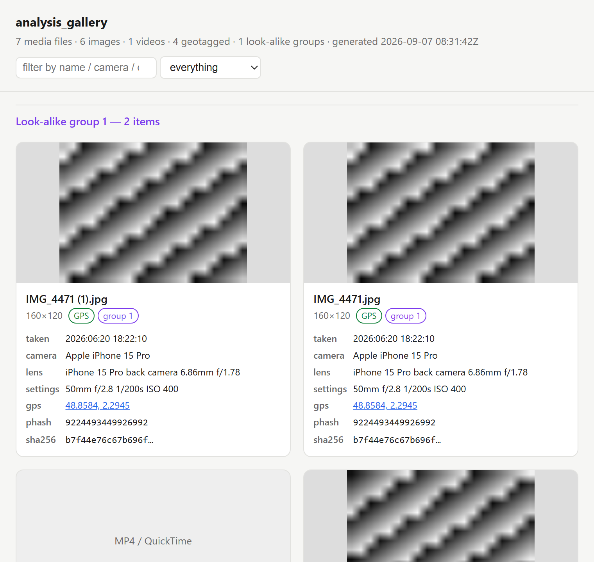

# analysis_gallery

**Picture and video gallery for an evidence set.** Walks a folder or a
mounted image, finds **every image and video by content signature**
(extension-independent), and pulls out **EXIF / QuickTime metadata, GPS
position, and capture timestamps**. With `--phash` it computes a perceptual
hash for each still image and **groups visually near-identical pictures** -
resized copies, re-saves, crops - that a byte-hash would miss. Output is
CSV / JSON or a single self-contained **HTML contact sheet**.


```
analysis_gallery scan /cases/evidence --html gallery.html
analysis_gallery scan /mnt/image --phash --csv pictures.csv
analysis_gallery scan /dcim --gps-only --json geo.json
analysis_gallery scan /export --category image --phash --threshold 6
analysis_gallery scan /photos --no-exif-only --csv stripped.csv
```

Pure **standard library**, zero third-party imaging packages: the
JPEG / PNG / GIF / BMP decoders used for hashing and thumbnails are
implemented in-tree.

### `--html` contact sheet

Every thumbnail, its metadata, a map link for geotagged files, and the
look-alike grouping, in one self-contained page that filters in the browser.



---

## Why it matters

* **Where and when** - EXIF `DateTimeOriginal` and GPS put a photo at a
  place and time; QuickTime `mvhd` / `©xyz` do the same for video. The tool
  converts GPS to decimal degrees and links each geotagged file to a map.
* **Provenance** - camera make / model / serial, lens, software, and the
  presence of a MakerNote say whether a picture came off a device or through
  an editor. `--no-exif-only` isolates the files whose metadata was
  **stripped** (often a sign of deliberate laundering or a messaging-app
  round-trip).
* **The same picture, again** - a perceptual hash matches a photo to its
  resized thumbnail, its re-compressed copy, or a lightly cropped version.
  `--phash` groups them so an examiner reviews one representative instead of
  fifty near-duplicates, and can tie a file on one device to a file on
  another.
* **One review surface** - the HTML contact sheet embeds every thumbnail
  (from the file's own EXIF thumbnail when present, otherwise a coarse
  decode) with its metadata, GPS link, and look-alike group, filterable in
  the browser with no server.

---

## Install

Requires **Python 3.11+**.

```bash
git clone https://github.com/mostafaimam/Forensics-Tools
cd Forensics-Tools/analysis/analysis_gallery
pip install .
```

or run it straight from the checkout with `python -m analysis_gallery`.

---

## Usage

### `scan`

```
analysis_gallery scan PATH [PATH ...] [options]
```

| option | effect |
|---|---|
| `--phash` | compute a dHash per still image and group look-alikes |
| `--threshold N` | max Hamming distance for a group (default 10; lower = stricter) |
| `--category image,video` | keep only one media class |
| `--gps-only` | keep only geotagged files |
| `--no-exif-only` | keep only images with no EXIF (stripped / re-saved) |
| `--include GLOB` / `--exclude GLOB` | filter by file name (repeatable) |
| `--min-size BYTES` | ignore files below this size |
| `--no-hash` | skip SHA-256 (faster) |
| `--max-decode-mp MP` | decode images up to this size for hashing / thumbnails |
| `--csv FILE` / `--json FILE` | write structured output |
| `--html FILE` | write a self-contained HTML contact sheet |
| `--thumb-box PX` | thumbnail bounding box for the HTML (default 220) |

Exit code is `0` when at least one media file was found, `1` when none were,
`2` on a bad path.

### `gui`

```
analysis_gallery gui [PATH ...]
```

A sortable, filterable table of the scan results with a details pane;
geotagged rows are highlighted. Export the current view to CSV / JSON.

---

## Output columns

`path`, `category`, `format`, `width`, `height`, `megapixels`, `size`,
`sha256`, `datetime_original`, `make`, `model`, `lens`, `iso`, `f_number`,
`exposure`, `focal_length`, `orientation`, `software`, `gps_lat`, `gps_lon`,
`gps_altitude`, `gps_timestamp`, `duration_s`, `has_exif`, `has_thumbnail`,
`phash`, `phash_group`, `notes`.

CSV is UTF-8 with a BOM and is formula-injection safe.

---

## Formats

| Container | Signature | Dimensions | Metadata | Decode (hash / thumb) |
|---|---|---|---|---|
| JPEG / JFIF / Exif | yes | yes | EXIF + GPS + embedded thumbnail | DC-only baseline / progressive |
| PNG | yes | yes | `tEXt` / `iTXt`, embedded `eXIf` | full (paletted / greyscale / truecolour, Adam7) |
| GIF | yes | yes | comment block | first frame |
| BMP / DIB | yes | yes | - | 1 / 4 / 8 / 24 / 32-bit |
| TIFF | yes | yes | EXIF + GPS | metadata only |
| WebP | yes | yes | EXIF if present | metadata only |
| HEIF / HEIC / AVIF | yes | yes (`ispe`) | - | metadata only |
| MP4 / MOV / M4V / 3GP | yes | yes (`tkhd`) | `mvhd` times, `©xyz` GPS, `©mak` / `©mod` | - |
| AVI | yes | yes (`avih`) | duration | - |
| Matroska / WebM, ASF / WMV, FLV, MPEG-PS, Ogg | yes | - | - | - |

The DC-only JPEG decoder reconstructs one pixel per 8x8 block, which is all a
perceptual hash or a contact-sheet thumbnail needs, at a fraction of a full
decode's cost. The in-tree decoders are still pure Python, so a large image
is slow: by default only images up to about 1.5 MP (PNG) or 3 MP (JPEG) are
decoded for hashing, and larger ones fall back to their embedded thumbnail or
are noted as un-hashed. Raise `--max-decode-mp` for a targeted photo set.

---

## Notes

* `phash_group` is `0` for a file with no near-duplicate. Groups are numbered
  by size, largest first.
* A JPEG's own EXIF thumbnail is used for the contact sheet and the
  perceptual hash whenever it is present - fast and exact to what the camera
  embedded.
* PST/RAW camera formats (`.cr3`, `.nef`, `.arw`, …) are TIFF-based; their
  metadata is read, but they are not decoded.
* Password recovery and steganography detection are out of scope.
