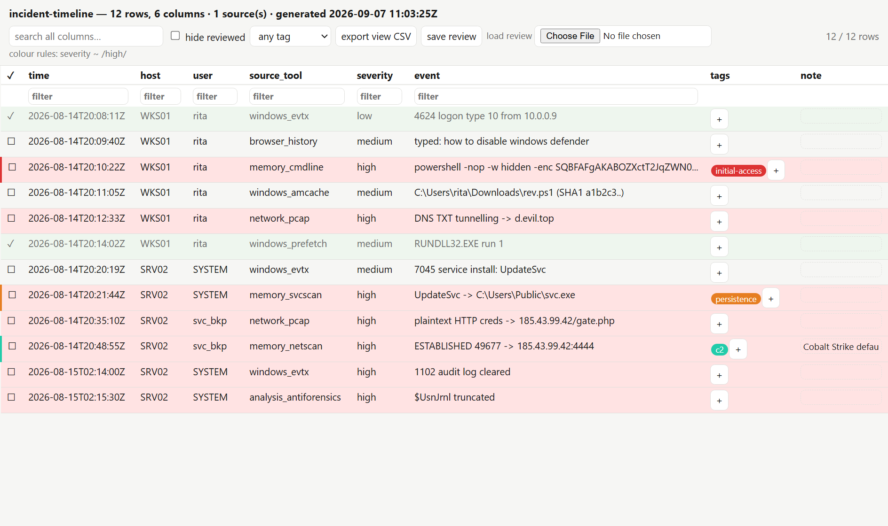

# analysis_view

**Review any tabular evidence in one place.** Loads CSV / TSV / JSON /
JSONL and basic `.xlsx` files, merges them into one table (with a
`_source` column), and produces a **self-contained interactive HTML
review page**: per-column filters, full-text search, multi-column sort,
conditional row colouring, and - saved into a sidecar file so the work
survives - **tags, a notes column and a reviewed flag** per row.



```
analysis_view mft.csv evtx.csv prefetch.csv --html review.html
analysis_view *.csv --filter 'severity=high' --export triage.csv
analysis_view timeline.csv --sort 'time:desc' --rule 'event~beacon=#f88'
analysis_view case.xlsx --review case.review.json --gui
```

It generalises the `analysis_timeline` viewer to *any* table, and it is
where the reconstruction actually happens - you tag the rows that matter,
note *why*, mark the rest reviewed, and hand over one HTML file.

Pure standard library - the `.xlsx` reader (shared strings + sheet XML) is
in-tree.

---

## The HTML page

Open it in any browser, no server:

* **filter** each column (a box under every header) and **search** across
  all of them;
* **sort** by clicking a header (click again to reverse; headers stack);
* **tag** a row (`+` in the tags cell) - each tag gets a colour, and the
  tag dropdown filters to one tag or to *untagged*;
* type a **note** inline; tick **✓** to mark a row **reviewed** and hide
  it with the *hide reviewed* toggle;
* **colour rules** (`--rule 'col~regex=#hex'`) shade matching rows;
* **export view CSV** downloads exactly what is on screen, with the tags /
  notes / reviewed columns appended;
* **save review** downloads a `review.json`; **load review** re-applies
  it (or a colleague's).

---

## Headless

| flag | |
|---|---|
| `--filter 'COL OP VAL'` (repeatable) | `=`, `!=`, `~` / `!~` (contains), `>` `>=` `<` `<=` (numeric); a bare word is a full-text match; `--or` to OR the clauses |
| `--search TEXT` | full-text filter |
| `--sort 'COL[:desc][,COL2…]'` | multi-column, timestamp- and number-aware |
| `--rule 'COL~REGEX=#hex'` | row-colour rule for the HTML |
| `--review FILE` | load a tags / notes / reviewed sidecar (and, with `--gui`, save back to it) |
| `--export FILE` | write the filtered view as CSV (`.json` for JSON) |
| `--delim` / `--sheet` | force a CSV delimiter / pick an xlsx sheet |

CSV output is UTF-8 with a BOM and formula-injection safe.

---

## GUI

`analysis_view --gui` opens a `tkinter` window with the same table:
select rows and **Tag** / **Reviewed** / **Note** them (keys `t` and
`r`), sort by clicking headers, filter with the search box, and **Export
CSV** / **Export HTML** / **Save review** from the button bar.

---

## Limitations (v0.1)

* The `.xlsx` reader handles shared strings, inline strings and numbers on
  the first (or `--sheet`-matched) worksheet; formulas are read as their
  cached value, dates as the raw serial number, styles are ignored.
* `.xls` (old binary) and `.ods` are not supported.
* Very large tables (> ~200 k rows) are better filtered with `--filter`
  before `--html`, since the whole table is embedded in the page.
* The review sidecar keys rows by a hash of their content + source +
  position; re-exporting a source with changed rows invalidates those
  keys.
