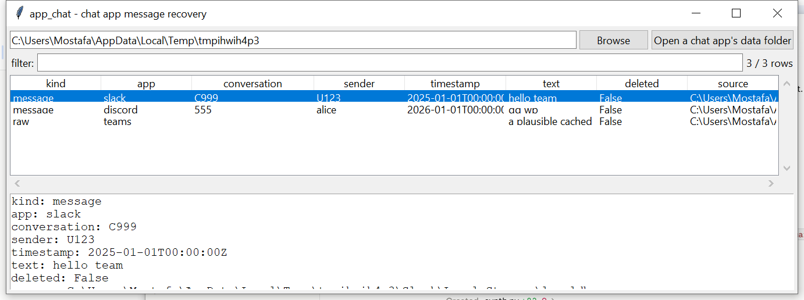

# app_chat

**Recover Slack and Discord messages from their local cache by
recognising the app's own public API JSON shape — reusing the LevelDB
reader `browser_localstorage` already built.**

Slack, Discord, and classic Microsoft Teams are Electron apps: they
cache data the same way any Chromium app does, in a Local Storage /
IndexedDB LevelDB directory. `app_chat` vendors the same from-scratch
LevelDB engine (`browser_localstorage`'s WAL log + SSTable + Snappy
reader) and, for every raw value it finds, carves out embedded JSON
objects and checks each one against Slack's and Discord's own
**documented public Web API message format** — a real, published
contract for both, not a guess at either client's internal storage
schema.

## Usage

```
app_chat "%APPDATA%\Slack"
app_chat ~/AppData/Roaming --app slack,discord --csv messages.csv
app_chat --gui
```

The target is a folder to search recursively — either an app's own
data directory, or a broader profile root covering several apps at
once.



| flag | effect |
|------|--------|
| `--app slack,discord,teams` | limit to specific apps (default: all) |
| `--deleted-only` | only rows whose own LevelDB record is a tombstone |
| `--csv` / `--json` | UTF-8-with-BOM, formula-injection-safe output |

## How each app is handled

- **Slack / Discord (`kind: message`)** — every LevelDB value is
  scanned for embedded JSON objects; each candidate is checked against
  Slack's `{"type": "message", "text": ..., "user": ..., "ts": ...}`
  shape and Discord's `{"id": ..., "content": ..., "author": {...},
  "timestamp": ..., "channel_id": ...}` shape. A match becomes a
  normalised row: app, conversation, sender, timestamp, text.
- **Classic Microsoft Teams (`kind: raw`)** — LevelDB directories under
  a Teams-named path are located and their values are carved for
  readable text, without claiming to decode a specific message schema
  (Teams' internal object format is less confidently documented than
  Slack's or Discord's own public API).

LevelDB is append-only, so a message evicted or deleted from the local
cache is often still recoverable from an earlier `.log`/`.ldb` record —
the same property `browser_localstorage` relies on. `--deleted-only`
surfaces records whose *own* entry is a tombstone (an empty value, no
message content) — the earlier record holding the actual message text
is a separate row and won't itself be flagged deleted, since it wasn't
the record that got deleted.

## Why it matters

A message a user deleted from their end, or one evicted from the local
cache as newer messages arrived, is still evidence of what was said —
and finding it means recognizing the vendor's own real API format
inside an opaque local database, not depending on Slack's or Discord's
servers still having it.

## Limitations (v0.1)

- **Signal Desktop, WhatsApp Desktop, and Telegram Desktop are out of
  scope for v0.1.** Signal's database needs a key from the app's own
  `config.json` this project has no verified way to apply; WhatsApp
  Desktop's local storage format isn't confidently known; Telegram's
  `tdata` is itself encrypted by the account passcode.
- **Teams data is carved as raw text, not decoded into messages** — its
  internal object schema isn't confidently known the way Slack's and
  Discord's public API formats are.
- **False negatives are expected.** A message shape only matches when
  the *entire* cached value is (or contains) a JSON object with every
  required field present and correctly typed — a client that caches
  messages in a different wrapper structure, or a future API version
  that changes field names, won't be recognised.
- No attachment/file extraction, no per-conversation HTML transcript
  (both mentioned in the original spec stub) in v0.1.

## Tests

`tests/_synth.py` builds real LevelDB `.log` files (correct
CRC32C-checksummed WAL records, the same fixture approach validated in
`browser_localstorage`) containing genuine Slack- and Discord-shaped
message JSON, plus a Teams-shaped raw cache entry. Tests cover JSON
carving (plain, embedded in noise, and nested), the Slack and Discord
shape matchers (including rejecting non-message/incomplete objects),
message content surviving a later deletion of the same key, Teams raw
carving, multi-app collection, and the CLI (`--app`, `--csv`/`--json`).

```
cd apps/app_chat && python -m pytest -q
```
