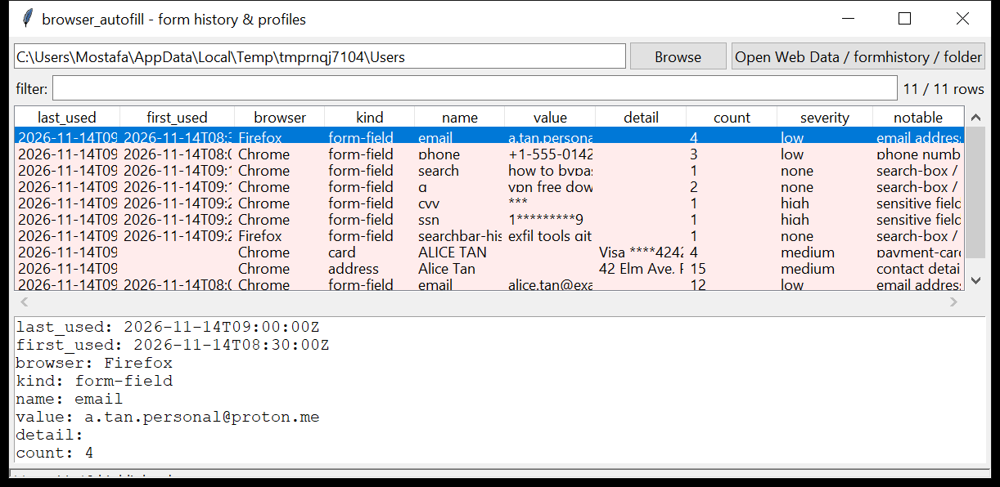

# browser_autofill

**What the user typed into forms, the addresses they saved, and card
metadata — never the card number.** `browser_autofill` reads the Chromium
`Web Data` store (`autofill` form-field history, `autofill_profiles` /
`contact_info` / `local_addresses` address profiles, and `credit_cards` /
`masked_credit_cards` metadata) and Firefox `formhistory.sqlite`.

Every autocompleted field is one row with its first / last use and use count.
CVV / SSN / PIN / password-shaped field values are **masked**; card numbers are
never read or emitted — only the network, last four, expiry and use count.
Read-only and WAL-safe. Pure Python standard library.



## Usage

```
browser_autofill './Web Data'
browser_autofill /mnt/evidence/Users --csv autofill.csv
browser_autofill ./profile --kind form-field --grep email
browser_autofill ./profile --notable-only --min-severity medium
browser_autofill ./Users --gui
```

Point it at a `Web Data` / `formhistory.sqlite` file, or at a folder to walk.

| flag | effect |
|------|--------|
| `--kind {form-field,address,card}` | one record type |
| `--browser NAME` | one browser only |
| `--grep REGEX` | match field name / value / detail |
| `--notable-only` / `--min-severity` | filter by the flags raised |
| `--csv PATH` / `--json PATH` | write the table instead of the text report |

## Why it matters

Form history is a record of intent expressed in the user's own words — search
queries typed into a site's search box, an email address or username entered on
a login page, a shipping address, the name on a card. It survives a history
clear (form history is a separate store) and is timestamped per field.

## Flags

| flag | meaning |
|------|---------|
| `sensitive field name (X) - value masked` | field name matches `pass` / `pwd` / `pin` / `cvv` / `ssn` / `card number` / … |
| `payment-card metadata saved in the browser` | a `credit_cards` row (metadata only) |
| `contact details in a saved address profile` | an address profile with an email / phone |
| `search-box / query field` | the field is a site search box (`q`, `search`, `searchbar-history`, …) |
| `email address in form history` / `phone number in form history` | by field name or value shape |

## Limitations (v0.1)

- **Values that are still encrypted** (Chromium stores some autofill values
  encrypted with the OS key) are shown as stored — this tool does not decrypt.
- The address-profile schema changes often between Chromium versions; this
  reads the first of `autofill_profiles` / `contact_info` / `local_addresses`
  that is present and pulls the common columns.
- Card metadata only. There is no code path that reads a full card number.
- Safari has no equivalent form-history store.

## Tests

```
cd browser/browser_autofill && python -m pytest -q
```

Synthetic `Web Data` (form fields, an address profile, a card row) and a
Firefox `formhistory.sqlite` exercise the parsers, the masking of sensitive
values, the flags and the CLI — including a check that no full PAN appears in
the output.
