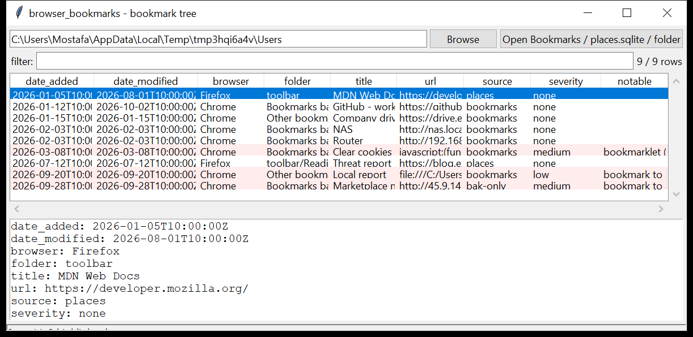

# browser_bookmarks

**The bookmark tree, with timestamps and the deleted ones.**
`browser_bookmarks` reads the Chromium `Bookmarks` JSON — and diffs it against
`Bookmarks.bak` to surface entries that were removed — and Firefox
`moz_bookmarks` in `places.sqlite`.

Each bookmark is one row: the full folder path (`Bookmarks Bar/Work/Tools`),
title, URL, and the dates it was added and last modified. Bookmarklets
(`javascript:` URLs), `file://` / `ftp://` targets, raw-IP hosts and
`.bak`-only survivors are flagged. Read-only and WAL-safe. Pure Python
standard library.



## Usage

```
browser_bookmarks ./Bookmarks
browser_bookmarks /mnt/evidence/Users --csv bookmarks.csv
browser_bookmarks ./profile --folder Admin --grep 'onion|drive'
browser_bookmarks ./profile --deleted-only
browser_bookmarks ./Users --gui
```

Point it at a `Bookmarks` / `places.sqlite` file, or a folder to walk.

| flag | effect |
|------|--------|
| `--folder SUBSTR` | bookmarks whose folder path contains this |
| `--grep REGEX` | match title / URL / folder |
| `--deleted-only` | only entries found only in `Bookmarks.bak` |
| `--browser NAME` | one browser only |
| `--notable-only` / `--min-severity` | filter by the flags raised |
| `--csv PATH` / `--json PATH` | write the table instead of the text report |

## Why it matters

Bookmarks are deliberate — a user saved that page on purpose, and the
`date_added` says when they first cared about it. The `Bookmarks.bak` (Chromium
keeps the previous version) is a small, free source of *deleted* bookmarks: a
site removed from the bar right before an interview or a search warrant is
worth knowing about.

## Flags

| flag | meaning |
|------|---------|
| `bookmarklet (javascript: URL)` | executable code stored as a bookmark |
| `bookmark to a local file (file://)` | points at a path on the machine |
| `bookmark to an FTP resource` | `ftp://` / `sftp://` target |
| `bookmark to a browser-internal page` | `chrome://` / `about:` / `chrome-extension://` |
| `bookmark to a raw IP address` | host is a bare public IP |
| `bookmark to a non-standard port (N)` | not 80 / 443 / 8080 / 8443 |
| `only present in Bookmarks.bak (deleted bookmark)` | in the backup but not the live file |

## Limitations (v0.1)

- The `Bookmarks.bak` diff shows what was in the *last* saved version — a
  bookmark added and deleted between two Chromium writes is not captured.
- Firefox keeps a bookmark-change history in `moz_bookmarks` /
  `moz_places` deletions and in JSON backups (`bookmarkbackups/*.jsonlz4`) —
  those backups are not parsed yet (only the live `places.sqlite`).
- Chromium bookmark `date_last_used` is recorded only in recent builds.
- Safari bookmarks live in `Bookmarks.plist` (binary plist) — not read yet.

## Chain of custody

Every run writes a `<output>.manifest.json` sidecar (via the shared
`tracelib`) recording the tool version, the exact command line,
`--case-id` / `--examiner` / `--evidence-id`, start and finish time (UTC),
the host, and the **SHA-256 of every input and output file**. CSV rows carry
`evidence_source` / `parser_confidence` / `tz_provenance` columns; JSON is
wrapped as `{"manifest": {...}, "records": [...]}`. `--no-provenance`
disables it; `--max-input-bytes` / `--max-records` / `--wall-seconds` bound a
run against hostile or oversized evidence.

## Tests

```
cd browser/browser_bookmarks && python -m pytest -q
```

Synthetic Chromium `Bookmarks` (+ a `.bak` with an extra entry) and a Firefox
`places.sqlite` exercise the tree walk, the folder-path reconstruction, the
`.bak` diff, every flag and the CLI.
