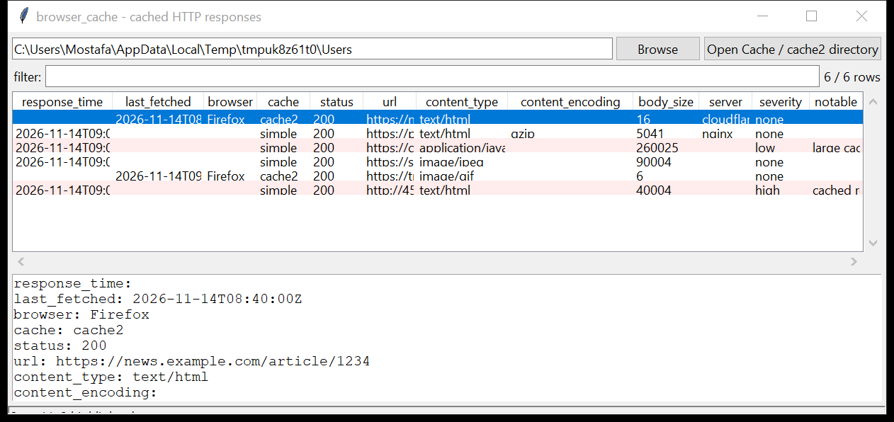

# browser_cache

**The pages the browser kept — with the bytes.** `browser_cache` reads the
Chromium **Simple Cache** and the Firefox **cache2** store and lists every
cached HTTP response: URL, status, content-type, size, and the request /
response / last-fetched / expiry timestamps. With `--extract` it writes the
response bodies to disk (`gzip` / `deflate` decoded), each hashed with SHA-256.

Both parsers are from scratch — the Simple Cache `SimpleFileHeader` /
`SimpleFileEOF` layout and the `HttpResponseInfo` pickle, and the cache2
`data + metadata` layout (hash chunks, header, key, `response-head` element).
Read-only. Pure Python standard library.



## Usage

```
browser_cache ./Cache
browser_cache /mnt/evidence/Users --csv cache.csv
browser_cache ./Cache --extract ./bodies --grep '\.js$'
browser_cache ./cache2 --notable-only --min-severity high
browser_cache ./Cache --content-type image --min-size 10000
browser_cache ./Users --gui
```

Point it at a `Cache` / `cache2` directory (or an individual entry file), or at
a folder to walk — it finds both a Chromium `Cache_Data` and a Firefox
`cache2/entries` under the tree.

| flag | effect |
|------|--------|
| `--extract DIR` | write each cached body into `DIR` (name from the URL, then content-type) |
| `--no-decode` | keep bodies `gzip` / `deflate` encoded |
| `--min-size BYTES` | ignore bodies smaller than this |
| `--content-type SUBSTR` | substring match on content-type |
| `--grep REGEX` | match the URL |
| `--notable-only` / `--min-severity` | filter by the flags raised |
| `--csv PATH` / `--json PATH` | write the table instead of the text report |

## Why it matters

The cache is a copy of what a site actually served — the rendered HTML, the
script that ran, the image that was shown — timestamped and keyed by URL. It
survives a history clear (the two stores are separate) and holds the payload
itself, so a suspicious download or a page that no longer exists can be
recovered and hashed straight from disk.

## Flags

| flag | meaning |
|------|---------|
| `cached response body is an executable` | `MZ` / `ELF` body |
| `content-type / body mismatch (says X, is Y)` | the declared type and the magic bytes disagree |
| `cached URL is an executable / installer` | `.exe` / `.msi` / `.dmg` / `.apk` in the URL |
| `cached archive` | zip / rar / 7z / gzip body or URL |
| `cached from a raw IP host` | the URL host is a bare public IP |
| `large cached script` | a JavaScript response over 200 KB |
| `body shorter than Content-Length (partial cache)` | the cached body is incomplete |

## Limitations (v0.1)

- The Chromium **block-file cache** (`data_0`–`data_3` + `f_*` external files,
  used by older builds and still by some subsystems) is **not** parsed — only
  the Simple Cache. Firefox's older `Cache/` (v1) is likewise out of scope.
- `Content-Encoding: br` (Brotli) bodies are listed but not decoded (no
  standard-library Brotli).
- The cache2 metadata offset is read from the file's trailing `uint32`; a
  malformed entry falls back to scanning for `response-head` and may miss some
  fields.
- Chromium `_1` (stream 2 / alt-data) and `_s` (sparse) files are not read.
- No decryption of any store.

## Tests

```
cd browser/browser_cache && python -m pytest -q
```

Hand-built Simple Cache `_0` entries (with a valid `SimpleFileEOF` pair and an
`HttpResponseInfo` pickle) and Firefox cache2 entry files exercise both
parsers, `gzip` decode, magic-byte detection, `--extract` hashes, the flags and
the CLI.
