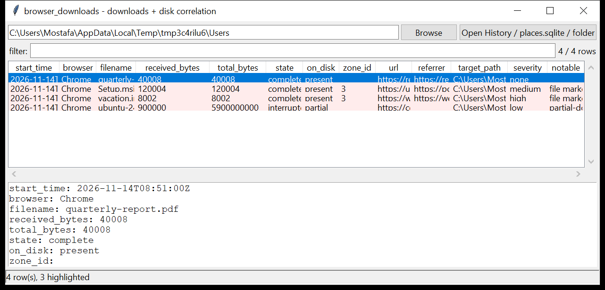

# browser_downloads

**Every file the browser saved — and what happened to it on disk.**
`browser_downloads` reads the download history from the Chromium family
(`History.downloads` + `downloads_url_chains`) and Firefox (`places.sqlite`
annotations and legacy `downloads.sqlite` / `moz_downloads`), then correlates
each record with the filesystem:

- **`.crdownload` / `.part` / `.download` / `.opdownload` leftovers** — an
  interrupted or in-progress transfer, kept even when the history row is gone
- **the NTFS `:Zone.Identifier` stream** — Mark-of-the-Web `ZoneId`,
  `ReferrerUrl` and `HostUrl` on the saved file (read from the live ADS, or
  from `name:Zone.Identifier` / `name_Zone.Identifier` sidecar files in an
  extracted tree)
- **the saved file itself** — present / missing / partial, its size, and
  (with `--hash`) its SHA-256

Every download becomes one normalised row. Read-only and WAL-safe. Pure Python
standard library.



## Usage

```
browser_downloads ./History
browser_downloads /mnt/evidence/Users --csv downloads.csv
browser_downloads ./profile --notable-only --hash
browser_downloads ./History --grep '\.exe$|\.iso$'
browser_downloads ./Users --on-disk partial      # unfinished downloads
browser_downloads ./Users --gui
```

Point it at a `History` / `places.sqlite` file, or at a folder — it walks the
folder for both history stores and download artefacts and merges them (records
that point at the same saved path are one download).

| flag | effect |
|------|--------|
| `--no-fs` | history stores only, skip the filesystem scan |
| `--hash` | SHA-256 the on-disk file for each download (≤ 512 MB) |
| `--on-disk {present,missing,partial}` | filter by the file's fate |
| `--browser NAME` | one browser only |
| `--notable-only` / `--min-severity` | filter by the flags raised |
| `--grep REGEX` | match filename / URL / target path |
| `--csv PATH` / `--json PATH` | write the table instead of the text report |

## Why it matters

The download list is the shortest path from "what did they bring onto this
machine" to the actual bytes. The history row gives the source URL and the
referrer; the `Zone.Identifier` confirms it came from the internet and often
records a *different* host and referrer than the history did; the `.crdownload`
left behind is the download that was interrupted before anyone could look.

## Flags

| flag | meaning |
|------|---------|
| `double extension (disguised executable)` | `invoice.pdf.exe`, `photo.jpg.scr`, … |
| `executable / script download (.ext)` | `.exe .dll .msi .ps1 .vbs .hta .lnk .jar` … |
| `macro-enabled document download` | `.docm` / `.xlsm` / `.pptm` |
| `MIME / extension mismatch` | server said `image/jpeg`, the file is `.exe` |
| `downloaded from a raw IP address` | the download host is a bare public IP |
| `browser danger flag: X` | Chromium's own `danger_type` was set |
| `internet-zone (MOTW) executable / archive on disk` | `ZoneId=3` on a saved binary |
| `referrer host differs from download host` | a redirected executable / archive download |
| `incomplete download (state)` | interrupted / failed / cancelled with bytes received |
| `partial-download file left on disk (name)` | a `.crdownload` / `.part` was found |

## Limitations (v0.1)

- **Safari** stores downloads in `~/Library/Safari/Downloads.plist` (a binary
  plist), which this tool does not read yet — Chromium and Firefox only.
- `Zone.Identifier` correlation needs the ADS to be reachable: the live NTFS
  stream, or a sidecar file an imaging tool preserved. A plain file copy
  loses it.
- SHA-256 is skipped for files over 512 MB.
- The filesystem scan only walks folders passed on the command line (and the
  folders that contained a history store) — it does not follow the
  `target_path` of a download to an unrelated directory unless that directory
  was also given.

## Chain of custody

Every run writes a `<output>.manifest.json` sidecar (via the shared
`tracelib`) recording the tool version, the exact command line,
`--case-id` / `--examiner` / `--evidence-id`, start and finish time (UTC),
the host, and the **SHA-256 of every input and output file**. CSV rows carry
`evidence_source` / `parser_confidence` / `tz_provenance` columns; JSON is
wrapped as `{"manifest": {...}, "records": [...]}`. `--no-provenance`
disables it; `--max-input-bytes` / `--max-records` / `--wall-seconds` bound a
run against hostile or oversized evidence.

## Tests

```
cd browser/browser_downloads && python -m pytest -q
```

Synthetic Chromium `History` and Firefox `places.sqlite` stores plus a
filesystem tree (`.crdownload` leftovers, standalone `Zone.Identifier` files,
present / missing targets) exercise the parsers, the merge / correlation and
every flag.
