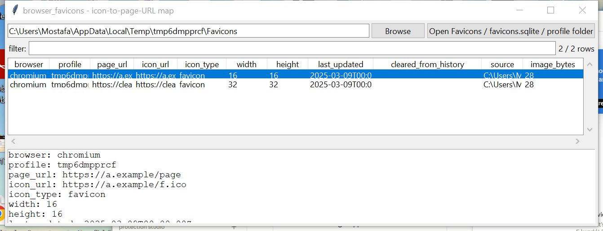

# browser_favicons

**The icon cache doesn't know "clear browsing data" happened.**

`browser_favicons` reads Chromium's `Favicons` database
(`icon_mapping` → `favicons` → `favicon_bitmaps`) and Firefox's
`favicons.sqlite` (the modern `moz_icons` / `moz_pages_w_icons` /
`moz_icons_to_pages` schema) — the icon-to-page-URL map browsers keep
purely to make tabs and bookmarks render fast. Because it's a UI cache
rather than user-visible history, many "clear browsing data" flows leave
it alone, and a page's icon can outlive its own `History` row.

## Usage

```
browser_favicons Favicons
browser_favicons "User Data/Default" --history History --csv icons.csv
browser_favicons Favicons --extract-dir ./icons
browser_favicons --gui
```

The target may be a `Favicons` / `favicons.sqlite` file directly, or a
directory to search recursively.



| flag | effect |
|------|--------|
| `--history PATH` | cross-reference page URLs against a `History` / `places.sqlite` |
| `--cleared-only` | (with `--history`) only rows missing from it |
| `--extract-dir DIR` | write every cached icon image to disk, named `icon_NNNN.<ext>` (format sniffed from magic bytes: PNG / ICO / GIF / JPEG / BMP / SVG) |
| `--csv` / `--json` | UTF-8-with-BOM, formula-injection-safe output |

`--history` is CLI-only in v0.1 (not wired into `--gui`).

## Why it matters

A favicon entry for a page URL that no longer appears anywhere in
`History` is direct evidence the visit happened and was later erased —
`--history` automates exactly that comparison. Extracted icon images can
also identify a site even when its URL was obfuscated, shortened, or
already garbled by partial deletion.

## Limitations (v0.1)

- **Firefox pre-55 (`moz_favicons`, no `moz_icons` table) is not
  supported** — that schema predates the current one by close to a
  decade; only the modern `moz_icons` layout is read.
- The `--history` cross-check is an **exact URL string match**; a
  trailing-slash or query-string difference between the favicon's
  `page_url` and the history row will read as "cleared" even if the
  page is technically still there. Treat a hit as a strong lead, not
  proof.
- No favicon-image content analysis (perceptual hashing, brand-logo
  matching) — `--extract-dir` hands you the files for that.

## Tests

`tests/_synth.py` builds real SQLite databases matching both schemas
(with an embedded PNG-magic image blob). Tests cover the Chromium join,
the Firefox reader, the `--history` cross-reference (both the flagged
and not-flagged cases, and a corrupt-history warning path), no-store
warnings, image indexing, and the CLI (`--extract-dir`, `--csv`/`--json`,
`--cleared-only`).

```
cd browser/browser_favicons && python -m pytest -q
```
