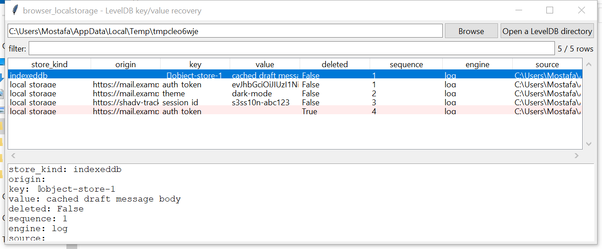

# browser_localstorage

**A from-scratch LevelDB reader: every key/value ever written, not just
what's live today.**

Chromium's Local Storage and IndexedDB are backed by
[LevelDB](https://github.com/google/leveldb) databases on disk — a
write-ahead log (`*.log`) of recent writes plus sorted-string table
files (`*.ldb`) the log periodically compacts into. `browser_localstorage`
implements the LevelDB on-disk format from scratch (varint decoding,
CRC32C record/block checksums, the `WriteBatch` log-record layout, and
the SSTable index/data-block structure — including a pure-Python Snappy
block decompressor, since blocks are Snappy-compressed by default) and
reads it directly, standard library only.

**LevelDB never overwrites a record in place.** A later write or a
deletion is a *new* record with a higher sequence number; the old record
lingers in an older `.log` or `.ldb` file until compaction removes it.
This tool surfaces every record it finds — current, overwritten, and
deleted — with its sequence number, so an overwritten auth token or a
"deleted" chat draft is often still recoverable.

## Usage

```
browser_localstorage "Local Storage/leveldb"
browser_localstorage ~/AppData/Local/Google/Chrome/User Data --csv rows.csv
browser_localstorage --gui
```

The target may be a LevelDB directory directly, or a root to search
recursively (any directory containing `.log`/`.ldb` files, or a
`CURRENT` file, is treated as one).



| flag | effect |
|------|--------|
| `--origin TEXT` | only `local_storage` rows whose origin contains this |
| `--deleted-only` | only tombstone (deletion) records |
| `--csv` / `--json` | UTF-8-with-BOM, formula-injection-safe output |

## How each directory is decoded

- **`Local Storage/leveldb`** — Chromium's own key convention is
  applied: `_` + origin + `\x00` + the page's JS key, with values
  carrying a 1-byte encoding tag (UTF-16LE or Latin-1). A row that
  doesn't match this shape still comes through with its raw key/value
  text so nothing is silently dropped (`store_kind` stays `local_storage`
  but reflects a raw fallback in that case).
- **`IndexedDB/*.leveldb` and anything else** — read by the same engine
  and reported as raw key/value pairs (`store_kind: indexeddb` or
  `leveldb`), without attempting IndexedDB's own object-store value
  schema (see Limitations).

## Why it matters

Local Storage is the backing store for a huge share of web-app state —
auth tokens, drafts, feature flags, chat message caches — much of which
never touches a cookie or the history database at all. Because LevelDB
keeps stale versions around until compaction, this tool routinely
recovers a value the user (or the app) already overwrote or "deleted".

## Limitations (v0.1)

- **IndexedDB object-store values are not deserialized.** IndexedDB's
  own key/value serialization (structured-clone-based, versioned per
  object store) is a separate, more complex format on top of LevelDB;
  v0.1 surfaces the raw bytes IndexedDB itself stored, which is still
  useful for `analysis_search` / `utilities_strings` follow-up, but does
  not reconstruct object-store records.
- **The Local Storage key/value schema (`_origin\x00key`, the value
  type-byte) is Chromium-internal and undocumented** — stable for years,
  but not a published spec, so a future Chromium change could shift it.
  Rows that don't match are still reported (see above) rather than
  dropped.
- **Compaction can remove old records before this tool ever sees them** —
  this reads whatever `.log`/`.ldb` files are present on disk; a fully
  compacted database only has its current values.
- Snappy support covers block *decompression* only (this tool never
  writes); the framing/compression type must be `0` (none) or `1`
  (Snappy) — a store using Zstd compression (a newer, optional LevelDB
  fork feature) is not supported.
- No MANIFEST/CURRENT parsing — this reads every `.log`/`.ldb` file
  present rather than reconstructing which files the DB currently
  considers live, which is exactly what makes stale/deleted values
  visible but means a value can appear more than once across files at
  different sequence numbers; sort by `sequence` to find the latest.

## Tests

`tests/_synth.py` builds real `.log` files (correct CRC32C-checksummed
`WriteBatch` records) and real `.ldb` SSTables (correct footer, index
block, data block, and a genuine Snappy-compressed block via a literal
-only encoder in `tests/_snappy_encode.py`) by hand. Tests cover a known
CRC32C test vector, varint round-tripping, Snappy round-tripping and a
rejected corrupt-offset case, log value/deletion decoding and CRC
-rejection, uncompressed and Snappy-compressed SSTable reads, the Local
Storage key/value schema (including its Latin-1 value path and the
unmatched-key fallback), directory classification (`local_storage` vs.
`indexeddb`), recovering a deleted value alongside its tombstone, and
the CLI (`--csv`/`--json`, `--origin`).

```
cd browser/browser_localstorage && python -m pytest -q
```
