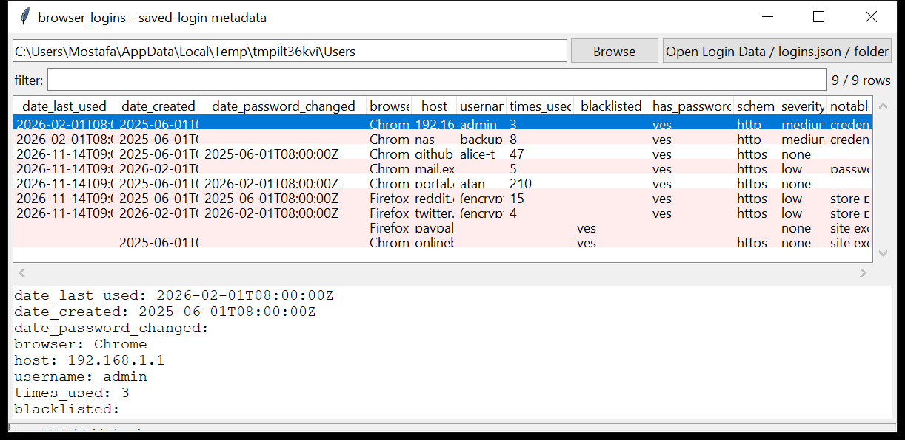

# browser_logins

**Which sites had a saved password — never the password itself.**
`browser_logins` lists the saved-credential *metadata* from Chromium
`Login Data` and Firefox `logins.json`: origin, sign-on realm, username,
created / last-used / password-changed times, use count, and the never-save
exclusion list.

The encrypted password blob is **never decrypted or emitted** — the tool
reports only that one exists. Read-only and WAL-safe. Pure Python standard
library.



## Usage

```
browser_logins './Login Data'
browser_logins /mnt/evidence/Users --csv logins.csv
browser_logins ./profile --host github.com
browser_logins ./profile --username alice
browser_logins ./Users --notable-only
browser_logins ./Users --include-blacklist
browser_logins ./Users --gui
```

Point it at a `Login Data` / `logins.json` file, or a folder to walk.

| flag | effect |
|------|--------|
| `--host SUBSTR` / `--username SUBSTR` | filter |
| `--browser NAME` | one browser only |
| `--include-blacklist` | include never-save entries (hidden by default) |
| `--notable-only` / `--min-severity` | filter by the flags raised |
| `--csv PATH` / `--json PATH` | write the table instead of the text report |

The text report lists **findings** (a host with 5+ saved credentials) above the
record list.

## Why it matters

The saved-login list is an inventory of the accounts the user cared enough
about to store — with a `last_used` timestamp per credential and a
`password_changed` date that often marks a security event. It says *which*
services were in play without ever exposing a secret. The never-save list is
its own signal: the sites the user deliberately kept out of the password
manager.

## What is reported (and what is not)

| reported | not reported |
|----------|--------------|
| origin URL, sign-on realm, host | the password (encrypted blob, left alone) |
| username (Chromium) | the Firefox username (also encrypted — shown as `(encrypted)`) |
| created / last-used / password-changed times, use count | any decrypted value |
| whether an encrypted password blob is present | the OS / keychain / DPAPI key |
| the never-save exclusion list | |

## Flags

| flag | meaning |
|------|---------|
| `credential stored for an http:// (cleartext) origin` | the sign-on page was not HTTPS |
| `credential for a bare-IP origin` | login saved for `http://192.168.1.1/` etc. |
| `credential for a non-FQDN host` | single-label host (`nas`, `router`) |
| `password saved with no username` | a password blob with an empty username |
| `store protected by a Primary Password …` | Firefox `key4.db` looks like it has a primary password set — values are not recoverable without it |
| `site excluded from saving (never-save list)` | the user chose "never for this site" |

## Limitations (v0.1)

- **Metadata only, by design.** Decryption is out of scope — a separate
  `analysis_dpapi` / keychain path would be needed and is not built.
- The Firefox Primary-Password detection is a heuristic on `key4.db`
  structure, not a definitive check.
- Chromium `Login Data For Account` (signed-in / account-scoped store) is read
  the same way as `Login Data` when present.
- Safari stores credentials in the system Keychain, not a browser file — out
  of scope.

## Chain of custody

Every run writes a `<output>.manifest.json` sidecar (via the shared
`tracelib`) recording the tool version, the exact command line,
`--case-id` / `--examiner` / `--evidence-id`, start and finish time (UTC),
the host, and the **SHA-256 of every input and output file**. CSV rows carry
`evidence_source` / `parser_confidence` / `tz_provenance` columns; JSON is
wrapped as `{"manifest": {...}, "records": [...]}`. `--no-provenance`
disables it; `--max-input-bytes` / `--max-records` / `--wall-seconds` bound a
run against hostile or oversized evidence.

## Tests

```
cd browser/browser_logins && python -m pytest -q
```

Synthetic `Login Data` and `logins.json` (+ `key4.db`) stores exercise the
parsers, the per-host findings, every flag and the CLI — with an explicit check
that no password blob bytes reach the output.
