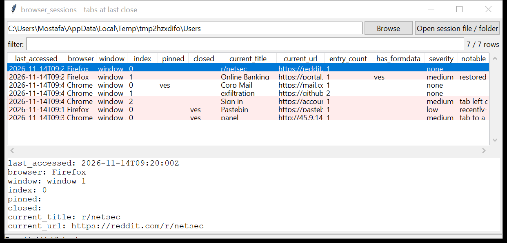

# browser_sessions

**The tabs that were open when the browser last closed.** `browser_sessions`
reconstructs the browsing session from:

- **Chromium** — the SNSS command stream in `Sessions/Session_*` and
  `Sessions/Tabs_*`, plus `Last Session` / `Current Session` / `Last Tabs` /
  `Current Tabs` (magic `SNSS`, a from-scratch `base::Pickle` reader)
- **Firefox** — `sessionstore.jsonlz4` and `sessionstore-backups/*.jsonlz4`
  (a bundled `mozLz4` container decoder + a from-scratch LZ4 block
  decompressor — no `lz4` package), and legacy plain `sessionstore.js`

Each tab is one row: window, position, pinned state, current URL and title,
navigation-history depth (with the recent back-stack), last-accessed time, and
whether it was a *recently-closed* tab retained in the store. Restored form
data, sign-in pages and closed-tab retention are flagged. Read-only. Pure
Python standard library.



## Usage

```
browser_sessions './Last Session'
browser_sessions /mnt/evidence/Users --csv tabs.csv
browser_sessions ./profile --closed-only
browser_sessions ./Users --grep 'mail|drive|onion'
browser_sessions ./Users --notable-only
browser_sessions ./Users --gui
```

Point it at a session file, or a folder to walk (it finds both Chromium and
Firefox session files).

| flag | effect |
|------|--------|
| `--closed-only` / `--open-only` | recently-closed vs. still-open tabs |
| `--browser NAME` | one browser only |
| `--grep REGEX` | match URL / title / history |
| `--notable-only` / `--min-severity` | filter by the flags raised |
| `--csv PATH` / `--json PATH` | write the table instead of the text report |

The text report prints **findings** (30+ open tabs, 8+ tabs on one host) above
the tab list.

## Why it matters

The session store is a snapshot of what the user was doing at a single moment —
the tabs they had open, in order, with the page they were on and the pages they
had navigated back from. The recently-closed list holds tabs they shut
deliberately, and Firefox keeps the unsent **form data** in a restored tab,
which can include a username typed into a login page.

## Flags

| flag | meaning |
|------|---------|
| `restored form data preserved in the session` | Firefox kept `formdata` for the tab (unsent field values) |
| `tab left on a sign-in / auth page` | URL path is `/login`, `/oauth`, `/sso`, `accounts.`, … |
| `tab pointing at a local file (file://)` | a local path was open in a tab |
| `tab to a raw IP address` | the tab host is a bare public IP |
| `recently-closed tab retained in the session store` | a closed tab still recoverable from the store |

## Limitations (v0.1)

- The Chromium **tab-restore** streams (`Last Tabs` / `Current Tabs` /
  `Tabs_*`) use a slightly different command set — they are parsed
  best-effort and may yield fewer fields than the `Session_*` streams.
- SNSS `SerializedNavigationEntry` has many version-dependent trailing
  fields; this reads the tab id, entry index, URL and title and stops —
  enough for the timeline, not the full navigation record.
- Encrypted SNSS (`kFileVersion3`, some enterprise configs) is not decrypted.
- Safari session state lives in `LastSession.plist` (binary plist) — not read
  yet.

## Chain of custody

Every run writes a `<output>.manifest.json` sidecar (via the shared
`tracelib`) recording the tool version, the exact command line,
`--case-id` / `--examiner` / `--evidence-id`, start and finish time (UTC),
the host, and the **SHA-256 of every input and output file**. CSV rows carry
`evidence_source` / `parser_confidence` / `tz_provenance` columns; JSON is
wrapped as `{"manifest": {...}, "records": [...]}`. `--no-provenance`
disables it; `--max-input-bytes` / `--max-records` / `--wall-seconds` bound a
run against hostile or oversized evidence.

## Tests

```
cd browser/browser_sessions && python -m pytest -q
```

A hand-built SNSS stream (multi-entry tabs, pinned, closed, last-active time)
and a `mozLz4`-compressed `sessionstore` (open tabs, a tab with `formdata`, a
closed tab) exercise the Pickle reader, the LZ4 / `mozLz4` decoders, the flags
and the CLI.
