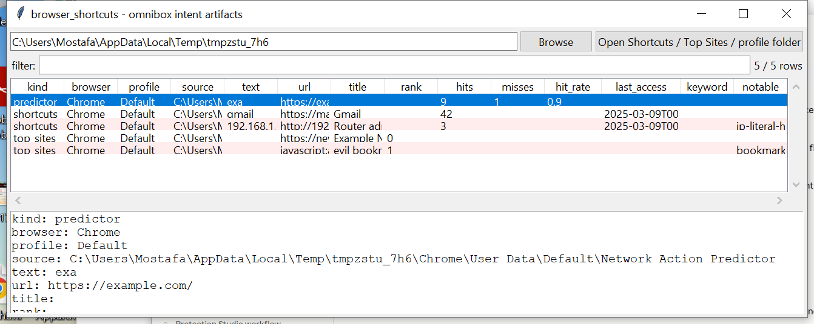

# browser_shortcuts

**Browsing intent that survives a "clear history" click.**

`browser_shortcuts` reads three small Chromium SQLite stores that record
what the user *meant* to do in the address bar and new-tab page, kept
separate from `History` itself:

- **`Shortcuts`** (`omni_box_shortcuts`) — every typed-text → chosen-URL
  pair the omnibox has learned, with a hit count and last-access time.
  This is autocomplete *training data*: it survives clearing `History`
  because Chromium treats it as a separate, smaller cache.
- **`Top Sites`** (`top_sites`) — the ranked tiles shown on the new-tab
  page (site frequency), independent of the history list.
- **`Network Action Predictor`** (`network_action_predictor`) — per
  typed-prefix hit/miss counts the browser uses to decide whether to
  pre-resolve or pre-connect a predicted destination; a high hit count
  for a prefix is evidence of a frequently, deliberately typed URL.

## Usage

```
browser_shortcuts Shortcuts
browser_shortcuts "~/AppData/Local/Google/Chrome/User Data" --csv hits.csv
browser_shortcuts --gui
```

The target may be one of the three store files directly, or a directory
(a profile folder, a whole `User Data` tree, or a mounted image) —
searched recursively, verifying each candidate file actually has the
expected table before treating it as a match.



| flag | effect |
|------|--------|
| `--kind {shortcuts,top_sites,predictor}` | only rows of this kind |
| `--notable-only` | only flagged rows |
| `--csv` / `--json` | UTF-8-with-BOM, formula-injection-safe output |

Flags: `bookmarklet` (`javascript:` URL), `file-url`, `ip-literal-host`,
`punycode-host`.

## Why it matters

`History` gets cleared; these three stores are smaller, separately
maintained caches that many "clear browsing data" flows don't zero out
as thoroughly (and that most examiners don't think to check). A
`Shortcuts` hit count of 40+ for a URL that appears nowhere in `History`
is strong evidence of deliberate, repeated visits the user tried to
erase.

## Limitations (v0.1)

- Column sets have drifted slightly across Chromium releases; this tool
  reads whichever of the expected columns are present (via
  `PRAGMA table_info`) rather than assuming a fixed schema, but very old
  or very new builds may be missing a field this tool expects.
- `Network Action Predictor` hit/miss counts describe *prefix* activity
  (partial typed text), not full URLs — treat `hit_rate` as a relative
  signal, not a visit count.
- Firefox has no equivalent of these three stores; its closest artifact
  (`moz_inputhistory`, typed-URL frequency) is already read by
  `browser_history`.
- No history correlation is performed here — pair with `browser_history`
  and `analysis_timeline` to place these hits on a full timeline.

## Tests

`tests/_synth.py` builds real SQLite databases matching the three
schemas. Tests cover extraction of all three kinds, field mapping,
predictor hit-rate computation, `ip-literal-host` / `bookmarklet`
flagging, single-file vs. directory targets, and the CLI (`--csv`/
`--json`, `--kind`, `--notable-only`).

```
cd browser/browser_shortcuts && python -m pytest -q
```
