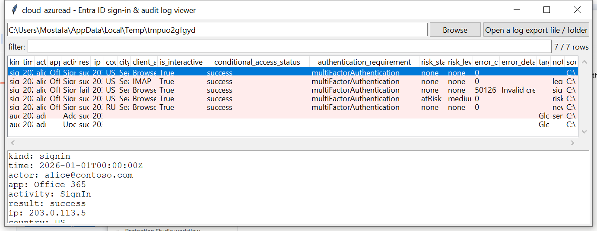

# cloud_azuread

**Sign-ins and directory changes, normalised into one timeline.**

`cloud_azuread` reads Entra ID (Azure AD) log JSON exports — from the
portal, the Microsoft Graph API, or a Log Analytics export — covering
both **sign-in logs** (interactive, non-interactive, service principal,
managed identity) and **directory audit logs** (role changes, consent
grants, credential changes), and normalises both into one row schema so
they sort and filter together.

## Usage

```
cloud_azuread signins.json
cloud_azuread ./entra-export --kind signin --notable-only --csv events.csv
cloud_azuread --gui
```

The target may be a single export file, or a directory to search
recursively for `.json` / `.json.gz` files. Both a bare JSON array and
the Graph API's `{"value": [...]}` pagination wrapper are accepted;
sign-in and audit records in the same file are told apart automatically
and can be mixed freely.



| flag | effect |
|------|--------|
| `--kind {signin,audit}` | only rows of this kind |
| `--user TEXT` | substring filter on actor |
| `--notable-only` | only flagged rows |
| `--csv` / `--json` | UTF-8-with-BOM, formula-injection-safe output |

### Flags

| flag | trigger |
|------|---------|
| `signin-failure` | a non-zero sign-in `status.errorCode` |
| `legacy-auth` | `clientAppUsed` indicates IMAP/POP/SMTP/ActiveSync/"Other clients" |
| `risky-signin` | `riskState` is anything other than none/dismissed/remediated |
| `ca-failure` | `conditionalAccessStatus == "failure"` |
| `new-country` | a user's first sign-in from a country not seen earlier for them (in event-time order) |
| `sensitive-activity` | an audit activity like *Add member to role*, *Consent to application*, *Add service principal*, *Reset user password* |

## Why it matters

Sign-in and audit logs are usually reviewed separately even though the
interesting story is often the join between them — a risky sign-in
followed minutes later by a role assignment from the same account. One
normalised, sortable timeline makes that sequence visible without
cross-referencing two different export formats by hand.

## Limitations (v0.1)

- The Entra ID sign-in and directory-audit schemas are Microsoft's own
  long-stable, publicly documented Graph API resources — no
  undocumented-structure caveat here.
- `new-country` is a simple first-seen-per-user heuristic in event-time
  order, not true impossible-travel geo-distance/velocity analysis (no
  geo-coordinate math, no travel-time plausibility check).
- The sensitive-activity list is a fixed, moderate-sized set of
  well-known privilege-escalation-relevant audit activity names; it is
  not exhaustive.
- No MFA-method-level detail (`authenticationDetails`) parsing, no
  conditional-access-policy-by-policy breakdown — `appliedConditional
  AccessPolicies` is not flattened per-policy in v0.1.

## Tests

`tests/_synth.py` builds JSON exports matching the real Graph API
sign-in and directory-audit schemas (both the bare-array and `{"value":
[...]}`-wrapped forms). Tests cover each flag independently (legacy
auth, sign-in failure, risky sign-in, CA failure, sensitive audit
activity), the new-country cross-record heuristic (confirming the
first two sign-ins from the same country are NOT flagged and the third,
different-country one is), mixed sign-in/audit files, and the CLI
(`--kind`, `--csv`/`--json`).

```
cd cloud/cloud_azuread && python -m pytest -q
```
