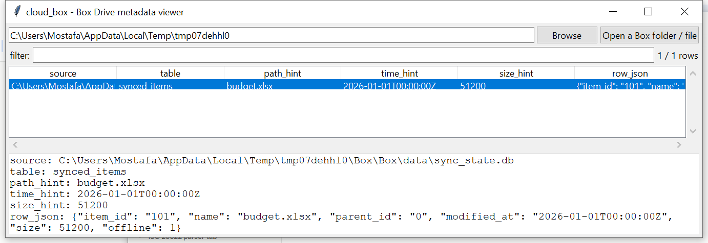

# cloud_box

**Find and dump whatever Box Drive left behind — without pretending to
know its filename in advance.**

Box Drive's local database format has meaningfully less public
forensic documentation than OneDrive, Dropbox, or Google Drive's
equivalents, and this project does not have a confident specific
filename to look for the way it does for the other three
(`SyncEngineDatabase.db`, `filecache.dbx`, `metadata_sqlite_db`).
Rather than guess at a name, `cloud_box` searches any directory whose
path mentions Box for *any* database-shaped file, verifies each one by
magic bytes rather than trusting its name or extension, and generically
dumps whichever turn out to actually be SQLite — full row fidelity, no
claimed schema understanding beyond conservative column-name hints.

## Usage

```
cloud_box "%LOCALAPPDATA%\Box\Box"
cloud_box some.db --csv rows.csv
cloud_box --gui
```

The target may be the Box install folder itself (searched recursively
for `.db`/`.sqlite`/`.sqlite3`/`.dat` files under any Box-named path
segment), or a specific file.



| flag | effect |
|------|--------|
| `--table TEXT` | substring filter on table name |
| `--csv` / `--json` | UTF-8-with-BOM, formula-injection-safe output |

## Why it matters

Even a schema-agnostic dump of Box Drive's local database — whatever
it's actually called on the disk in front of you — turns an opaque
binary blob into something searchable and reviewable, without needing
to install Box Drive or reverse its internal format first.

## Limitations (v0.1)

- **No confident specific filename or location within the Box folder**
  — unlike this suite's other three cloud-sync tools. The broad
  "any database-shaped file under a Box-named path" search is
  deliberately wider and less targeted as a result, and can surface
  false-positive candidates (non-database files with a matching
  extension) that are simply skipped once they fail the SQLite magic
  -byte check.
- **No claimed understanding of the schema.** Every table/column found
  is dumped as-is; `path_hint`/`time_hint`/`size_hint` are column-name
  pattern guesses, not verified field semantics.
- **No parent-ID → full-path reconstruction**, no offline-pinned-vs
  -streamed classification, no activity-log parsing — all deferred.
- If Box Drive's database turns out to be encrypted (this project has
  no confirmed information either way), it would need the same
  "detect, don't decrypt" treatment `cloud_dropbox` already has.

## Tests

`tests/_synth.py` builds a real, plain-SQLite database under a
Box-shaped folder tree, plus a random-bytes `.dat` file with a
plausible name to exercise the magic-byte rejection path. Tests cover
candidate discovery (including ignoring non-Box paths), generic table
dumping, hint extraction, the non-SQLite candidate not blocking real
data, a no-Box-found case, and the CLI (`--table`, `--csv`/`--json`).

```
cd cloud/cloud_box && python -m pytest -q
```
