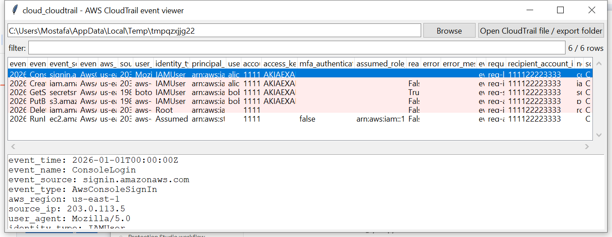

# cloud_cloudtrail

**One row per AWS API call, with the risky ones already flagged.**

`cloud_cloudtrail` reads CloudTrail's standard delivery format —
`.json` files, optionally gzip-compressed exactly as S3 delivers them,
each holding a top-level `{"Records": [...]}` array — and flattens
every record's `userIdentity`, request/response data, and error info
into one normalised row.

## Usage

```
cloud_cloudtrail 123456789012_CloudTrail_us-east-1_20260101.json.gz
cloud_cloudtrail ./cloudtrail-export --notable-only --csv events.csv
cloud_cloudtrail --gui
```

The target may be a single delivery file, or a directory (an S3 export
tree) to search recursively for `.json` / `.json.gz` files.



| flag | effect |
|------|--------|
| `--event-name TEXT` | substring filter on the API action name |
| `--notable-only` | only flagged rows |
| `--csv` / `--json` | UTF-8-with-BOM, formula-injection-safe output |

### Flags

| flag | trigger |
|------|---------|
| `console-login-no-mfa` | a successful `ConsoleLogin` without `mfaAuthenticated: true` |
| `iam-change` | a mutating call (`Create`/`Delete`/`Put`/`Attach`/`Detach`/`Update`/`Add`/`Remove`*) to `iam.amazonaws.com` |
| `secret-access` | `GetSecretValue`, `GetParameter(s)`, `DecryptSecret` |
| `public-access-change` | an ACL/policy call granting `AllUsers` / `AllAuthenticatedUsers` |
| `root-account-usage` | `userIdentity.type == "Root"` |
| `access-denied` | an error code containing "denied" |
| `delete-burst` | ≥5 `Delete*` calls by the same actor within a 5-minute window |

`assumed_role_arn` resolves `sessionContext.sessionIssuer.arn` for
`AssumedRole` identities, so a temporary session's actions trace back to
the IAM role that was assumed.

## Why it matters

CloudTrail is the canonical source of truth for "who did what" in an
AWS account. Flattening it into flat rows makes it queryable and
sortable in `analysis_timeline` / `analysis_report`, and the built-in
flags surface the handful of events per thousand that actually matter
for an IR triage pass — credential exposure, privilege escalation setup,
and public-exposure changes — without hand-writing a query for each.

## Limitations (v0.1)

- The CloudTrail JSON schema itself is a long-stable, publicly
  documented AWS format — no undocumented-structure caveat here, unlike
  several of this suite's memory-forensics and container-format tools.
- `delete-burst` is a simple fixed-threshold heuristic (5 events / 5
  minutes per actor) tuned for obvious mass-deletion, not a general
  anomaly detector.
- No CloudTrail Lake / Athena query support, no cross-account
  organization-trail deduplication.
- `public-access-change` checks for the two well-known public S3
  grantee URIs/names; it does not evaluate a full bucket-policy JSON
  for public-equivalent conditions (e.g. a policy with a permissive
  `Principal: "*"` and no compensating `Condition`).

## Tests

`tests/_synth.py` builds delivery files (plain and gzip-compressed)
with records matching the real CloudTrail schema for each flag case
plus a benign control event. Tests cover MFA-present vs. MFA-absent
console logins, gzip decompression, IAM-change/secret-access/public-ACL/
root-usage flagging, assumed-role ARN resolution, the delete-burst
threshold (both triggering and not), directory-target multi-file
discovery, and the CLI (`--csv`/`--json`, `--notable-only`).

```
cd cloud/cloud_cloudtrail && python -m pytest -q
```
