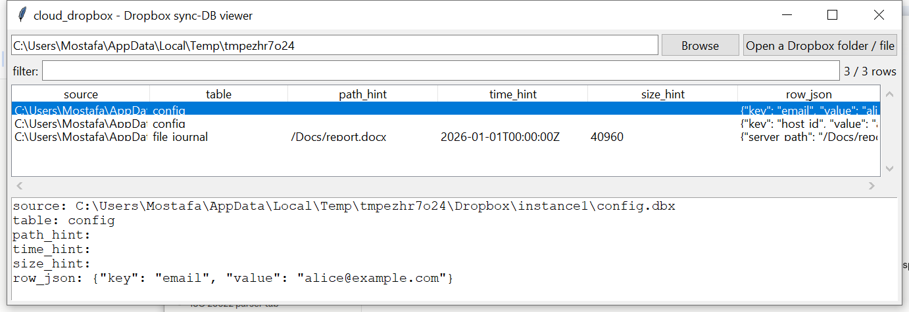

# cloud_dropbox

**Read a Dropbox sync database generically — and say plainly when it's
encrypted instead of guessing at a key.**

Dropbox's `config.dbx` / `filecache.dbx` / `deleted.dbx` are a
**proprietary, undocumented** SQLite variant, and every Dropbox client
released in roughly the last decade SQLCipher-encrypts them with
OS-specific key material (historically DPAPI on Windows, the OS
keychain on macOS, a derived key on Linux) that has changed more than
once and that this project has no verified way to reproduce.
`cloud_dropbox` locates candidate `.dbx`/`.db` files and, for any that
turn out to still be plain SQLite (an older client, or one where
encryption wasn't yet applied), dumps every table generically — full
row fidelity, no claimed schema understanding beyond conservative
column-name hints. An encrypted file is reported as such, not decrypted.

## Usage

```
cloud_dropbox "%LOCALAPPDATA%\Dropbox"
cloud_dropbox filecache.dbx --csv rows.csv
cloud_dropbox --gui
```

The target may be the Dropbox folder itself (searched recursively for
`config.dbx`, `filecache.dbx`, `deleted.dbx`, and their legacy `.db`
names), or a specific file.



| flag | effect |
|------|--------|
| `--table TEXT` | substring filter on table name |
| `--csv` / `--json` | UTF-8-with-BOM, formula-injection-safe output |

## Why it matters

`config.dbx` holds the linked account email and host ID even from a
handful of readable rows; `filecache.dbx`'s file journal records synced
paths, sizes and modification times — evidence of files that may no
longer exist locally. Where the database is still plain SQLite (which
does happen — not every Dropbox install on every OS/version has
encryption engaged), this recovers it without needing anything
Dropbox-specific beyond knowing where to look.

## Limitations (v0.1)

- **Encrypted `.dbx` files are detected, not decrypted** — this is the
  common case for any recent Dropbox client. There is no reliable,
  version-independent way to derive the SQLCipher key without deeper
  OS-specific research this project doesn't have high confidence in;
  guessing would risk silently producing garbage rather than an honest
  "encrypted" result.
- **No claimed understanding of the schema.** Every table/column is
  dumped as-is; `path_hint`/`time_hint`/`size_hint` are column-name
  pattern guesses, not verified field semantics.
- No cross-referencing of `file_journal` entries against what's
  actually still present on disk (pair with `recovery_fs` /
  `windows_mft` for that).

## Tests

`tests/_synth.py` builds real, plain-SQLite `config.dbx` and
`filecache.dbx` files plus a `deleted.dbx` standing in for an encrypted
one (random bytes, no SQLite magic). Tests cover file discovery,
SQLite-vs-encrypted detection, generic table dumping, path/size hint
extraction, the encrypted-file warning path, a no-Dropbox-found case,
and the CLI (`--table`, `--csv`/`--json`).

```
cd cloud/cloud_dropbox && python -m pytest -q
```
