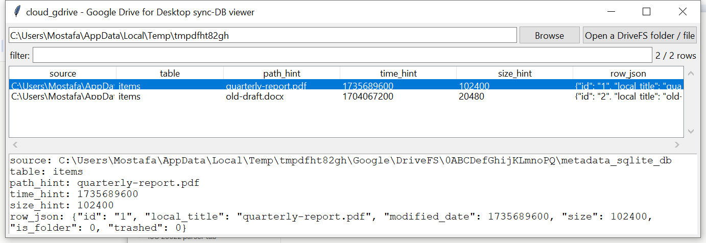

# cloud_gdrive

**Generically dump Google Drive for Desktop's synced-file inventory —
no claimed understanding of its proprietary schema, but no encryption
blocking access either.**

`metadata_sqlite_db` / `snapshot.db` (under `%LOCALAPPDATA%\Google\
DriveFS\<account_id>\` / `~/Library/Application Support/Google/
DriveFS/`) hold Google Drive for Desktop's local file inventory —
Google file IDs, names, versions, parents — in a **proprietary,
undocumented** schema, like every cloud-sync-client database this
suite's cloud/ tools cover (unlike the audit-log tools, which read a
vendor's own published format). Unlike Dropbox's `.dbx` files, these
are typically **not** encrypted, so `cloud_gdrive` can usually dump
real content: every table, in full, with only conservative
column-name hints layered on top.

## Usage

```
cloud_gdrive "%LOCALAPPDATA%\Google\DriveFS"
cloud_gdrive metadata_sqlite_db --csv rows.csv
cloud_gdrive --gui
```

The target may be the `DriveFS` folder itself (searched recursively for
`metadata_sqlite_db`, `snapshot.db`, `sync_config.db`), or a specific
file.



| flag | effect |
|------|--------|
| `--table TEXT` | substring filter on table name |
| `--csv` / `--json` | UTF-8-with-BOM, formula-injection-safe output |

## Why it matters

A synced-file inventory recovered this way includes items marked
trashed in Drive but not yet purged, and version/modification metadata
independent of what's still present in the local sync folder on disk —
useful even without decoding the full parent-path hierarchy.

## Limitations (v0.1)

- **No claimed understanding of the `items`/`stable_ids` schema.**
  Every table/column is dumped as-is; `path_hint`/`time_hint`/
  `size_hint` are column-name pattern guesses (including "title", a
  historical Drive API field name), not verified field semantics.
- **No parent-ID → full-path reconstruction.** A row's Google file ID
  and its parent's ID are both present in the raw dump (`row_json`),
  but walking that into a real folder path is not implemented in v0.1.
- **No shared-drive-specific handling** — shared-drive items appear in
  the same generic dump as personal-drive items, undifferentiated.
- If a future client version encrypts these databases the way Dropbox
  does, this tool would need the same "detect, don't decrypt" treatment
  `cloud_dropbox` already has — not currently the common case.

## Tests

`tests/_synth.py` builds a real, plain-SQLite `metadata_sqlite_db` with
an `items` table (including a trashed entry). Tests cover file
discovery, generic table dumping, path/size hint extraction (via the
`title`-style column name), trashed-item data surviving in the row
JSON, a no-DriveFS-found case, and the CLI (`--table`, `--csv`/`--json`).

```
cd cloud/cloud_gdrive && python -m pytest -q
```
