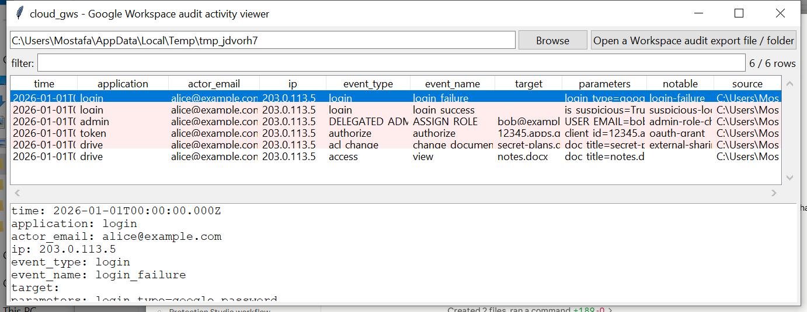

# cloud_gws

**One event row across Google Workspace's login, admin, Drive, and
token audit categories.**

`cloud_gws` reads Google Workspace audit exports — the Admin SDK
Reports API's JSON shape (`{"items": [...]}`), whether pulled live or
exported from the Admin console — and expands each activity record
(which can carry several events) into one row per event: actor, IP,
application category, event, and a best-effort target.

## Usage

```
cloud_gws activities.json
cloud_gws ./gws-export --application drive --notable-only --csv events.csv
cloud_gws --gui
```

The target may be a single export file, or a directory to search
recursively for `.json` / `.json.gz` files.



| flag | effect |
|------|--------|
| `--application TEXT` | substring filter on `applicationName` (login, admin, drive, token, ...) |
| `--actor TEXT` | substring filter on actor email |
| `--notable-only` | only flagged rows |
| `--csv` / `--json` | UTF-8-with-BOM, formula-injection-safe output |

### Flags

| flag | trigger |
|------|---------|
| `login-failure` | a `login` category event whose name contains "failure" |
| `suspicious-login` | an event name containing "suspicious", or an `is_suspicious` parameter set true |
| `admin-role-change` | an `admin` category event whose name suggests a role/privilege/delegated-admin change |
| `oauth-grant` | a `token` category "authorize" event (a user granted a third-party app access) |
| `external-sharing` | a `drive` sharing/visibility-change event whose parameters mention an outside/external/public/anyone grant |
| `2sv-disabled` | a `login` category event disabling 2-step verification |

## Why it matters

An OAuth grant to an unfamiliar third-party app and a Drive document
suddenly shared outside the domain are two of the most common
Workspace-specific compromise indicators, and both are easy to miss
scrolling through raw JSON where the interesting fields sit inside a
nested `parameters` array. Flattening to one row per event, with a
best-effort `target` pulled out of those parameters, makes both
scannable at a glance.

## Limitations (v0.1)

- **The overall activity envelope (`id`/`actor`/`ipAddress`/`events`/
  `parameters`) is Google's own long-stable, publicly documented Admin
  SDK Reports API schema — high confidence.** The *exact* event and
  parameter names for less-common audit categories (chat, meet,
  context-aware access, ...) vary and this project's confidence in
  every specific string is correspondingly lower; flags match on
  substrings of the application/event/parameter text rather than exact
  enum values specifically to stay robust to that variance.
- `target` is a best-effort pull from a small set of commonly-seen
  parameter names (`doc_title`, `USER_EMAIL`, `client_id`, ...) — it
  can come back blank for an event whose interesting value uses a
  parameter name not in that list.
- No geo-IP / impossible-travel analysis (pair with `cloud_azuread`'s
  approach if cross-referencing against Entra ID sign-ins for the same
  users).

## Tests

`tests/_synth.py` builds JSON exports matching the real Reports API
`{"items": [...]}` shape for each flag case plus a benign control
event. Tests cover each flag independently, `target` extraction for
admin-role and Drive-sharing events, an activity carrying multiple
events expanding into multiple rows, and the CLI (`--application`,
`--csv`/`--json`).

```
cd cloud/cloud_gws && python -m pytest -q
```
