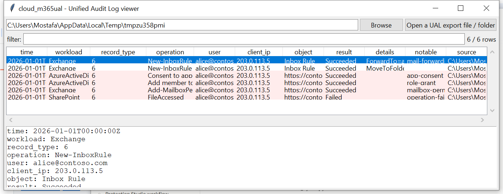

# cloud_m365ual

**One activity schema across Exchange, SharePoint, Entra ID, and Teams.**

The Microsoft 365 Unified Audit Log wraps every event's real detail
inside an `AuditData` field — a JSON *string* that has to be parsed a
second time — and each workload (Exchange, SharePoint/OneDrive, Entra
ID, Teams) puts different fields in it. `cloud_m365ual` reads UAL
exports (from the Purview portal, CSV or JSON, or
`Search-UnifiedAuditLog`'s JSON output), does that second parse, and
normalises every workload into one common row: actor, IP, target,
result.

## Usage

```
cloud_m365ual UnifiedAuditLog.json
cloud_m365ual ./ual-export --notable-only --csv events.csv
cloud_m365ual --gui
```

The target may be a single export file (`.json`/`.csv`, optionally
`.gz`), or a directory to search recursively.



| flag | effect |
|------|--------|
| `--workload TEXT` | substring filter (Exchange, SharePoint, AzureActiveDirectory, ...) |
| `--user TEXT` | substring filter on actor |
| `--notable-only` | only flagged rows |
| `--csv` / `--json` | UTF-8-with-BOM, formula-injection-safe output |

### Flags

| flag | trigger |
|------|---------|
| `mail-forwarding-rule` | a `New`/`Set-InboxRule` (or transport rule) whose parameters forward, redirect, or auto-delete mail |
| `app-consent` | `Consent to application` |
| `role-grant` | `Add member to role` / `Add member to group` |
| `mailbox-permission-change` | `Add-MailboxPermission` / `Add-RecipientPermission` / `Add-MailboxFolderPermission` |
| `operation-failed` | `ResultStatus == "Failed"` |
| `mass-download` | ≥10 `FileDownloaded` events by the same user within a 5-minute window |

The `details` column decodes an inbox/transport rule's `Parameters`
array (e.g. `ForwardTo=attacker@evil.example`) so the forwarding
destination is visible without opening the raw `AuditData`.

## Why it matters

A mail-forwarding rule pointed at an external address is one of the
most common post-compromise persistence/exfiltration techniques in
Business Email Compromise cases, and it's buried in `AuditData` JSON
most reviewers never unpack by hand. Normalizing every workload into
one schema also makes cross-workload correlation possible — an app
consent grant followed by a role grant from the same account, say —
without switching between differently-shaped exports.

## Limitations (v0.1)

- The UAL schema (the outer envelope plus the nested `AuditData` JSON)
  is Microsoft's own long-stable, publicly documented format — no
  undocumented-structure caveat here.
- `mass-download` is a simple fixed-threshold heuristic (10 events / 5
  minutes per user), not a general data-loss-prevention anomaly
  detector.
- The sensitive-operation list (inbox rules, consent, role/permission
  grants) is a fixed, moderate-sized set of well-known
  abuse-relevant operations; it is not exhaustive across every M365
  workload's full operation catalog.
- No Teams-specific message-content parsing, no SharePoint
  sharing-link-expiry analysis.

## Tests

`tests/_synth.py` builds both JSON and CSV UAL exports with the real
outer-envelope-plus-nested-`AuditData` shape. Tests cover the
mail-forwarding-rule parameter check (and confirming a benign rule
change is NOT flagged), app consent, role grants, mailbox-permission
changes, failed-operation flagging, the mass-download threshold (both
triggering and not), CSV export parsing, workload/user field
extraction, and the CLI (`--workload`, `--csv`/`--json`).

```
cd cloud/cloud_m365ual && python -m pytest -q
```
