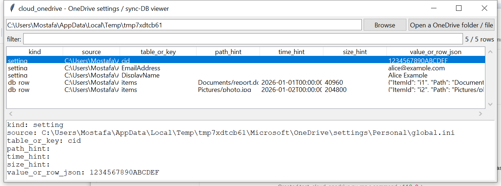

# cloud_onedrive

**Turn an opaque OneDrive sync database into something reviewable —
without pretending to know its undocumented schema.**

OneDrive's local sync-client metadata (`%LOCALAPPDATA%\Microsoft\
OneDrive\settings\<Personal|BusinessN>\`) is a **proprietary,
undocumented** format that has changed shape across client versions —
unlike this suite's cloud audit-log tools (CloudTrail, Entra ID, M365
UAL, Workspace), which all read a vendor's own *published* schema.
`cloud_onedrive` locates the settings directory, parses the plain
`*.ini`-shaped settings files there directly (a real, unambiguous
format), and generically dumps `SyncEngineDatabase.db` table by table
when it's SQLite — full row fidelity, with only conservative
column-name hints layered on top, honest about not claiming to
understand the vendor's internal schema beyond that.

## Usage

```
cloud_onedrive "%LOCALAPPDATA%\Microsoft\OneDrive"
cloud_onedrive SyncEngineDatabase.db --csv rows.csv
cloud_onedrive --gui
```

The target may be the OneDrive folder itself (searched recursively for
`settings/*.ini`/`.dat` files and `SyncEngineDatabase.db`), or a
specific file.



| flag | effect |
|------|--------|
| `--kind {setting,db_row}` | only rows of this kind |
| `--csv` / `--json` | UTF-8-with-BOM, formula-injection-safe output |

Each database row carries `row_json` (the full row, every column,
verbatim) plus three best-effort hints pulled out by matching column
*names* against a short list of common words (`path`/`time`/`size` and
close variants) — not by understanding what the column actually means.

## Why it matters

Settings files reveal the linked account (email, client ID) even
without touching the sync database; the sync database itself — even
read generically — surfaces file paths, timestamps and sizes for
content that may no longer exist on disk, since OneDrive's local index
tracks cloud-only ("Files On-Demand") entries too.

## Limitations (v0.1)

- **No claimed understanding of `SyncEngineDatabase.db`'s actual
  schema.** Every table and column is dumped as-is; the `path_hint` /
  `time_hint` / `size_hint` columns are name-pattern guesses, not
  verified field semantics — treat them as a starting point for manual
  review, not as ground truth.
- **ESE/JET-format databases (older OneDrive clients) are detected,
  not read** — v0.1 handles SQLite only; an ESE-format
  `SyncEngineDatabase.db` is reported with a pointer to this project's
  own `windows_esedb`, which can open it directly.
- **No ODL activity-log de-obfuscation.** OneDrive's `*.odl`/`*.odlgz`
  diagnostic logs use an obfuscated, undocumented encoding this project
  has no confident way to reverse — out of scope for v0.1.
- Settings-file key names are captured exactly as found rather than
  normalized, since the real key set is undocumented and has drifted
  across client versions.

## Tests

`tests/_synth.py` builds a real settings `.ini` file and a real SQLite
`SyncEngineDatabase.db`, plus a byte-stub standing in for an ESE-format
database (magic bytes only, not a full ESE file). Tests cover settings
parsing, SQLite-vs-ESE detection, generic table dumping, path/time/size
hint extraction, the ESE-database warning path, no-files warnings, and
the CLI (`--kind`, `--csv`/`--json`).

```
cd cloud/cloud_onedrive && python -m pytest -q
```
