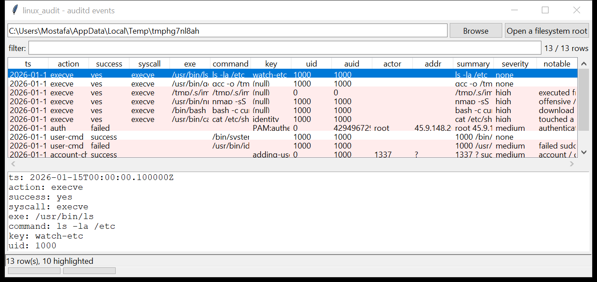

# linux_audit

**Every auditd event, reassembled and decoded.** `linux_audit` reads the
Linux audit daemon logs (`/var/log/audit/audit.log*`, `.gz` included) under a
mounted image or a live root, groups the multi-line records by their
`msg=audit(<epoch>.<ms>:<serial>)` event id, and turns each event into one
normalised row.

Per event: the syscall and its outcome, the **reconstructed command line**
(from `EXECVE`, falling back to the decoded `PROCTITLE`), the executable, the
working directory (`CWD`), the touched paths (`PATH`), uid / auid / session,
the audit key, and — for the `USER_*`, `AVC` and account-management record
types — the actor, host / address and result. Hex-encoded fields are decoded;
`SOCKADDR` records are resolved to an address and port; syscall numbers are
mapped to names for the common architectures.



## Usage

```
linux_audit /mnt/evidence
linux_audit / --action execve --csv exec.csv
linux_audit /mnt/img --notable-only --min-severity high
linux_audit /mnt/img --key sudoers --json k.json
linux_audit /var/log/audit/audit.log --grep 'nmap|/tmp/'
linux_audit /mnt/img --auid 1000 --action user-cmd
linux_audit /mnt/img --gui
```

| flag | effect |
|------|--------|
| `--action NAME` | `execve` / `auth` / `user-cmd` / `login` / `account-change` / `selinux-denial` / `audit-config` / `network` / `service` / `system` / `anomaly` |
| `--key SUBSTR` | only events carrying this audit key |
| `--uid` / `--auid` | filter by uid or login-uid |
| `--since` / `--until` `YYYY-MM-DD` | UTC date window |
| `--grep REGEX` | match command / exe / summary / paths |
| `--notable-only` / `--min-severity` | filter by the flags raised |
| `--csv PATH` / `--json PATH` | write the table instead of the text report |

## Why it matters

When auditd is running it is the highest-fidelity record on the host: it
captures every `execve` with its arguments, the real login-uid behind a
`sudo`, file access against watched paths, module loads, and — crucially —
any attempt to change the audit rules themselves. Reassembling the raw
records off a mounted image gives you that timeline without needing
`ausearch` or a matching kernel.

## Flags

| flag | meaning |
|------|---------|
| `executed from a user-writable path` | `exe` under `/tmp`, `/home`, `/dev/shm`, `/run/user`, `/root` |
| `offensive / recon tool executed` | `nmap`, `nc`, `socat`, `responder`, `linpeas`, `pspy`, … |
| `download / decode cradle in the command` | `curl … \| sh`, `base64 -d`, `python -c` |
| `escalation to root (auid N -> uid 0)` | a non-root login-uid running as uid 0 |
| `failed sudo / privileged command` | a `USER_CMD` with `res=failed` |
| `authentication failure` | a `USER_AUTH` / `USER_ACCT` with `res=failed` |
| `account / group change` | `ADD_USER` / `DEL_USER` / `ADD_GROUP` / role change |
| `audit rule set changed (possible tampering)` | a `CONFIG_CHANGE` record |
| `SELinux access denial` | an `AVC` denied record |
| `touched a sensitive file` | `PATH` under `/etc/shadow`, `/etc/sudoers`, `/etc/ssh/sshd_config`, `/etc/audit/` |
| `outbound connection to <ip:port>` | a `connect` syscall to a non-private address |
| `kernel module loaded` | `init_module` / `finit_module` |
| `ptrace call (debugger / injection)` | a `ptrace` syscall |

## Limitations (v0.1)

- Syscall-name tables cover the common cases per architecture; an unlisted
  number is shown as `syscall#<n>`.
- `EXECVE` argument reconstruction joins the `aN` fields with spaces — an
  argument that itself contains spaces is not re-quoted.
- Enrichment that needs the target file system (uid → name, inode → path)
  is not performed; ids are shown numerically.
- Events split across a log rotation boundary are assembled per file, so the
  same serial appearing in two files yields two partial events.

## Tests

```
cd linux/linux_audit && python -m pytest -q
```

`tests/_synth.py` builds a synthetic `audit.log` (plain and gzip-rotated)
with `SYSCALL` + `EXECVE` + `CWD` + `PATH` + `PROCTITLE` groups, `USER_CMD`
/ `USER_AUTH` / `ADD_USER` / `CONFIG_CHANGE` / `AVC` records and a
`SOCKADDR`, and exercises the record grammar, hex decoding, event assembly,
every flag and the CLI.
