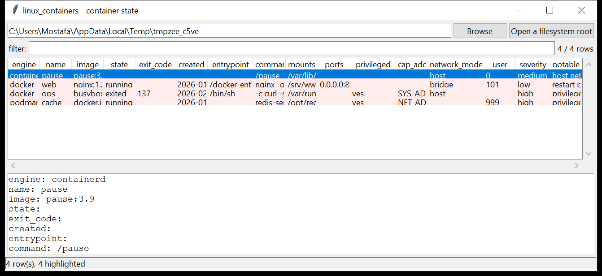

# linux_containers

**Container activity, straight off the disk.** `linux_containers` reads the
container-runtime data directories under a mounted image or a live root and
produces one normalised record per container — no daemon, no `docker inspect`.

| engine | reads |
|--------|-------|
| Docker | `/var/lib/docker/containers/<id>/config.v2.json` + `hostconfig.json` + `<id>-json.log`; image names from `image/*/repositories.json` |
| Podman | `/var/lib/containers/storage/overlay-containers/containers.json` + per-container `userdata/config.json` (OCI spec) + `state.json`; images from `overlay-images/images.json` |
| containerd | the OCI `config.json` under `io.containerd.runtime.v2.task/<ns>/<id>/` |

Per container: engine, id, name, image + image id, created / started /
finished, exit code, entrypoint + command, environment, bind mounts,
published ports, and the full security posture — privileged, added
capabilities, host namespaces, `SecurityOpt`, run-as user, restart policy,
labels.



## Usage

```
linux_containers /mnt/evidence
linux_containers / --csv containers.csv
linux_containers /mnt/img --engine docker --notable-only
linux_containers /mnt/img --min-severity high
linux_containers /mnt/img --state exited --grep 'curl|/tmp/'
linux_containers /mnt/img --gui
```

| flag | effect |
|------|--------|
| `--engine {docker,podman,containerd}` | only this engine (repeatable) |
| `--state NAME` | `running` / `exited` / `created` / … |
| `--grep REGEX` | match name / image / command / mounts / env |
| `--notable-only` / `--min-severity` | filter by the flags raised |
| `--csv PATH` / `--json PATH` | write the table instead of the text report |

## Why it matters

A container is a common foothold and an even more common blind spot: the
process tree on the host shows `runc` and a shim, not what is inside. The
runtime's own JSON, though, records the image, the exact command, every bind
mount and the security options it was started with — and whether it was set
up to come back after a reboot. A `--privileged` container with the Docker
socket mounted is a full host compromise waiting to be used.

## Flags

| flag | meaning |
|------|---------|
| `privileged container` | `--privileged` — nearly all capabilities, all devices |
| `container-runtime socket mounted` | `/var/run/docker.sock` (or containerd/podman) inside the container = host takeover |
| `sensitive host path bind-mounted` | `/`, `/etc`, `/root`, `/proc`, `/sys`, `/dev`, `/var/lib`, … mapped in |
| `host device exposed` | a `/dev/*` device passed through |
| `host PID / network / IPC namespace` | `--pid=host` / `--network=host` / `--ipc=host` |
| `dangerous capability added` | `SYS_ADMIN`, `SYS_PTRACE`, `SYS_MODULE`, `BPF`, `DAC_READ_SEARCH`, `ALL`, … |
| `AppArmor / seccomp disabled` | `apparmor=unconfined` / `seccomp=unconfined` |
| `no-new-privileges explicitly disabled` | setuid binaries can still escalate |
| `runs as root inside the container` | `User` empty or `0` |
| `secret-looking environment variable` | `*_PASSWORD` / `*_TOKEN` / `*_SECRET` / `*_API_KEY` = … |
| `cradle / reverse-shell in the entrypoint / command` | `curl … \| sh`, `/dev/tcp/`, `nc -e`, `bash -i` |
| `image pinned loosely` | `:latest` or no tag |
| `image from a raw-IP registry` | pulled from `http://<ip>/…` |
| `restart policy 'always' / 'unless-stopped'` | the container is meant to survive reboots |

## Limitations (v0.1)

- **Metadata databases are not read.** containerd's `meta.db` (bbolt) and
  Podman's `bolt_state.db` / `db.sql` are skipped — the tool works from the
  per-container spec files, so a container whose task dir was removed but
  whose DB row remains will not appear.
- The `overlay2` / `overlay` layer stack and the merged container filesystem
  are **not** reconstructed in this version (listing / extracting files from
  a container is on the roadmap).
- `<id>-json.log` and `ctr.log` are located and recorded but not parsed into
  the timeline yet.
- Docker Compose / Swarm and Kubernetes-level objects are out of scope; only
  the individual containers on the node are read.

## Tests

```
cd linux/linux_containers && python -m pytest -q
```

`tests/_synth.py` builds a Docker data dir (a benign `nginx` container and a
`--privileged`, socket-mounted, host-namespace, `curl | sh` container), a
Podman storage dir with an OCI `userdata/config.json`, and a containerd task
dir, and checks the parsers, the namespace inference, every flag and the CLI.
