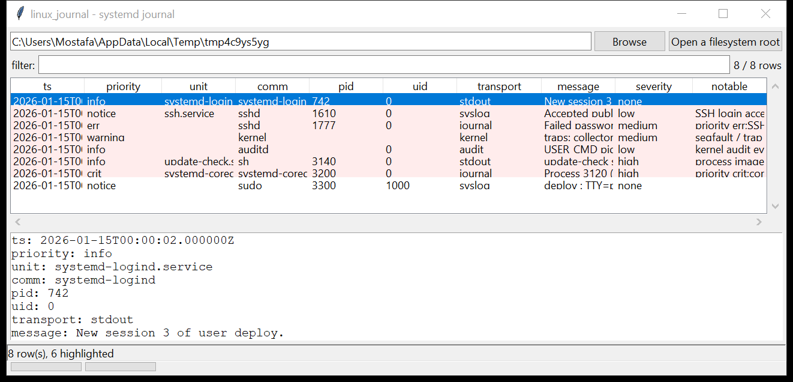

# linux_journal

**Read the systemd journal without systemd.** `linux_journal` is a
from-scratch reader for the `.journal` binary format. It walks the object
arena of each file linearly (the most corruption-tolerant path — no reliance
on the hash tables), pulls out every `ENTRY` object, resolves its `DATA`
objects into `FIELD=value` pairs, and emits one record per entry with the
realtime (UTC) and monotonic timestamps, the boot id and the full field set.

Several files merge into one ordered timeline. Filter on any field
(`_SYSTEMD_UNIT`, `_PID`, `_UID`, `PRIORITY`, `_BOOT_ID`, …), a priority
ceiling, a boot id or a time window.



## Usage

```
linux_journal /mnt/evidence
linux_journal / --unit ssh.service --csv ssh.csv
linux_journal /mnt/img -p err --notable-only
linux_journal /mnt/img --field _UID=0 --grep 'sudo|su '
linux_journal /mnt/img --list-boots
linux_journal /mnt/img --boot 3f2b… --since 2026-01-01 --json j.json
linux_journal /mnt/img --gui
```

| flag | effect |
|------|--------|
| `--unit NAME` | only this `_SYSTEMD_UNIT` (or `UNIT`) |
| `--field NAME=VALUE` | require a field value (repeatable, AND) |
| `--boot ID` | only this `_BOOT_ID` |
| `-p / --priority` | maximum priority, inclusive (`emerg`…`debug`) |
| `--since` / `--until` | UTC `YYYY-MM-DD[ HH:MM:SS]` window |
| `--grep REGEX` | match `MESSAGE` / `_COMM` / `_CMDLINE` / `_EXE` |
| `--list-boots` | print boot ids and their time spans, then exit |
| `--notable-only` / `--min-severity` | filter by the flags raised |
| `--csv PATH` / `--json PATH` | write the table (JSON keeps every raw field) |

## Why it matters

On a modern Linux host the journal *is* the log — auth, sudo, service
start/stop, kernel messages, coredumps and audit events all land in the same
binary store. Being able to read it straight off a mounted image, with the
original realtime and monotonic clocks intact, means you are not dependent on
a matching `journalctl` or a bootable copy of the evidence.

## Flags

| flag | meaning |
|------|---------|
| `priority emerg / alert / crit / err` | a high-severity record |
| `process image in a user-writable path` | `_EXE` under `/tmp`, `/home`, `/dev/shm`, `/run/user`, `/root` |
| `download / decode cradle …` | `curl … \| sh`, `base64 -d`, `python -c` in the message or cmdline |
| `offensive / recon tool referenced` | `nmap`, `nc`, `socat`, `responder`, `mimikatz`, … |
| `coredump recorded` | a `systemd-coredump` entry |
| `SSH authentication failure` / `login accepted` | from `sshd` messages |
| `sudo / su authentication failure` | failed privilege escalation |
| `kernel audit event via the journal` | `_TRANSPORT=audit` |
| `segfault / trap logged` | a crash in a kernel message |
| `unit job failed / timeout` | a `.service` job that did not succeed |

## Limitations (v0.1)

- **Compression.** `XZ`-compressed data objects are inflated (stdlib `lzma`).
  `LZ4` and `ZSTD` objects — the modern defaults for large fields — cannot be
  inflated with the standard library alone; they are surfaced as a short
  placeholder and counted in a partial-parse warning. Short fields (unit,
  priority, pid, most messages) are stored uncompressed and read fine.
- **No FSS verification.** Sealing tags are skipped, not checked.
- The linear scan reads objects in file order, then the merged timeline is
  sorted by realtime; entry-array / hash-table traversal is not used.
- `.journal~` (corrupt-rotated) files are read on a best-effort basis and
  stop at the first unreadable object.

## Tests

```
cd linux/linux_journal && python -m pytest -q
```

`tests/_synth.py` writes a structurally valid `.journal` (header + one
`DATA` object per field + one `ENTRY` per record) in both the regular and
`COMPACT` layouts, with XZ and (stub) LZ4 data objects, and exercises the
reader, discovery / merge, every flag and the CLI.
