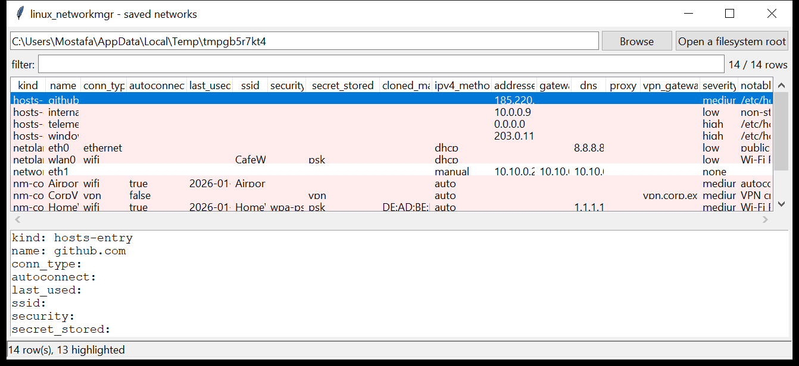

# linux_networkmgr

**Saved network configuration and the networks a host has joined.**
`linux_networkmgr` collects, from a mounted image or a live root, every
place Linux keeps network settings and connection history:

| source | what it reads |
|--------|---------------|
| NetworkManager | `/etc/NetworkManager/system-connections/*` keyfiles — id, uuid, type, autoconnect, **last-used timestamp**, Wi-Fi SSID / BSSID / mode, `key-mgmt` and whether a **PSK / 802.1x secret is stored in the file**, IPv4 / IPv6 method + addresses + DNS + gateway + routes, proxy / PAC URL, cloned MAC, VPN service + gateway |
| wpa_supplicant | the `network={…}` blocks in `/etc/wpa_supplicant/wpa_supplicant*.conf` — SSID, `key_mgmt`, whether a `psk` is present |
| systemd-networkd | `/etc/systemd/network/*.network` — `[Match]`, `Address`, `Gateway`, `DNS`, `DHCP` |
| netplan | `/etc/netplan/*.yaml` — **best-effort** read of `dhcp4`, `addresses`, `gateway4`, `nameservers`, `access-points` and any `password` |
| resolver / hosts | `/etc/resolv.conf` (+ the `systemd-resolved` stubs) and `/etc/hosts` |

**Secret values are never printed** — only the fact that a secret is stored
in the clear.



## Usage

```
linux_networkmgr /mnt/evidence
linux_networkmgr / --csv networks.csv
linux_networkmgr /mnt/img --kind nm-connection --type wifi
linux_networkmgr /mnt/img --notable-only --min-severity medium
linux_networkmgr /mnt/img --grep 'corp|vpn'
linux_networkmgr /mnt/img --gui
```

| flag | effect |
|------|--------|
| `--kind` | `nm-connection` / `wpa-network` / `networkd` / `netplan` / `hosts-entry` / `resolv` |
| `--type` | connection type — `wifi` / `ethernet` / `vpn` |
| `--grep REGEX` | match name / SSID / addresses / DNS / detail |
| `--notable-only` / `--min-severity` | filter by the flags raised |
| `--csv PATH` / `--json PATH` | write the table instead of the text report |

## Why it matters

The saved connections are a travel history: every Wi-Fi network the host has
associated with, when it was last used, and often the pre-shared key sitting
in the file in plaintext. `/etc/hosts` and `/etc/resolv.conf` are two of the
simplest redirection primitives on the box — a single line can send
`windowsupdate.microsoft.com` to an attacker's server or a corporate domain
to a Tor exit — and a cloned MAC or an `autoconnect` open network points at
deliberate evasion or a rogue-AP setup.

## Flags

| flag | meaning |
|------|---------|
| `Wi-Fi PSK stored in the clear` | `psk=` present (not `psk-flags=1` agent-owned) |
| `WEP key stored` | obsolete, trivially broken |
| `802.1x password / private-key secret stored` | enterprise-Wi-Fi credential in the file |
| `VPN credential stored in the connection file` | a VPN password not delegated to the agent |
| `autoconnect to an open (unencrypted) Wi-Fi network` | rogue-AP / evil-twin exposure |
| `cloned / spoofed MAC address` | `cloned-mac-address` set to a specific MAC |
| `proxy configured` | `[proxy]` method / PAC URL on the connection |
| `public DNS server set` | `8.8.8.8`, `1.1.1.1`, `9.9.9.9`, … |
| `external DNS server` (resolv.conf) | a non-private nameserver that is not a known public resolver |
| `/etc/hosts overrides a security / update domain` | e.g. `windowsupdate.microsoft.com`, `clamav`, `pypi.org` |
| `/etc/hosts blackholes a public domain` | mapped to `0.0.0.0` / `127.0.0.1` |
| `/etc/hosts maps a public domain to <ip>` | a public FQDN pointed at an arbitrary address |

## Limitations (v0.1)

- **netplan is read heuristically**, not with a real YAML parser — nested or
  unusual layouts (anchors, flow maps beyond simple lists, `match:` blocks)
  may be parsed partially. `linux_networkmgr` never *writes* config, so the
  risk is a missed field, not a wrong one.
- NetworkManager / connection **logs** are not parsed — they normally go to
  the journal; use `linux_journal` for the connect/disconnect timeline.
- `ifcfg-*` (RHEL legacy) and `/etc/network/interfaces` (ifupdown) are not
  yet covered.
- `ModemManager`, `connman` and per-user NetworkManager connections are out
  of scope for v0.1.

## Tests

```
cd linux/linux_networkmgr && python -m pytest -q
```

`tests/_synth.py` builds four NetworkManager keyfiles (WPA-PSK with a
cloned MAC, an open autoconnect network, a static-IP wired connection with
a PAC proxy, an OpenVPN profile with an inline password), a
`wpa_supplicant.conf` with a PSK and an open block, a netplan file with
Wi-Fi `access-points`, a `systemd-networkd` unit, an `/etc/hosts` with an
update-domain override / a blackhole / a public-domain remap, and a
`resolv.conf`, and checks the parsers, every flag, that no secret value is
ever emitted, and the CLI.
