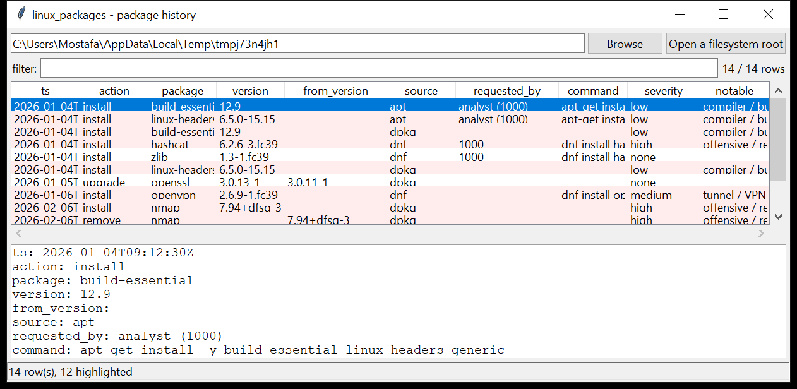

# linux_packages

**One package timeline from every package-manager log.** `linux_packages`
walks the log trees under a mounted image or a live root and merges them into
a single ordered list of package events:

| source | files |
|--------|-------|
| dpkg | `/var/log/dpkg.log*` (+ rotated / `.gz`) |
| apt | `/var/log/apt/history.log*` — `Start-Date`, `Commandline`, `Requested-By`, `Install` / `Upgrade` / `Remove` / `Downgrade` / `Reinstall` blocks |
| dnf / yum | `/var/log/dnf.log*`, `/var/log/dnf.rpm.log*`, `/var/log/yum.log*` (text) |
| dnf history | `/var/lib/dnf/history.sqlite` (read via the stdlib `sqlite3`) |

Each event is one row: time, action (`install` / `upgrade` / `remove` /
`purge` / `downgrade` / `reinstall` / `obsolete`), package, version,
from-version, arch, source, the requesting user and the command line (when the
log records it). Individual log files or single roots both work.



## Usage

```
linux_packages /mnt/evidence
linux_packages / --csv packages.csv
linux_packages /mnt/img --notable-only --min-severity high
linux_packages /mnt/img --source apt --action install
linux_packages /var/log/dpkg.log --grep 'openssh|sudo'
linux_packages /mnt/img --since 2026-01-01 --until 2026-03-31
linux_packages /mnt/img --gui
```

| flag | effect |
|------|--------|
| `--source {dpkg,apt,dnf,yum}` | only this log source (repeatable) |
| `--action NAME` | only this action (`install` / `remove` / …) |
| `--since` / `--until` `YYYY-MM-DD` | restrict to a UTC date window |
| `--grep REGEX` | match package / version / command |
| `--notable-only` / `--min-severity` | filter by the flags raised |
| `--csv PATH` / `--json PATH` | write the table instead of the text report |

## Why it matters

The package log is the cleanest record of what an intruder brought onto a host:
a compiler and kernel headers before a rootkit build, `nmap` / `netcat` /
`socat` for lateral movement, a tunnel client for exfil, `bleachbit` or
`shred` on the way out. It also shows *how* the software arrived — through the
distro repo, from a manually copied `.deb`, or piped straight from `curl` into
`dpkg`.

## Flags

| flag | meaning |
|------|---------|
| `compiler / build toolchain installed` | `gcc`, `make`, `build-essential`, `linux-headers`, `dkms`, `golang`, `rustc`, … |
| `offensive / recon tool installed` | `nmap`, `netcat`, `socat`, `hydra`, `sqlmap`, `responder`, `crackmapexec`, `chisel`, … |
| `tunnel / VPN client installed` | `openvpn`, `wireguard`, `tor`, `ngrok`, `cloudflared`, `tailscale`, … |
| `anti-forensic / wiping tool installed` | `bleachbit`, `shred`, `secure-delete`, `nwipe`, … |
| `package downgraded` | a lower version replaced a higher one |
| `manual .deb install (out-of-repo package file)` | a local `.deb` / `dpkg -i`, outside the repo chain |
| `package manager invoked from a download pipe` | `curl … \| sudo dpkg`, `wget … \| apt` |
| `re-installed after an earlier removal` | package removed, then reinstalled later |

## Timestamp provenance

`dpkg.log` and the dnf logs are written in UTC and are recorded as such.
The apt `history.log` and the yum text logs use the host's local wall-clock
with no offset, so their times are carried as `assumed-utc` — correct them
with the host time-zone from `linux_timezone` before correlating across hosts.

## Limitations (v0.1)

- Currently-installed state is not read (`dpkg --get-selections`,
  the rpm database); this is an *event* history, not an inventory.
- apt `term.log` / `eipp.log.xz` and the dnf `transaction` blobs are not parsed.
- The dnf `history.sqlite` schema has changed across releases; unknown
  `trans_item.action` codes are passed through as their integer value.
- Package names are matched literally for the flags, so a renamed or
  vendored copy of a tool will not be recognised.

## Tests

```
cd linux/linux_packages && python -m pytest -q
```

Synthetic `dpkg.log` (plain + gzip-rotated), an apt `history.log` with
`Commandline` / `Requested-By` blocks, a yum text log, a dnf text log and a
hand-built `history.sqlite` exercise every parser, the de-duplication across
sources, each flag and the CLI (CSV / JSON, the filters, the injection guard).
