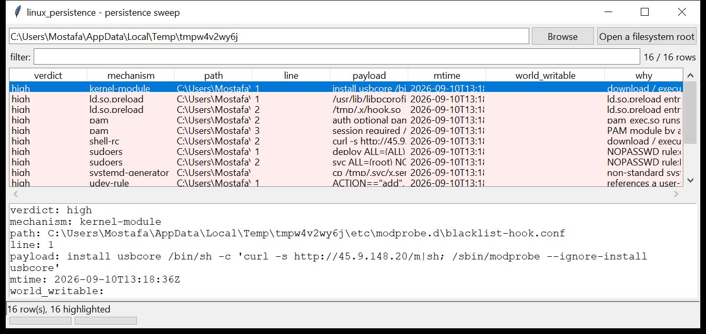

# linux_persistence

**One sweep for every userland persistence vector.** `linux_persistence`
walks a mounted image or a live root and rolls every common Linux persistence
mechanism into a single finding list — so you review one table instead of
`grep`-ing a dozen directories.

| mechanism | what it reads |
|-----------|---------------|
| shell rc / profile | `/etc/profile`, `/etc/profile.d/*`, `/etc/bash.bashrc`, `~/.bashrc` / `.bash_profile` / `.profile` / `.zshrc` / `.bash_logout` … |
| environment | `/etc/environment` (with `LD_*` detection) |
| dynamic loader | `/etc/ld.so.preload`, `/etc/ld.so.conf` + `ld.so.conf.d/*` |
| boot scripts | `rc.local`, `rc.d/rc.local`, `/etc/init.d/*` |
| login banner | `/etc/update-motd.d/*` |
| inetd | `/etc/xinetd.conf` + `xinetd.d/*`, `/etc/inetd.conf` |
| PAM | non-standard module lines in `/etc/pam.d/*`, `pam_exec.so` |
| kernel modules | `/etc/modules`, `modules-load.d/*`, `modprobe.d/*` (`install …` lines) |
| udev | `RUN{}` / `PROGRAM` in `/etc/udev/rules.d/*`, `/lib/udev/rules.d/*` |
| sudoers | `/etc/sudoers` + `sudoers.d/*` — `NOPASSWD`, `!authenticate`, shell-capable commands |
| systemd generators | `/etc/systemd/system-generators/*` |

`linux_cron` and `linux_units` do the full cron / unit job — this tool only
takes a light pass over those and covers everything else directly.



## Usage

```
linux_persistence /mnt/evidence
linux_persistence / --csv persistence.csv
linux_persistence /mnt/img --min-verdict medium
linux_persistence /mnt/img --mechanism sudoers,pam,ld.so.preload
linux_persistence /mnt/img --grep '/tmp/|45\.9\.'
linux_persistence /mnt/img --gui
```

| flag | effect |
|------|--------|
| `--mechanism a,b,c` | only these mechanisms |
| `--grep REGEX` | match payload / path / reason |
| `--min-verdict {low,medium,high}` | hide findings below this verdict |
| `--csv PATH` / `--json PATH` | write the table instead of the text report |

## Verdicts

Each finding gets `info` / `low` / `medium` / `high`:

- **high** — reverse-shell pattern, download-and-execute cradle, a
  world-writable config, an `ld.so.preload` entry, a non-standard systemd
  generator, a PAM module loaded by absolute path or `pam_exec.so`, or a
  `sudoers` rule that grants `NOPASSWD: ALL`.
- **medium** — inline interpreter (`sh -c`, `python -c`), an encoded /
  indirected payload, a loader variable in a config file.
- **low** — a config that merely references a user-writable path.
- **info** — noted for completeness.

Every finding carries the file **mtime** and owner uid (where the host
preserves them) so you can line the change up against other activity.

## Limitations (v0.1)

- Content matching is heuristic — a legitimate script that pulls from an
  internal mirror over `curl … | sh` will be flagged, and a novel technique
  that avoids all the patterns will not be.
- "Not owned by a package" is **not** yet checked against the package
  database — that discrimination (planted file vs shipped file) is on the
  roadmap; for now use the mtime and the payload.
- `~/.config/autostart/*.desktop`, `~/.config/systemd/user/*` and desktop-
  environment hooks are out of scope for v0.1.
- POSIX mode bits (the world-writable flag, owner uid) are only read when the
  analysis host preserves them; a copy that lost them will not raise those.

## Tests

```
cd linux/linux_persistence && python -m pytest -q
```

`tests/_synth.py` plants a persistence item in every supported mechanism
(a cradle in `.bash_profile`, `/tmp` hooks in `ld.so.preload`, a
`/dev/tcp` reverse shell in `update-motd.d`, `pam_exec.so`, a `modprobe
install` command, a udev `RUN+=`, `NOPASSWD: ALL`, a rogue generator, …)
alongside benign baseline files, and checks that each is caught, that the
benign files stay quiet, and that the CLI filters work.
