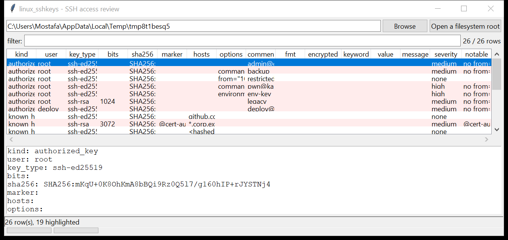

# linux_sshkeys

**A focused look at SSH-based access and persistence.** `linux_sshkeys`
walks a mounted image or a live root and reviews every piece of SSH material
in one pass:

- **`authorized_keys`** — system-wide and per-user (`/root/.ssh`,
  `/home/*/.ssh`, `/etc/ssh/authorized_keys*`). Options (`command=`, `from=`,
  `environment=`, `no-pty`, `restrict`, …), key type, RSA bit size, comment,
  and the `SHA256:` / `MD5:` fingerprints.
- **host keys** — `/etc/ssh/ssh_host_*_key.pub` and the matching private key:
  its format (`openssh`, `pem-rsa`, `pkcs8`, `putty`, …) and whether it is
  passphrase-encrypted. Key material is never parsed.
- **`known_hosts`** — hostnames (hashed `|1|…` entries are noted, not
  reversed), `@cert-authority` / `@revoked` markers, key type, fingerprint.
- **`sshd_config`** — every directive, including `sshd_config.d/*.conf` and
  `Match` blocks, with a review of the risky settings.



## Usage

```
linux_sshkeys /mnt/evidence
linux_sshkeys / --csv sshkeys.csv
linux_sshkeys /mnt/img --notable-only --min-severity high
linux_sshkeys /mnt/img --kind authorized_key --user root
linux_sshkeys /mnt/img --all-directives --kind config
linux_sshkeys /mnt/img --gui
```

| flag | effect |
|------|--------|
| `--kind` | one of `authorized_key` / `known_host` / `host_key` / `private_key` / `config-finding` / `config` |
| `--user NAME` | only `authorized_keys` for this user |
| `--all-directives` | emit every `sshd_config` directive, not just the review findings |
| `--notable-only` / `--min-severity` | filter by the flags raised |
| `--csv PATH` / `--json PATH` | write the table instead of the text report |

## Why it matters

An extra line in `authorized_keys` is one of the quietest ways to keep access
to a host — no new user, no process, survives a password reset. A wildcard
`from=`, a forced `command=` that spawns a shell, an `environment=` option
paired with `PermitUserEnvironment yes`, or a `@cert-authority` line in
`known_hosts` all widen that access in ways that are easy to miss by eye.
Fingerprinting every key also lets you tie a key seen here to one seen in a
log, a backup, or on another host.

## Flags

| flag | meaning |
|------|---------|
| `no from= restriction` | the key works from any source address |
| `wildcard from=` | `from="*"` / `0.0.0.0/0` / `::/0` |
| `forced command looks like a shell / tool` | `command="…"` runs `bash`, `nc`, `python`, something in `/tmp`, … |
| `environment= option set` | can inject `LD_PRELOAD` and friends at login |
| `DSA key` / `short RSA key` | `ssh-dss`, or an RSA key under 2048 bits |
| `notable key comment` | comment contains `test`/`backup`/`kali`/an IP/… |
| `@cert-authority` | `known_hosts` trusts a CA to vouch for host keys |
| `private key is world-readable` | a private key any user can read |
| `unencrypted PEM / user private key` | no passphrase on the key |
| `root login permitted` | `PermitRootLogin yes` (high) / `prohibit-password` (medium) |
| `password authentication enabled` | `PasswordAuthentication yes` |
| `PermitUserEnvironment yes` | pairs with `environment=` in `authorized_keys` |
| `external AuthorizedKeysCommand` / `ForceCommand set` | keys or the session come from a script |
| `PermitTunnel` / `GatewayPorts` / `AllowTcpForwarding` | SSH usable as a tunnel / proxy |
| `UsePAM no` / `StrictModes no` / `LogLevel QUIET` | weakened checks or logging |
| `weak cipher / MAC / key-exchange offered` | legacy crypto still enabled |

## Limitations (v0.1)

- Hashed `known_hosts` entries are flagged as hashed but not brute-forced
  against a candidate host list.
- Certificate keys (`*-cert-v01@openssh.com`) are fingerprinted as-is; the
  embedded principals / validity are not decoded.
- File-permission flags depend on the mounted image preserving the original
  mode bits; a copy that lost them will not raise the writable/readable flags.
- `~/.ssh/config` (client config) is not reviewed — only `sshd_config`.

## Tests

```
cd linux/linux_sshkeys && python -m pytest -q
```

`tests/_synth.py` builds real SSH public-key blobs (ed25519, 3072- and
1024-bit RSA, DSA), `authorized_keys` with every option variant, an
`OpenSSH`/`PEM` private key (encrypted and not), a `known_hosts` with a
`@cert-authority` and a hashed entry, and an `sshd_config` with a `Match`
block, and exercises the parsers, every flag, the review and the CLI.
