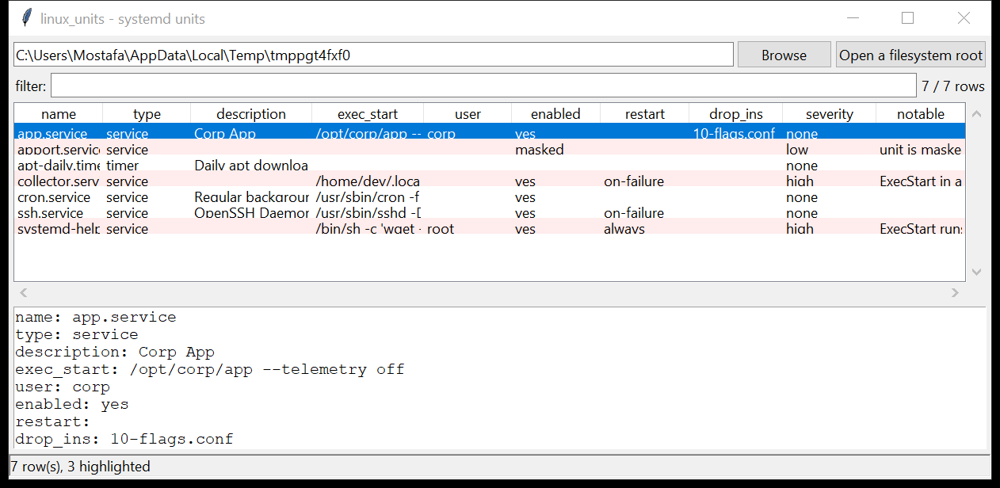

# linux_units

**Every systemd unit, merged and enable-resolved.** `linux_units` walks the
systemd trees under a mounted image or a live root — `/etc/systemd`,
`/run/systemd`, `/usr/local/lib/systemd`, `/usr/lib/systemd`, `/lib/systemd`,
plus the per-user equivalents — parses each unit file, **layers its drop-ins**
(`<unit>.d/*.conf`, with `ExecStart=` resets honoured), and works out whether
it is enabled from the `.wants` / `.requires` symlinks.

Each unit is one row: `Type`, `Description`, `ExecStart` (post-merge), `User`,
`WantedBy`, enabled / masked state, restart policy, the drop-in chain and the
unit-file path. Units that run from a writable path, execute an inline shell,
carry an encoded payload, respawn aggressively, or are enabled without an
`[Install]` section are flagged. Pure Python standard library.



## Usage

```
linux_units /mnt/evidence
linux_units / --csv units.csv
linux_units /mnt/img --notable-only --min-severity high
linux_units /mnt/img --enabled-only --type service
linux_units /mnt/img --grep 'curl|/tmp/|base64'
linux_units /mnt/img --gui
```

| flag | effect |
|------|--------|
| `--type NAME` | one unit type (`service` / `timer` / `socket` / …) |
| `--scope {system,user}` | system units or per-user units |
| `--enabled-only` | only units enabled via a `.wants` / `.requires` symlink |
| `--grep REGEX` | match name / description / `ExecStart` |
| `--notable-only` / `--min-severity` | filter by the flags raised |
| `--csv PATH` / `--json PATH` | write the table instead of the text report |

## Why it matters

A systemd `.service` is one of the cleanest persistence mechanisms on modern
Linux — it survives reboots, runs as whatever user you name, and can respawn
itself. Reading the *effective* unit (base + every drop-in) and confirming it
is actually wired into a boot target is how you tell a legitimate daemon from
an implant that dropped a file in `/etc/systemd/system` and `systemctl
enable`d it.

## Flags

| flag | meaning |
|------|---------|
| `ExecStart in a user-writable / temp path` | binary under `/tmp`, `/home`, `/dev/shm`, `/srv`, … |
| `ExecStart binary under a home directory` | `/home/…` or `/root/…` executable |
| `ExecStart runs an inline shell / download cradle` | `sh -c`, `curl … \| sh`, `python -c`, `eval` |
| `ExecStart contains an encoded payload` | `base64 -d`, `\xNN`, a long `echo` blob |
| `Restart=always with a tight / default RestartSec` | an aggressive respawner |
| `enabled via a .wants symlink but has no [Install] section` | manually `systemctl enable`d, not shipped that way |
| `system-looking name, no description, in /etc` | `systemd-helper.service` and friends with no `Description=` |
| `runs as root from a writable path` | `User=root` (or unset) + writable `ExecStart` |
| `unit is masked (-> /dev/null)` | the unit was disabled by masking |

## Limitations (v0.1)

- Enable state is read from the on-disk symlinks; `systemctl preset` defaults
  and generator-produced units (`/run/systemd/generator*`) are not evaluated.
- `.socket` / `.path` / `.mount` units are inventoried but only `ExecStart`-style
  flags apply.
- Template units (`foo@.service`) are listed as the template; per-instance
  overrides are not expanded.
- `EnvironmentFile=` contents are not resolved, so `$VAR` in `ExecStart` stays
  literal.

## Tests

```
cd linux/linux_units && python -m pytest -q
```

A synthetic systemd tree (vendor units, an `/etc` override drop-in with an
`ExecStart=` reset, `.wants` enable symlinks, a masked unit, a download-cradle
service, a home-directory binary) exercises the parser, the drop-in merge, the
enable resolution, every flag and the CLI.
