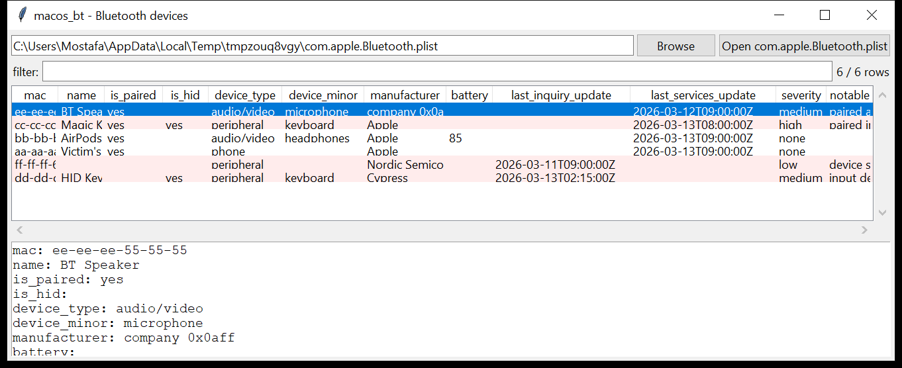

# macos_bt

**Every Bluetooth device the Mac has seen — and which ones are paired.**
`macos_bt` reads `/Library/Preferences/com.apple.Bluetooth.plist` (and the
per-host `~/Library/Preferences/ByHost/com.apple.Bluetooth.*.plist`):

- **`DeviceCache`** — one entry per MAC address the Mac has encountered:
  the name, the vendor / product id, the manufacturer **company id**
  (resolved: `0x004C` → Apple, `0x00D2` → Logitech, …), the **class of
  device** decoded to a type (`computer` / `phone` / `audio/video` /
  `peripheral` / `imaging` / `wearable`) and minor type
  (`keyboard` / `pointing device` / `microphone` / `headphones` / …), the
  battery percentage, and the `LastNameUpdate` / `LastInquiryUpdate` /
  `LastServicesUpdate` timestamps (Mac absolute time → UTC);
- **`PairedDevices`** / **`HIDDevices`** — which of those are paired, and
  which are input devices.



## Usage

```
macos_bt com.apple.Bluetooth.plist --csv bt.csv
macos_bt /Volumes/Macintosh\ HD --paired-only
macos_bt com.apple.Bluetooth.plist --type peripheral --json hid.json
macos_bt /mnt/mac --notable-only --min-severity high
```

| flag | effect |
|------|--------|
| `--paired-only` / `--hid-only` | filter to paired / input devices |
| `--type NAME` | `computer` / `phone` / `audio/video` / `peripheral` / … |
| `--grep REGEX` | match name / MAC / manufacturer |
| `--notable-only` / `--min-severity` | filter by the flags raised |
| `--csv PATH` / `--json PATH` | write the table instead of the text report |

## Why it matters

A paired Bluetooth **keyboard** is a keystroke-injection vector — the BT
equivalent of a Rubber Ducky, and it works from across a room. A paired
Bluetooth **microphone** or headset is a covert-audio risk. The
`LastInquiryUpdate` time tells you when a device was last *in range* (even
if never paired), which places a phone or a beacon near the Mac at a point
in time. And the paired-device list is a small social graph — whose
AirPods and iPhone the machine trusts.

## Flags

| flag | meaning |
|------|---------|
| `paired input device (keyboard / pointing device) — a keystroke-injection vector` | a paired HID / peripheral-class device |
| `input device seen but not paired` | an HID device was in range but not trusted |
| `paired audio-input device (microphone / headset) — possible covert microphone` | |
| `device has a generic / default name` | `Keyboard`, `HC-05`, `BLE Device`, `iPhone`, … — a cheap or spoofed adapter |
| `paired / HID device with no name recorded` | paired but nameless |
| `paired device from an unrecognised manufacturer` | the company id is not a known vendor |
| `device seen once by inquiry, never named or paired` | a beacon / another device that passed by once |

## Limitations (v0.1)

- Timestamps are only as good as macOS keeps them — `LastNameUpdate` and
  friends are refreshed on reconnect, so they mark the *most recent*
  contact, not the first.
- The `SDPServiceRecords` (the exact service UUIDs and their attributes)
  are counted but not enumerated.
- BLE-only devices that were never classic-paired may appear with a
  sparse record (manufacturer + inquiry time only).
- Per-host plist names embed a hardware UUID; the tool reads them by glob
  but does not tie the record back to a specific Mac.

## Tests

```
cd macos/macos_bt && python -m pytest -q
```

`tests/_synth.py` builds a `com.apple.Bluetooth.plist` with six
`DeviceCache` entries — an iPhone, AirPods (with battery), a paired Magic
Keyboard, an unpaired third-party HID keyboard, a "BT Speaker" that is
class *microphone* from an unknown vendor, and an unnamed inquiry-only
device — plus `PairedDevices` / `HIDDevices`, and the tests check the
class-of-device decode, the pair/HID join, the timestamp conversion,
every flag and the CLI.
