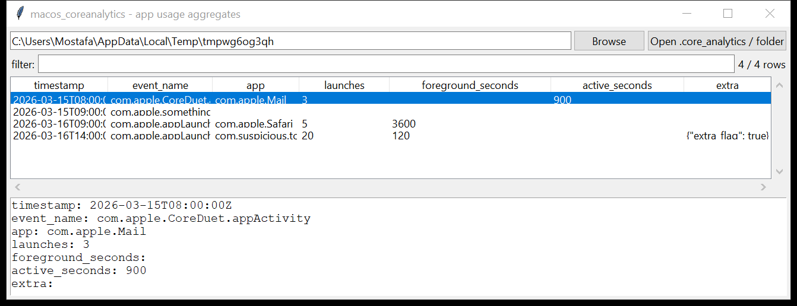

# macos_coreanalytics

**Weeks of "what ran, how long" from a compact diagnostics file.**

`macos_coreanalytics` reads the `.core_analytics` bundles macOS writes
under `/Library/Logs/DiagnosticReports/Analytics-*` (and per-user copies)
— per-day aggregates of app launches, foreground / active time, and other
usage counters, spanning weeks per file.



## How it reads the file

A `.core_analytics` file is either a binary/XML **property list** (read
with the standard library's `plistlib`, unwrapping an `NSKeyedArchiver`
payload if the top level is one) or, on builds that write the aggregate as
**newline-delimited JSON**, one JSON object per line — both forms are
tried automatically. The internal record shape is undocumented and has
drifted across macOS releases, so extraction is **schema-tolerant**:
every record is searched for a name-like field, a timestamp, and a
message/counters dict; known counter aliases (`launches` /
`launchCount` / `activations`, `fg_time` / `foregroundSeconds`,
`activeSeconds` / `usageTime`, `bundleId` / `appId`) are normalised, and
everything else is kept as JSON in an `extra` column rather than dropped.

Numeric timestamps are ambiguous in Apple's own analytics data (Mac's
2001 epoch vs. Unix's 1970 epoch); both interpretations are tried and
whichever lands in a plausible 2001–2040 window is kept.

## Usage

```
macos_coreanalytics /Library/Logs/DiagnosticReports --csv usage.csv
macos_coreanalytics Analytics-2026-03-16.core_analytics --app Safari
macos_coreanalytics ./reports --since 2026-03-01
```

| flag | effect |
|------|--------|
| `--app SUBSTR` | match the app / bundle id |
| `--grep REGEX` | match event name / app / the `extra` JSON |
| `--since` / `--until` `YYYY-MM-DD` | UTC date window |
| `--csv PATH` / `--json PATH` | `timestamp, event_name, app, launches, foreground_seconds, active_seconds, extra, source` |

## Why it matters

`.core_analytics` is a small, easy-to-miss file that quietly answers "was
this app used, and roughly how much, on this day" for weeks of history —
useful corroboration alongside `macos_knowledgec` and `macos_powerlog`
when a more detailed source has gaps or was cleared.

## Limitations (v0.1)

- **Schema-tolerant, not schema-exact.** Field names are matched against a
  small alias list; a build that uses different key names for a counter
  will still surface the record (name + timestamp), just without that
  counter populated — check the `extra` column, which always keeps the
  full record.
- Confidence is reported as **low** (`--csv`/`--json` provenance) to
  reflect the reverse-engineered, best-effort nature of the parse.
- No hardware / OS context fields are broken out separately yet — they
  land in `extra` alongside everything else non-standard.
- Not validated against a real `.core_analytics` file (no macOS hardware
  in this environment) — tested against hand-built plist and NDJSON
  fixtures that match the documented shape.

## Tests

`tests/_synth.py` builds a binary-plist aggregate (`appLaunch` events with
`bundleId` / `launches` / `fg_time`, including an unusually
high-launch-low-foreground-time entry) and an NDJSON aggregate (an
`activations`/`activeSeconds` counter set, plus a record with no counters
at all). The tests cover both container formats, the counter-alias
normalisation, the epoch-disambiguation timestamp conversion, multi-file
`collect()`, and the CLI CSV(BOM) / JSON output with `--app` filtering.

```
cd macos/macos_coreanalytics && python -m pytest -q
```
