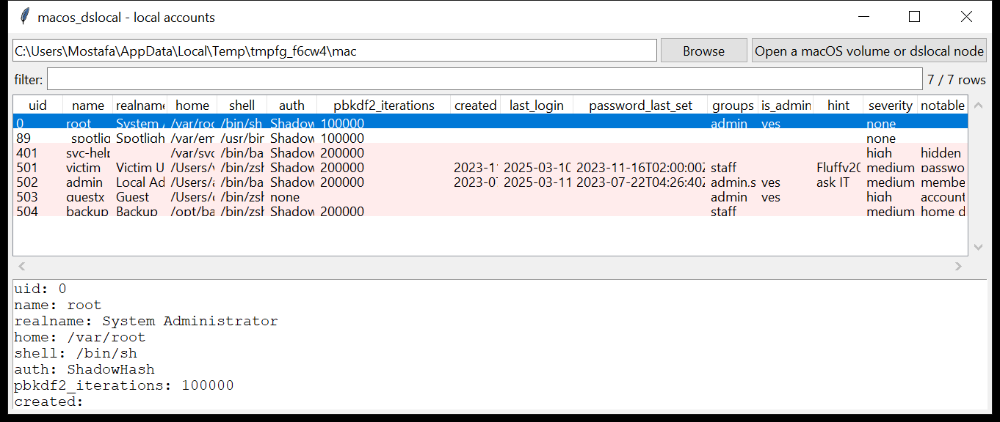

# macos_dslocal

**Local accounts, decoded — from the raw Directory Services node.**
`macos_dslocal` reads `/private/var/db/dslocal/nodes/Default/{users,groups}/*.plist`
— the on-disk form of every local user and group.

Per user, one row: name, uid, gid, real name, home, shell,
`generateduid`, the **password hint**, and:

- the configured **authentication mechanisms** — `ShadowHash`, `Kerberos`,
  `SRP`, `SecureToken`, a legacy `crypt-hash`, or `none`;
- the **PBKDF2 iteration count** from the embedded `ShadowHashData` binary
  plist;
- from the embedded `accountPolicyData` binary plist: the **account
  creation** time, the **last successful / failed login**, the
  **failed-login count**, and the **last password change** — all UTC.

Group membership is resolved and each user is tagged with its groups
(`admin` in particular).

> **No hash material is printed and nothing is cracked.** The tool reports
> *that* a hash exists and how it is configured, not its contents.



## Usage

```
macos_dslocal /Volumes/Macintosh\ HD --csv users.csv
macos_dslocal _victim.plist --json u.json
macos_dslocal /mnt/mac --admins-only
macos_dslocal /mnt/mac --include-service         (show the _service accounts)
macos_dslocal /mnt/mac --notable-only --min-severity high
```

| flag | effect |
|------|--------|
| `--admins-only` | only members of the `admin` group |
| `--include-service` | include the `_service` accounts (hidden unless flagged) |
| `--notable-only` / `--min-severity` | filter by the flags raised |
| `--csv PATH` / `--json PATH` | write the table instead of the text report |

## Why it matters

`dslocal` is the macOS equivalent of the SAM: it is where a new local
account, a backdoor admin, or a passwordless login lives. The
`accountPolicyData` timestamps give you **when the account was created and
last used**, and the `ShadowHashData` iteration count can flag a hash that
predates a macOS upgrade (i.e. the password has not been changed in years).
The **password hint** is free text the user chose — and people put their
actual password in it more often than you'd think.

## Flags

| flag | meaning |
|------|---------|
| `account has no configured password and an interactive shell` | passwordless login |
| `account is marked DisabledUser` | login disabled via `authentication_authority` |
| `uid 0 account other than root` | a second superuser |
| `member of the 'admin' group` | can `sudo` — listed so you can eyeball the set |
| `hidden account (uid <500) with an interactive shell` | a service-range uid that can actually log in |
| `non-service account below uid 500` | a normal-looking name in the reserved range |
| `password hint may contain the password itself` | the hint is a single ≥6-char token or `password: …` |
| `home directory outside /Users` | a uid ≥ 500 account whose home is elsewhere |
| `low PBKDF2 iteration count` | the hash likely predates a macOS upgrade |

## Limitations (v0.1)

- `generateduid`-based group membership (`groupmembers` array of GUIDs) is
  not resolved — only the plain-name `users` array is used, which covers
  the common case.
- `KerberosKeys` / `HeimdalSRPKey` are detected but not decoded.
- The `_writers_*` attributes (which principal can modify which field) are
  not surfaced yet.
- `authentication_authority` values from a mobile / network account
  (`;NetworkUser;`) are noted only via the mechanism list.

## Tests

```
cd macos/macos_dslocal && python -m pytest -q
```

`tests/_synth.py` builds a `dslocal` node with `root`, a `_spotlight`
service account, `victim` (a normal user with `accountPolicyData` and a
password-like hint), `admin`, and four planted accounts — a hidden
interactive `svc-helper` at uid 401, a passwordless `guestx`, a `backup`
user with a home in `/opt`, plus group plists — and the tests check the
plist parse, the embedded-plist decode, the group join, every flag and
the CLI.
