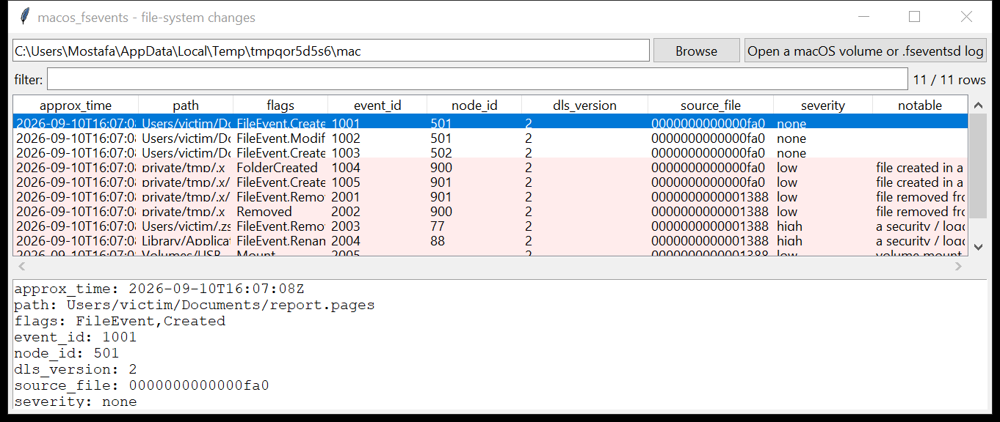

# macos_fsevents

**Every file created, deleted, renamed or modified — for weeks.**
`macos_fsevents` reads the gzip-compressed binary logs under `/.fseventsd`
(or `/System/Volumes/Data/.fseventsd` on APFS) — the record macOS keeps of
file-system activity across the whole volume.

Each log file starts with a `DLS1` / `DLS2` / `DLS3` page magic and holds
records of `<path> <event-id> <flags> [<node-id>]`. This tool decodes the
pages, decompresses multi-member gzip, de-duplicates records across
overlapping logs, and decodes the change flags:

`Created` · `Removed` · `Renamed` · `Modified` · `FolderCreated` ·
`FolderRemoved` · `InodeMetaMod` · `XattrModified` · `XattrRemoved` ·
`HardLink` · `SymbolicLink` · `PermissionChange` · `FinderInfoMod` ·
`Mount` · `Unmount` · `LastHardLinkRemoved` · …

**There is no per-record timestamp** — the event id is a monotonic counter,
so records are ordered by event id and the approximate time is the source
log file's mtime (`approx_time`).



## Usage

```
macos_fsevents /Volumes/Macintosh\ HD --csv fsevents.csv
macos_fsevents 0000000001a2b3c4 --json one_log.json
macos_fsevents /mnt/mac --grep '/\.fseventsd/|TCC\.db' --notable-only
macos_fsevents /mnt/mac --flag Removed --grep '/Users/victim/'
```

| flag | effect |
|------|--------|
| `--flag NAME` | only records carrying this change flag (repeatable) |
| `--grep REGEX` | match the path |
| `--no-dedupe` | keep duplicate records across overlapping logs |
| `--notable-only` / `--min-severity` | filter by the flags raised |
| `--csv PATH` / `--json PATH` | write the table instead of the text report |

## Why it matters

FSEvents is macOS's answer to the NTFS `$UsnJrnl`: it survives the file it
describes, so a payload dropped in `/private/tmp`, run, and deleted leaves a
`FolderCreated` → `Created` → `Removed` trail here even though nothing is
left on disk. It is also one of the few places that records an attacker
**deleting** `TCC.db`, `.zsh_history` or the quarantine store — and, being
per-volume, it catches activity on an external drive that was plugged in.

## Flags

| flag | meaning |
|------|---------|
| `a security / logging artefact was removed / renamed / touched` | the path is `TCC.db`, the quarantine store, `.bash_history` / `.zsh_history`, `knowledgeC.db`, `XProtect`, `/var/log`, `/var/audit`, `/var/db/diagnostics`, a `LaunchAgents`/`LaunchDaemons` plist, `.ssh/authorized_keys`, `/etc/sudoers`, or `.fseventsd` itself |
| `file created / removed in a user-writable / temp path` | `/private/tmp`, `/tmp`, `~/Downloads`, `~/Library/Caches`, `~/.Trash`, `/Users/Shared` |
| `volume mount / unmount event` | a disk was attached or detached |

## Limitations (v0.1)

- **No timestamps.** The `approx_time` column is the log file's mtime — use
  it as a coarse bracket, and cross-reference the event id ordering with
  `$MFT`-style artefacts (`macos_installhistory`, `knowledgeC.db`) for
  precise timing.
- Event ids are per-volume and reset on some reformats; the
  `fseventsd-uuid` file (not parsed) identifies the volume epoch.
- The `EndOfTransaction` marker groups records into a single filesystem
  operation; this version lists records individually.
- Records whose path was purged (the volume ran out of log space) are gone
  — FSEvents is a ring, like `$UsnJrnl`.

## Tests

```
cd macos/macos_fsevents && python -m pytest -q
```

`tests/_synth.py` builds a `.fseventsd` directory with three gzip logs — a
`DLS2` log (a Pages doc created + modified, a `.dmg` download, a
`/private/tmp/.x/payload` create), a second `DLS2` log (the payload +
folder removed, `.zsh_history` removed, `TCC.db` renamed, a USB mount) and
a `DLS1` log — and the tests check the binary parser (v1 and v2), the
collection + de-dup, the flag decoding, every heuristic flag and the CLI.
