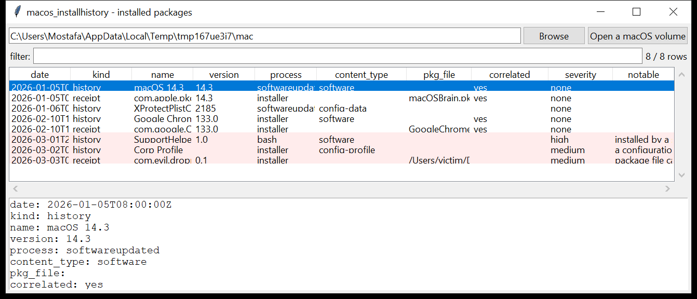

# macos_installhistory

**What was installed, when, and by what — from both records macOS keeps.**

- **`/Library/Receipts/InstallHistory.plist`** — the install-event
  timeline: one entry per install / update with the date, the display name
  and version, the package identifiers, the content type
  (`software` / `config-data` / …) and the process that ran the install
  (`softwareupdated`, `installer`, `Installer`, `storedownloadd`, or
  something else);
- **`/private/var/db/receipts/*.plist`** — one receipt per package still
  registered on disk: the identifier, version, install date, the install
  prefix, the installing process and the `.pkg` file name.

The two are **correlated** on package id — a receipt with no matching
history entry (or a history event with no receipt left on disk) is called
out.



## Usage

```
macos_installhistory /Volumes/Macintosh\ HD --csv installs.csv
macos_installhistory InstallHistory.plist --json ih.json
macos_installhistory /mnt/mac --kind receipt --notable-only
macos_installhistory /mnt/mac --process bash --min-severity high
macos_installhistory /mnt/mac --since 2026-02-01 --grep 'com\.acme'
```

| flag | effect |
|------|--------|
| `--kind {history,receipt}` | one record type |
| `--process SUBSTR` | match the installing process |
| `--grep REGEX` | match name / package ids / pkg file |
| `--since` / `--until` `YYYY-MM-DD` | UTC date window |
| `--notable-only` / `--min-severity` | filter by the flags raised |
| `--csv PATH` / `--json PATH` | write the table instead of the text report |

## Why it matters

`InstallHistory.plist` is the cleanest "software timeline" on macOS — it
records OS updates, App Store apps, `.pkg` installs and the XProtect / MRT
signature drops, each with a timestamp. The **process** field is the
giveaway: a package installed by `bash`, `osascript` or `curl` rather than
`installer` / `softwareupdated` is almost certainly a scripted drop, and a
receipt whose `.pkg` came from `~/Downloads` and has no history entry is a
strong lead.

## Flags

| flag | meaning |
|------|---------|
| `installed by a shell / scripting process` | `bash`, `zsh`, `python`, `osascript`, `curl`, `ruby`, `Terminal` ran the install |
| `installed by an unexpected process` | not `softwareupdated` / `installer` / `Installer` / `storedownloadd` / `PackageKit` / … |
| `package file came from a download / temp folder` | the receipt's `PackageFileName` is under `~/Downloads`, `~/Desktop`, `/tmp`, `/var/tmp` |
| `a configuration profile / MDM payload` | `.mobileconfig` / `config-profile` content type |
| `receipt on disk with no matching InstallHistory entry` | a package registered but not in the timeline (history was trimmed, or the install bypassed it) |
| `install event with no receipt left on disk` | uninstalled, or a scripted install that left no receipt |
| `non-standard install prefix` | `InstallPrefixPath` is not `/` (e.g. installed into a home directory) |

## Limitations (v0.1)

- The `.bom` (Bill of Materials — the exact file list) is **not** parsed;
  only the receipt `.plist` is read. A `.bom` reader (to list every file a
  package dropped, with modes and checksums) is on the roadmap.
- `InstallHistory.plist` records the *display* name/version, which for
  some updates is generic (`Command Line Tools`); the package id is the
  reliable key.
- App Store apps also leave receipts under
  `~/Library/Application Support/App Store` / the app bundle — not read.

## Tests

```
cd macos/macos_installhistory && python -m pytest -q
```

`tests/_synth.py` builds a macOS volume with an `InstallHistory.plist`
(macOS update, an XProtect config-data drop, Chrome via `installer`, a
`SupportHelper` installed by `bash`, a corp configuration profile) and a
`/var/db/receipts` set (the macOS and Chrome receipts, plus a
`com.evil.dropper` receipt from `~/Downloads/Update.pkg` with no history
entry), and the tests check the parse, the correlation, every flag and the
CLI.
