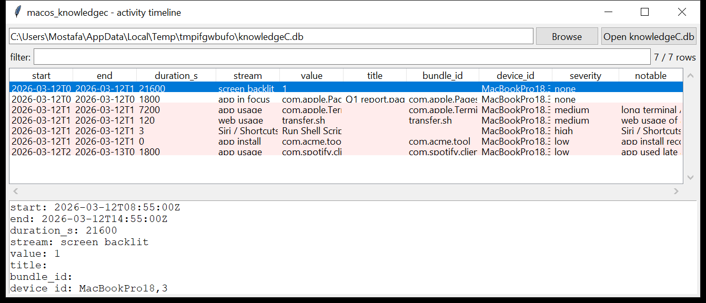

# macos_knowledgec

**A minute-by-minute record of what the Mac was doing.**
`macos_knowledgec` reads `knowledgeC.db` — the CoreDuet SQLite store behind
Siri suggestions and Screen Time:

- `/private/var/db/CoreDuet/Knowledge/knowledgeC.db` (system);
- `~/Library/Application Support/Knowledge/knowledgeC.db` (user).

`ZOBJECT` is a stream of timestamped events. This tool decodes the
forensically useful ones:

| stream | what it records |
|--------|-----------------|
| `/app/usage`, `/app/inFocus` | which application, when, for how long |
| `/app/webUsage`, `/safari/history` | which web domain / page |
| `/display/isBacklit` | screen on / off |
| `/app/intents` | Siri / Shortcuts invocations |
| `/app/mediaUsage`, `/notification/usage`, `/app/install` | media, notifications, installs |

Each row: stream, value (bundle id / domain), **start / end** (Mac absolute
time → UTC), **duration**, the device id, the recorded GMT offset, and any
metadata title (the document / activity name). The evidence file is copied
with its WAL side files first; read-only.



## Usage

```
macos_knowledgec knowledgeC.db --csv kc.csv
macos_knowledgec /Volumes/Macintosh\ HD --stream /app/usage
macos_knowledgec knowledgeC.db --app 'Terminal|osascript' --min-duration 600
macos_knowledgec knowledgeC.db --since 2026-03-01 --until 2026-03-31
macos_knowledgec knowledgeC.db --notable-only --min-severity high
```

| flag | effect |
|------|--------|
| `--stream NAME` | one `ZSTREAMNAME` (repeatable); default is the useful set |
| `--app REGEX` | match the value / bundle id / title |
| `--min-duration N` | events at least N seconds long |
| `--since` / `--until` `YYYY-MM-DD` | UTC date window |
| `--notable-only` / `--min-severity` | filter by the flags raised |
| `--csv PATH` / `--json PATH` | write the table instead of the text report |

## Why it matters

`knowledgeC.db` is one of the richest activity sources on macOS and it goes
back weeks. It places a **specific app in the foreground for a specific
duration at a specific time** — and, for `/app/webUsage`, which domain
Safari was on. A two-hour unbroken `Terminal` session at 02:00, a
`/app/webUsage` entry for `transfer.sh`, or a `/app/intents` "Run Shell
Script" invocation are all direct leads, timestamped to the second.

## Flags

| flag | meaning |
|------|---------|
| `long terminal / script-editor session` | ≥ 1 h continuous use of `Terminal` / `iTerm` / `Script Editor` / `Warp` / `Hyper` |
| `app id is an absolute path` | the `/app/usage` value is a path (`/tmp/…`, `/Users/…`) not a bundle id |
| `web usage of a paste / file-sharing / tunnel site` | pastebin, mega, transfer.sh, ngrok, `*.onion`, dynamic-DNS |
| `Siri / Shortcuts intent that runs a script` | an `/app/intents` value mentioning shell / run script |
| `app used late at night` | ≥ 10 min of use between 23:00 and 06:00 |
| `app install recorded` | an `/app/install` event |

## Limitations (v0.1)

- The `ZSTRUCTUREDMETADATA` schema is large and version-dependent; the tool
  reads the activity **title** and the intent class where present, but not
  every per-stream metadata field.
- `knowledgeC.db` also syncs data from paired iOS devices (`ZSOURCE` /
  `ZDEVICEID` distinguishes them) — those events are included and the
  device id is shown.
- Screen Time's own `RMAdminStore` / `usage` databases are separate — that
  reader is on the roadmap (`macos_screentime`).
- Timestamps are Mac absolute time (UTC); the `gmt_offset` column gives the
  device's local offset at the time of the event.

## Tests

```
cd macos/macos_knowledgec && python -m pytest -q
```

`tests/_synth.py` builds a `knowledgeC.db` with a `ZOBJECT` stream —
Pages in focus with a document title, a two-hour `Terminal` session, a
`transfer.sh` web-usage entry, screen-on, a "Run Shell Script" intent, a
late-night Spotify session and an app install — plus `ZSOURCE` and
`ZSTRUCTUREDMETADATA`, and the tests check the join, the Mac-time
conversion, the stream filter, every flag and the CLI.
