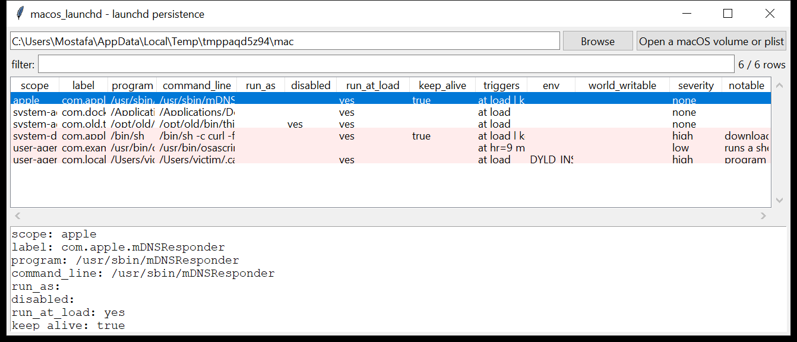

# macos_launchd

**LaunchAgents and LaunchDaemons, reviewed for persistence.**
`macos_launchd` reads every `launchd` job plist under a mounted macOS volume
or a live root and turns each into one reviewable row:

| location | scope |
|----------|-------|
| `/Library/LaunchDaemons` | root daemons |
| `/Library/LaunchAgents` | agents for every user's login session |
| `~/Library/LaunchAgents` | per-user agents |
| `/System/Library/Launch{Daemons,Agents}` | Apple-shipped (marked `apple`) |

Per job: the label, the **resolved program / argument vector**, the run-as
user, the **triggers in plain language** (`RunAtLoad`, `StartInterval`,
`StartCalendarInterval` → `at hr=9 min=0`, `WatchPaths`, `KeepAlive`,
`StartOnMount`), the `Disabled` flag, `MachServices`, the stdout/stderr
paths, and the environment variables.



## Usage

```
macos_launchd /Volumes/Macintosh\ HD --csv launchd.csv
macos_launchd com.evil.plist --json j.json
macos_launchd /mnt/mac --notable-only --min-severity high
macos_launchd /mnt/mac --scope system-daemon --exclude-apple
macos_launchd /mnt/mac --grep 'osascript|curl'
```

| flag | effect |
|------|--------|
| `--scope` | `system-daemon` / `system-agent` / `user-agent` / `apple` |
| `--exclude-apple` | drop the `/System/Library` jobs |
| `--enabled-only` | hide `Disabled` jobs |
| `--grep REGEX` | match label / program / command / triggers |
| `--notable-only` / `--min-severity` | filter by the flags raised |
| `--csv PATH` / `--json PATH` | write the table instead of the text report |

## Why it matters

`launchd` is *the* persistence mechanism on macOS — a job plist survives
reboots, runs as whatever user (or `root`) it names, and fires on a trigger
the operator chooses. Reading the *effective* job (program, arguments,
triggers, environment) and checking where the binary lives is how you tell
a real background service from an implant that dropped a plist in
`~/Library/LaunchAgents` and a binary in `~/.cache`.

## Flags

| flag | meaning |
|------|---------|
| `program in a user-writable path` | the executable is under `/tmp`, `/var/folders`, a home directory, `/Users/Shared`, `/Library/Caches` |
| `download / execute cradle in the command` | `curl … \| sh`, `nscurl … \| bash` |
| `inline shell / interpreter in the command` | `sh -c`, `osascript -e`, `python -c`, `perl -e` |
| `encoded / obfuscated payload in the command` | `base64 -d`, a long `echo … \| base64`, `\xNN` |
| `runs a shell / AppleScript / interpreter script` | the program is a `.sh` / `.scpt` / `.py` / `.command` |
| `sets a dynamic-loader variable (DYLD_INSERT_LIBRARIES)` | dylib injection at launch |
| `Label 'X' does not match the plist file name 'Y'` | a common way to hide a job from a filename scan |
| `Label masquerades as an Apple job (com.apple.*) but is not under /System/Library` | impersonation |
| `RunAtLoad + KeepAlive respawner from a non-standard program path` | an always-on job whose binary is not in `/usr`, `/System` or `/Applications` |
| `root daemon executes from a user-writable path` | privilege + a writable binary |
| `stdout / stderr redirected to /tmp` | output stashed where anyone can read it |
| `the job plist is group/other-writable` | anyone can rewrite what runs |

## Limitations (v0.1)

- Enable state is read from the plist's `Disabled` key only;
  `/private/var/db/com.apple.xpc.launchd/disabled*.plist` overrides are not
  merged.
- `LimitLoadToSessionType`, `Sockets` and `MachServices` details are shown
  but not deeply analysed.
- The program path is not stat-ed to confirm the binary still exists or to
  read its code signature.
- Login items (`~/Library/Application Support/com.apple.backgroundtaskmanagementagent`
  / `btm`) are a separate artefact — that reader is on the roadmap.

## Tests

```
cd macos/macos_launchd && python -m pytest -q
```

`tests/_synth.py` builds a macOS volume with six job plists — a benign
Apple daemon, a benign Docker agent, a `curl | sh` daemon masquerading as
`com.apple.softwareupdated.helper`, a user agent with
`DYLD_INSERT_LIBRARIES` and a label / filename mismatch, an `osascript`
job on a calendar schedule, and a disabled job — and the tests check the
scope detection, the trigger rendering, every flag and the CLI.
