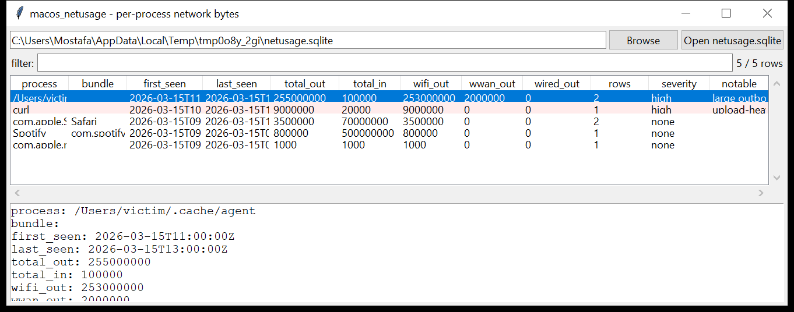

# macos_netusage

**Which executable sent how much data — the macOS SRUM-network table.**
`macos_netusage` reads `/private/var/networkd/netusage.sqlite`, the
per-process network-accounting store macOS keeps for Wi-Fi Assist and Data
Management.

- **`ZLIVEUSAGE` joined to `ZPROCESS`** → one row per process: the
  cumulative **bytes in / out**, split by interface class (**Wi-Fi** /
  **WWAN** / **wired**), with the **first-seen** and **last-seen**
  timestamps (Mac absolute time → UTC);
- **`ZNETWORKATTACHMENT`** (`--attachments`) → the interface / SSID usage
  windows (`CorpWiFi`, `iPhone Hotspot`, …).



## Usage

```
macos_netusage netusage.sqlite --csv net.csv
macos_netusage /Volumes/Macintosh\ HD --min-out 50000000
macos_netusage netusage.sqlite --grep 'curl|python|osascript'
macos_netusage netusage.sqlite --attachments
macos_netusage netusage.sqlite --notable-only --min-severity high
```

| flag | effect |
|------|--------|
| `--attachments` | show the interface / SSID list instead of the process usage |
| `--grep REGEX` | match the process name / bundle |
| `--min-out N` | processes with at least N bytes sent |
| `--notable-only` / `--min-severity` | filter by the flags raised |
| `--csv PATH` / `--json PATH` | write the table instead of the text report |

Processes are sorted by **bytes sent**, descending.

## Why it matters

Like Windows SRUM, this is one of the only places on a dead box that
attributes network bytes to a *process*. It answers the exfiltration
question directly: a process under `~/.cache` that sent 250 MiB while
receiving almost nothing, `curl` or `osascript` with any network usage at
all, or cellular (WWAN) traffic from a background helper — each stands out
immediately, and the first/last-seen times bracket when it happened.

## Flags

| flag | meaning |
|------|---------|
| `large outbound transfer (N MiB sent)` | ≥ 100 MiB total bytes out for one process |
| `upload-heavy traffic (far more sent than received)` | > 5 MiB out and out ≥ 20× in |
| `network usage by a shell / scripting / transfer tool` | the process is `sh`, `python`, `osascript`, `curl`, `wget`, `nc`, `socat`, `scp`, `ssh`, `rsync`, `Terminal`, … |
| `network usage by a process in a user-writable path` | the process image is under `/tmp`, `/private/tmp`, `/var/tmp`, `/Users/` |
| `cellular (WWAN) usage by a script / writable-path process` | the two combined |

## Limitations (v0.1)

- `netusage.sqlite` stores **cumulative** counters that reset on reboot and
  on the store's own rotation — the totals are per-epoch, not lifetime.
  The first/last-seen timestamps mark the current epoch.
- The database does not record **remote addresses or ports** — only the
  interface class and the byte counts. Pair with `network_pcap` /
  `macos_unifiedlog` (when it lands) for the destinations.
- Column names vary a little across macOS versions; the reader probes for
  the `ZWIFIIN` / `ZWWANIN` / `ZWIREDIN` (and `ZBYTESIN`) variants.
- `ZLIVEROUTEPERF` and the RSSI / signal-quality tables are not read.

## Tests

```
cd macos/macos_netusage && python -m pytest -q
```

`tests/_synth.py` builds a `netusage.sqlite` with `ZPROCESS` (Safari,
`curl`, `~/.cache/agent`, `mDNSResponder`, Spotify) and `ZLIVEUSAGE` rows —
Safari across two rows (summed), an `~/.cache/agent` 250 MiB upload plus a
WWAN burst, an upload-heavy `curl`, and a download-heavy Spotify — with a
`ZNETWORKATTACHMENT` table, and the tests check the aggregation, the
attachment list, every flag and the CLI.
