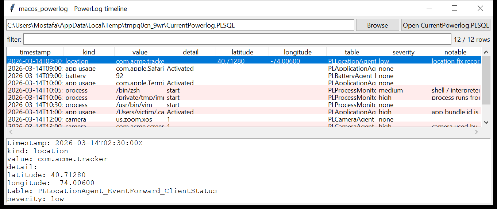

# macos_powerlog

**A second-by-second timeline of what the Mac was doing — for days.**
`macos_powerlog` reads `CurrentPowerlog.PLSQL` (a SQLite database at
`/private/var/db/powerlog/Library/BatteryLife/`, plus the archived
`Powerlog_*.PLSQL.gz`). PowerLog exists to model battery drain, so it
logs app usage, process starts, camera / microphone / location use and
power state with fine granularity.

This tool normalises the high-value `PL*Agent*` tables into one event
timeline:

| kind | source |
|------|--------|
| `app usage` | `PLApplicationAgent_EventForward_Application` — which bundle id, when |
| `process` | `PLProcessMonitorAgent_EventPoint_ProcessInfo` — process name + pid + state |
| `camera` / `microphone` | `PLCameraAgent_*` / `PL*AudioAgent_*` — which client, active/inactive |
| `location` | `PLLocationAgent_*` — **latitude / longitude** and the client that asked |
| `battery` / `power` | `PLBatteryAgent_*` — level, charging state |
| `notification` | `PLBulletinAgent_*` — delivery |

Timestamps are **auto-detected** (Unix seconds, milliseconds, or Mac
absolute time) and converted to UTC. `--list-tables` and `--table NAME`
dump any raw table for the ~200 the schema has.



## Usage

```
macos_powerlog CurrentPowerlog.PLSQL --csv powerlog.csv
macos_powerlog /Volumes/Macintosh\ HD --kind camera
macos_powerlog CurrentPowerlog.PLSQL --list-tables
macos_powerlog CurrentPowerlog.PLSQL --table PLLocationAgent_EventForward_ClientStatus --json loc.json
macos_powerlog Powerlog_2026-03-14.PLSQL.gz --notable-only --min-severity high
```

| flag | effect |
|------|--------|
| `--list-tables` | print every table in each database |
| `--table NAME` (`--limit N`) | raw dump of one table (bytes as hex) |
| `--kind NAME` | one normalised kind |
| `--grep REGEX` | match value / detail |
| `--since` / `--until` `YYYY-MM-DD` | UTC date window |
| `--notable-only` / `--min-severity` | filter by the flags raised |
| `--csv PATH` / `--json PATH` | write the table instead of the text report |

## Why it matters

PowerLog is one of the few artefacts that records **camera and microphone
activation** with a client name and a timestamp — a camera turned on by
`com.acme.screenspy` rather than Zoom is a direct finding. It also has
**GPS coordinates** from `PLLocationAgent`, per-process start times, and it
survives on a dead box for days regardless of Screen Time settings.

## Flags

| flag | meaning |
|------|---------|
| `camera / microphone used by a non-media client` | the requesting client is not FaceTime / Zoom / Teams / Photos / QuickTime / a messenger |
| `shell / interpreter / net tool started` | a `PLProcessMonitor` start of `sh`, `python`, `osascript`, `nc`, `socat`, `curl`, `Terminal`, … |
| `process runs from a user-writable path` | the process image is under `/tmp`, `/private/tmp`, `/var/tmp`, `/Users/` |
| `app bundle id is an absolute path` | an `app usage` value that is a path, not a bundle id |
| `location fix recorded overnight` | a `PLLocationAgent` fix between 23:00 and 06:00 |

## Limitations (v0.1)

- The PowerLog schema is large and changes across macOS versions. This
  version recognises a curated set of `PL*Agent*` tables by name + column
  presence; anything else is available via `--table` but not normalised.
- Timestamp units are heuristically detected per value — a table using an
  unusual epoch could be mis-dated; cross-check with `--table` if a time
  looks wrong.
- Camera / mic "active" vs "inactive" depends on the table's `State`
  column semantics, which vary; the tool flags an event when it cannot
  confirm the state is "off".
- The archived `Powerlog_*.PLSQL.gz` files are decompressed to a scratch
  copy before opening.

## Tests

```
cd macos/macos_powerlog && python -m pytest -q
```

`tests/_synth.py` builds a `CurrentPowerlog.PLSQL` with `PLApplicationAgent`
(Safari, Terminal, an `/Users/.../.cache/app`), `PLProcessMonitorAgent`
(`/bin/zsh`, `/private/tmp/impl`, `/usr/bin/vim`), `PLCameraAgent` (Zoom
and `com.acme.screenspy`), `PLLocationAgent` (a Maps fix and an overnight
`com.acme.tracker` fix with real coordinates), a `PLBatteryAgent` table
and an unrecognised table, and the tests check the normalisation, the
unknown-table handling, every flag, `--table` / `--list-tables`, gzip
input and the CLI.
