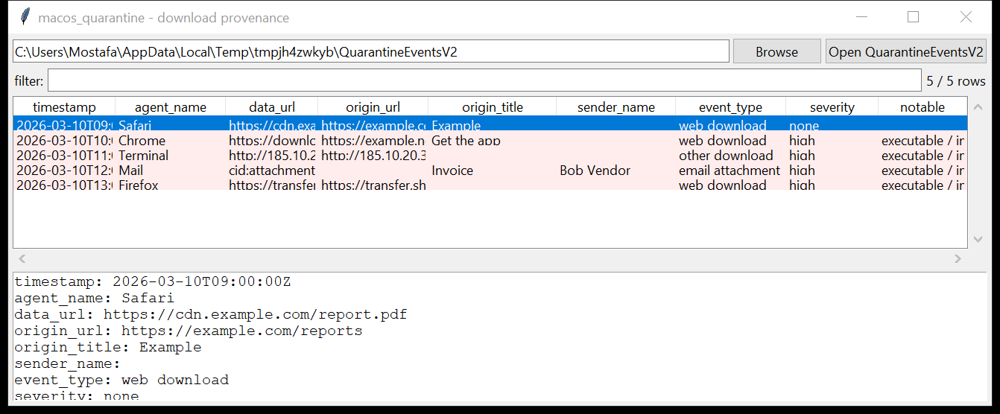

# macos_quarantine

**"Downloaded from the internet" — the provenance store.**
`macos_quarantine` reads `com.apple.LaunchServices.QuarantineEventsV2` (a
SQLite database in `~/Library/Preferences/`). It is the record Gatekeeper
uses to decide whether to show the *"are you sure you want to open this?"*
prompt, and it keeps one row per file that was downloaded.

Per event: the timestamp (Mac absolute time → UTC), the **agent** that
downloaded the file (bundle id + name — `com.apple.Safari` / `Safari`,
`com.google.Chrome` / `Chrome`, `com.apple.Terminal` / `Terminal`, …), the
**data URL** (the file), the **origin URL** (the page it came from), the
sender name / address (for email attachments), and the event type.



## Usage

```
macos_quarantine QuarantineEventsV2 --csv q.csv
macos_quarantine /Volumes/Macintosh\ HD          (a mounted macOS volume)
macos_quarantine QuarantineEventsV2 --agent 'Terminal|curl' --json cli.json
macos_quarantine QuarantineEventsV2 --grep '\.dmg|\.pkg' --since 2026-03-01
macos_quarantine QuarantineEventsV2 --notable-only --min-severity high
```

| flag | effect |
|------|--------|
| `--agent REGEX` | match the agent name / bundle id |
| `--grep REGEX` | match the data / origin URL |
| `--since` / `--until` `YYYY-MM-DD` | UTC date window |
| `--notable-only` / `--min-severity` | filter by the flags raised |
| `--csv PATH` / `--json PATH` | write the table instead of the text report |

## Why it matters

This is the macOS equivalent of `:Zone.Identifier` on Windows: it answers
"where did this file come from, and which app pulled it down". A `.dmg`,
`.pkg`, `.command` or `.mobileconfig` in the list — especially one fetched
by `Terminal`, `curl`, `osascript` or `Python` rather than a browser — is a
strong lead, and the origin URL ties the download back to the page (or the
phishing email) that delivered it.

## Flags

| flag | meaning |
|------|---------|
| `executable / installer / script fetched from the internet` | `.dmg`, `.pkg`, `.app`, `.command`, `.sh`, `.py`, `.jar`, `.mobileconfig`, `.terminal`, `.workflow`, … |
| `archive downloaded (may contain an executable)` | `.zip` / `.7z` / `.rar` / `.tar.gz` |
| `download from an IP-literal / punycode host` | `http://185.10.20.30/…`, `xn--…` |
| `downloaded by a command-line / scripting agent` | the agent is `Terminal`, `curl`, `wget`, `python`, `osascript`, `ruby`, … |
| `download from a paste / file-sharing / tunnel site` | pastebin, mega, transfer.sh, ngrok, trycloudflare, `*.onion`, dynamic-DNS |
| `dangerous file arrived as an email attachment` | a `.pkg` / `.dmg` / script with event type "email attachment" |

## Limitations (v0.1)

- The tool reads the database only; it does not walk the file system to
  join events to the `com.apple.quarantine` extended attribute on the
  actual files (that requires a live macOS `xattr` read or an image that
  preserves xattrs).
- On very old macOS the store was `LSQuarantineEvent` inside
  `com.apple.LaunchServices.QuarantineEvents` (v1) — only V2 is read.
- Per-user: point the tool at each user's `Library/Preferences` (the
  mounted-volume mode finds them all with `rglob`).

## Tests

```
cd macos/macos_quarantine && python -m pytest -q
```

`tests/_synth.py` builds a `QuarantineEventsV2` with five events — a Safari
PDF, a Chrome `.dmg`, a `Terminal`-fetched `.command` from an IP host, a
`.pkg` email attachment, and a `transfer.sh` `.zip` — and the tests check
the parse, the Mac-time conversion, every flag and the CLI (including
mounted-volume discovery).
