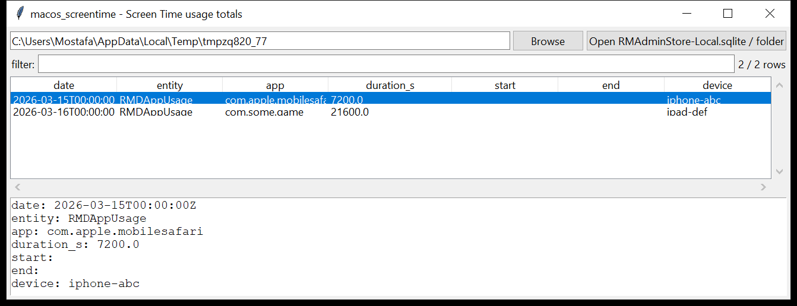

# macos_screentime

**Screen Time's own daily app / category usage totals — read generically.**

`macos_screentime` reads `RMAdminStore-Local.sqlite` — the Screen Time
"Remote Management" store macOS keeps under
`/private/var/folders/**/com.apple.ScreenTimeAgent/` — for per-app and
per-category **daily usage totals** by device, including usage synced in
from the user's other Apple devices on the same account.



## How it reads the store, without a hard-coded schema

`RMAdminStore-Local.sqlite` is a **Core Data** database, and Core Data has
one schema convention that has stayed stable across macOS releases even as
the *specific* column names have not: a `Z_PRIMARYKEY` table names every
entity (`Z_ENT`, `Z_NAME`), each backed by a `Z<NAME>` table whose own
columns are the entity's attributes, `Z`-prefixed. `macos_screentime` reads
that map, then finds the **usage-shaped** entities by their columns — one
that names an app (a bundle identifier / display name column), a duration
or a start/end pair, and usually a date and a device identifier — rather
than assuming an exact table name. That means it keeps working when Apple
renames a column or restructures the store between OS versions; you can
always fall back to `--list-entities` / `--dump-entity` to see exactly
what the current build calls things.

Event-level detail (individual app-focus sessions, not just daily totals)
lives in `knowledgeC.db` — see `macos_knowledgec`; this tool is the
summarised, Screen-Time-native view.

## Usage

```
macos_screentime RMAdminStore-Local.sqlite --csv st.csv
macos_screentime ~/Library --app com.apple.mobilesafari
macos_screentime store.sqlite --list-entities
macos_screentime store.sqlite --dump-entity RMDAppUsage
```

| flag | effect |
|------|--------|
| `--app SUBSTR` | match the app / bundle identifier |
| `--since` / `--until` `YYYY-MM-DD` | date window |
| `--min-hours N` | only rows with at least N hours of usage |
| `--list-entities` | print every Core Data entity found, flagging the usage-shaped ones |
| `--dump-entity NAME` | raw-dump one entity's rows for manual inspection |
| `--csv PATH` / `--json PATH` | `date, entity, app, duration_s, start, end, device, source` |

## Why it matters

Screen Time totals are what the *device itself* reported using — a useful
cross-check against `macos_knowledgec`'s finer-grained event stream, and
because the store syncs across a user's devices on the same Apple ID, a
single Mac's `RMAdminStore-Local.sqlite` can carry usage evidence for the
user's iPhone and iPad as well.

## Limitations (v0.1)

- **Heuristic entity discovery.** The usage-shaped entities and their
  columns are found by name and content, not a fixed schema — a build
  that names its duration column something outside the recognised
  aliases (`totaltime`, `duration`, `usagetime`, …) will not have that
  field populated; use `--dump-entity` to see the raw row and extend the
  alias lists in `coredata.py` if needed.
- Only the app/category **usage** entities are surfaced by default;
  Screen Time's downtime schedules, app limits and web-content filters
  live in other Core Data entities in the same store and are visible via
  `--list-entities` / `--dump-entity` but not specially parsed yet.
- Timestamps are Mac-absolute (2001 epoch), UTC.
- Not validated against a real `RMAdminStore-Local.sqlite` (no macOS
  hardware in this environment) — tested against a hand-built Core Data
  store using the same `Z_PRIMARYKEY` convention real Core Data
  databases use.

## Tests

`tests/_synth.py` builds a Core Data-shaped SQLite store with a
`Z_PRIMARYKEY` table naming two entities — `RMDAppUsage` (bundle id,
total time, date, device) and `RMDDevice` (a name/identifier pair with no
usage columns, which must **not** be picked up as usage-shaped). The
tests cover entity discovery, the usage-column guessing, the Mac-time
conversion, `--dump-entity`, `--list-entities`, multi-store `collect()`,
and the CLI CSV(BOM) / JSON output with `--app` / `--min-hours` filters.

```
cd macos/macos_screentime && python -m pytest -q
```
