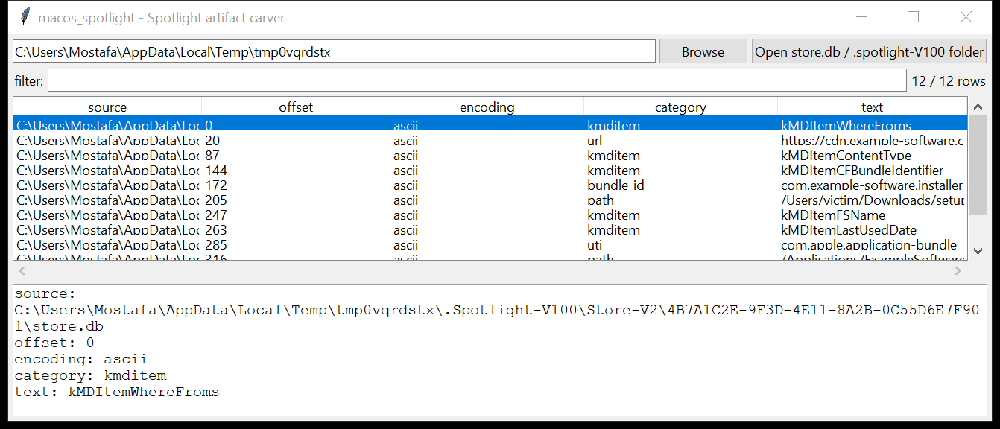

# macos_spotlight

**Carve Spotlight metadata artifacts without guessing at an undocumented
binary format.**

`.spotlight-V100/Store-V2/<UUID>/store.db` holds macOS's per-volume
Spotlight index — every file's `kMDItem*` metadata, packed into a
proprietary, undocumented block format (dictionary blocks mapping
attribute/category names to integer IDs, page-based records referencing
those IDs). No public specification of the layout exists, and decoding
it byte-exact without a reference implementation to validate against
isn't something this project can do honestly — see Limitations.

Instead, `macos_spotlight` extracts ASCII and UTF-16LE string runs from
the raw store file and classifies each against Spotlight-specific
patterns: `kMDItem*` attribute names, Uniform Type Identifiers,
reverse-DNS bundle identifiers, download-provenance URLs (a file's
`kMDItemWhereFroms` value — where it was downloaded from — is stored as
a plain URL string), and absolute macOS paths. This recovers real
forensic signal even from a store the OS has partially overwritten,
without claiming a level of structural precision this tool doesn't have.

## Usage

```
macos_spotlight store.db
macos_spotlight "/Volumes/Macintosh HD/.Spotlight-V100" --csv hits.csv
macos_spotlight store.db --category url,bundle_id
macos_spotlight --list-categories
macos_spotlight --gui
```

The target may be a `store.db` file directly, or a directory (a mounted
volume, a `.Spotlight-V100` tree, or anything containing one) — it is
searched recursively for `store.db`, `.store.db`, and
`store.db.previous` files.

| flag | effect |
|------|--------|
| `-n, --min-len N` | minimum run length before classification (default 6) |
| `-e, --encoding` | comma list of `ascii,utf-16le` (default both) |
| `--category A,B` | only these categories (default: all) |
| `--list-categories` | print the category names and exit |
| `--hex` | print offsets in hexadecimal |
| `--csv` / `--json` | UTF-8-with-BOM, formula-injection-safe output |

### Categories

| category | what it recovers |
|----------|-------------------|
| `kmditem` | Spotlight attribute names present in the store (`kMDItemWhereFroms`, `kMDItemLastUsedDate`, `kMDItemContentType`, ...) |
| `url` | download-provenance URLs (`kMDItemWhereFroms` values) |
| `uti` | Uniform Type Identifiers / content types (`public.*`, `com.apple.*`, `dyn.*`) |
| `bundle_id` | reverse-DNS bundle/executable identifiers (`kMDItemCFBundleIdentifier` values) |
| `path` | absolute macOS paths referenced by indexed items |



## Why it matters

Spotlight indexes metadata for files long after they are deleted from
the filesystem, and `kMDItemWhereFroms` specifically preserves a
download's source URL — evidence that regularly outlives the file it
describes. Because this tool works by carving strings rather than
walking B-tree/record structures, it also tolerates a store that is
truncated, corrupted, or only partially recovered from unallocated
space.

## Limitations (v0.1)

- **No record/block decoding.** This is a classified string carver, not
  a store.db parser: it cannot reconstruct which attributes belonged to
  which file, list a full per-item metadata dictionary, or recover
  values that were never stored as plain UTF-8/UTF-16 text (e.g.
  binary-plist-encoded dates or numbers).
- **No item-id → path mapping.** A recovered path or bundle ID is
  evidence that Spotlight indexed something referencing it — not proof
  of which specific record it came from.
- False positives are possible: any string in the file that happens to
  match a category's shape (e.g. a URL embedded in an unrelated
  attribute value) is reported. Corroborate with `macos_fsevents` /
  `macos_quarantine` / filesystem timestamps before relying on a single
  hit.
- Categories overlap by design (a three-segment reverse-DNS string can
  match both `uti` and `bundle_id`) — this is intentional, not a bug.

## Tests

`tests/test_macos_spotlight.py` builds synthetic store-file blobs with
known identifier strings isolated by null bytes (as they would be
between binary structure fields in a real store), and covers extraction
across both encodings, per-category classification and filtering,
directory-tree store discovery, multi-target collection, and the
`info`-less single `main()` CLI (stdout, `--csv`/`--json`,
`--list-categories`, not-found handling).

```
cd macos/macos_spotlight && python -m pytest -q
```
