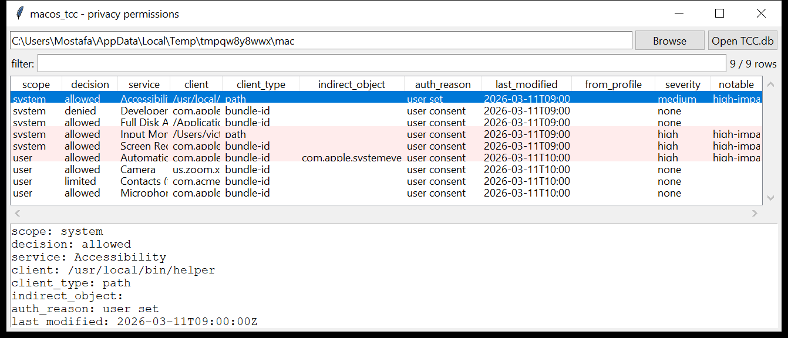

# macos_tcc

**Who was granted Camera, Screen Recording, Full Disk Access, Automation…**
`macos_tcc` reads the Transparency, Consent and Control databases:

- `/Library/Application Support/com.apple.TCC/TCC.db` — the **system**
  store (Full Disk Access, Accessibility, Screen Recording, Input
  Monitoring, Developer Tools, …);
- `~/Library/Application Support/com.apple.TCC/TCC.db` — the **per-user**
  store (Camera, Microphone, Contacts, Calendar, Photos, Automation, …).

One row per grant: the scope, the **service in plain language**
(`kTCCServiceScreenCapture` → *Screen Recording*), the client (bundle id or
absolute path), the decision (`allowed` / `denied` / `limited`), the auth
reason, the **indirect object** for Automation grants (the app being
controlled), the `last_modified` time (Unix → UTC), and whether the grant
came from a configuration profile / MDM.

The schema has changed a lot across macOS versions — the modern
`auth_value` layout and the older `allowed` layout are both handled.



## Usage

```
macos_tcc TCC.db --csv tcc.csv
macos_tcc /Volumes/Macintosh\ HD                (finds every TCC.db)
macos_tcc TCC.db --service Accessibility --decision allowed
macos_tcc TCC.db --client Terminal
macos_tcc TCC.db --notable-only --min-severity high
```

| flag | effect |
|------|--------|
| `--service SUBSTR` | match the service name |
| `--client SUBSTR` | match the client bundle id / path |
| `--decision {allowed,denied,limited}` | filter by outcome |
| `--scope {system,user}` | one store |
| `--notable-only` / `--min-severity` | filter by the flags raised |
| `--csv PATH` / `--json PATH` | write the table instead of the text report |

## Why it matters

TCC is macOS's answer to "which app can spy on the user". An attacker who
gets **Accessibility** can drive the whole UI; **Screen Recording** or
**Input Monitoring** is a screen/keylogger; **Full Disk Access** reads
everyone's mail and messages; **Automation over System Events** is
scriptable control of the machine. Seeing any of those granted to
`Terminal`, `osascript`, `Python` or an ad-hoc binary in a home directory —
rather than to a signed app in `/Applications` — is a direct finding, and
the `last_modified` time says when it happened.

## Flags

| flag | meaning |
|------|---------|
| `high-impact permission (X) granted to a command-line / scripting tool` | Accessibility / Screen Recording / Input Monitoring / Full Disk Access / Automation / Developer Tools given to `Terminal`, `iTerm`, `osascript`, `python`, `ruby`, `node`, `curl`, … |
| `high-impact permission (X) granted to a binary in a user-writable path` | the client is an absolute path under `/tmp`, `/var/folders`, a home directory, `/Users/Shared` |
| `input-monitoring / keystroke-capture permission granted` | `kTCCServiceListenEvent` = allowed |
| `Automation control over com.apple.systemevents / finder` | scriptable system control via Apple Events |
| `client is an absolute path outside /Applications` | likely unsigned / ad-hoc |
| `high-impact permission pushed by a configuration profile / MDM` | `auth_reason` = MDM policy |

## Limitations (v0.1)

- The `csreq` code-signing-requirement blob is not decoded — the tool
  can't tell you *which* signed identity a bundle-id grant is bound to.
- `TCC.db` also lives in Time Machine snapshots and, historically, at
  `~/Library/Application Support/com.apple.TCC/TCC.db` with a `MDMOverrides`
  companion plist — the plist is not read.
- Denied entries are shown (they are still evidence that an app *asked*),
  but "not present" ≠ "denied".

## Tests

```
cd macos/macos_tcc && python -m pytest -q
```

`tests/_synth.py` builds a modern-schema system `TCC.db` (Full Disk Access
to a signed app, Accessibility to `/usr/local/bin/helper`, Screen Recording
to `Terminal`, Input Monitoring to `~/.local/bin/kbd`, denied Developer
Tools), a user `TCC.db` (Camera / Mic / an Automation-over-System-Events
grant to `Terminal`), and an old-schema `TCC.db`, and the tests check both
schemas, every flag, the Automation indirect-object join and the CLI.
