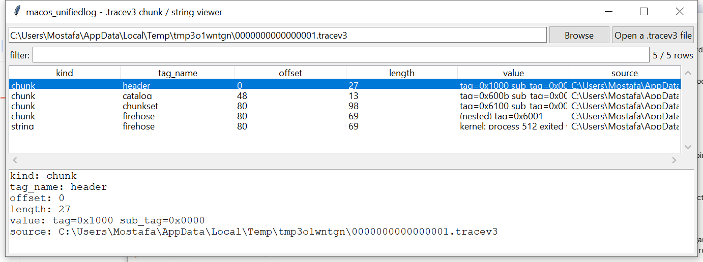

# macos_unifiedlog

**A .tracev3 chunk reader and string carver — not a full `log show`
replacement.**

## ⚠️ Confidence & Validation — read before relying on this

- **Moderate-good confidence**: the top-level tracev3 chunk framing —
  a 4-byte tag, 4-byte sub-tag, 8-byte payload length, 8-byte-aligned,
  repeated — is a simple TLV structure cited consistently across
  public research on the format (Mandiant's write-ups, the open-source
  UnifiedLogReader project).
- **High confidence**: LZ4 block decompression itself (`lz4block.py`)
  is a public, exact algorithm — tested here against hand-verified
  cases including an overlapping self-referential match copy, the same
  way this suite's `browser_localstorage` hand-rolled Snappy from its
  own public spec.
- **Genuinely uncertain**: the exact byte framing Apple wraps around
  that LZ4 data inside a ChunkSet chunk (the `bv41`/`bv4-` magic and
  header fields around it). Rather than trust one guessed offset,
  `decompress_chunkset` tries a small set of candidate framings and
  keeps only the one whose result **self-verifies** as a plausible
  nested-chunk sequence — if nothing self-verifies, it's reported as
  "could not decompress," never silently wrong.
- **Not attempted at all**: the internal Firehose record format
  (proc/activity IDs, timestamp deltas, item-type-tagged format-string
  arguments) and resolving message text against the `uuidtext`/`dsc`
  shared-cache files. This project has no verified reference for
  either. **This tool does not produce fully formatted, human-readable
  log lines the way `log show` does** — it inventories chunks and
  carves whatever printable strings survive inside them.

## Usage

```
macos_unifiedlog 0000000000000001.tracev3
macos_unifiedlog 0000000000000001.tracev3 --strings-only --csv strings.csv
macos_unifiedlog --gui
```



| flag | effect |
|------|--------|
| `--strings-only` | only the carved strings, skip the chunk inventory |
| `--csv` / `--json` | UTF-8-with-BOM, formula-injection-safe output |

## What it reports

- **`chunk`** rows — every top-level chunk (Header, Catalog, ChunkSet,
  and any Firehose/Oversize/StateDump/SimpleDump found directly at the
  top level) plus every chunk nested inside a successfully
  -decompressed ChunkSet, with tag, offset, and length.
- **`string`** rows — printable text carved from Firehose/Oversize/
  StateDump/SimpleDump payloads (both ASCII and, when the payload's
  NUL-byte density actually looks like UTF-16LE rather than plain
  ASCII reinterpreted two bytes at a time, UTF-16LE too — an
  unconditional dual-encoding pass produced CJK-range garbage on plain
  ASCII test data during development; it's now gated on that NUL
  -density signal instead, with a regression test covering the fix).

## Why it matters

Even without full format-string resolution, literal message fragments,
subsystem/category names, and other embedded text often survive as raw
strings inside a Firehose payload — real investigative signal (proof a
particular subsystem or process was logging something, roughly where
in the file) recoverable without needing the uuidtext/dsc resolution
this project doesn't have a confident implementation of.

## Limitations (v0.1)

- No message-text reconstruction, no timestamps, no process/subsystem/
  category attribution per log entry — see the confidence note above.
- ChunkSet decompression can fail to self-verify on real Apple data if
  this project's bv4-framing guesses don't match — reported honestly
  as a warning, not silently skipped.
- String carving has the usual false-positive/negative character of
  blind byte-pattern carving; not a substitute for a verified decoder.

## Tests

Builds real, correct LZ4 blocks (literal-only and match-containing, the
match case hand-verified against expected output) and real tracev3
-shaped chunk framing to test end-to-end: chunk-tag recovery, 8-byte
alignment, ChunkSet decompression (both the `bv4-` raw-passthrough and
`bv41` LZ4-compressed variants, plus garbage input correctly returning
"not decompressable"), string carving (including the UTF-16LE
false-positive regression above), and the CLI.

```
cd macos/macos_unifiedlog && python -m pytest -q
```
