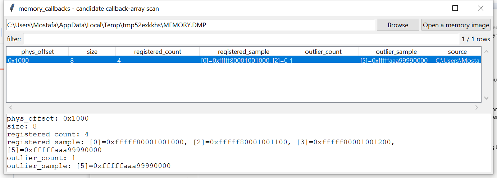

# memory_callbacks

**A candidate kernel-callback-array scan — not a symbol-resolved dump
of a specific named table.**

## ⚠️ Confidence & Validation — read before relying on this

The actual kernel globals holding process/thread/image-load
notification-callback arrays (e.g. behind
`PsSetCreateProcessNotifyRoutineEx`) are **unexported** on x64 Windows
with no stable public offset this project can resolve — the standard
technique elsewhere (Volatility3's `callbacks` plugin, for one)
locates them via x86-64 disassembly of the registration functions'
code, a genuinely different and more involved technique this project
has not implemented.

Instead, `memory_callbacks` scans for the **shape** these tables have:
small (8 or 64 entries — the two most commonly cited sizes), mostly
-NULL fixed arrays whose non-NULL entries are canonical kernel
pointers (low nibble masked off first, since some conventions use it
for flags) that cluster together. **This never claims a candidate
array is a specific named table** — there's no symbol resolution here
to confirm which kernel global it corresponds to. Every non-NULL entry
is reported as a real, checkable candidate registered callback; any
entry that doesn't fit the rest of its array's cluster (or doesn't even
translate to mapped memory) is flagged as a possible anomaly. Both are
investigative leads, not confirmed findings, and this has not been
verified against a real Windows image.

**A known, inherent limitation surfaced during development**: a sparse
array preceded by a long run of literal zero bytes is alignment
-ambiguous — any window overlapping that zero run can tie the correctly
-aligned window on non-null-entry count, since zeros carry no
distinguishing signal either way. Real kernel memory is packed with
other data, not a zero desert, so this is a lesser concern in practice
than it first appears; the tests document it explicitly.

## Usage

```
memory_callbacks MEMORY.DMP
memory_callbacks MEMORY.DMP --csv candidates.csv
memory_callbacks --gui
```



| flag | effect |
|------|--------|
| `--csv` / `--json` | UTF-8-with-BOM, formula-injection-safe output |

## Why it matters

A maliciously-registered callback (a common rootkit persistence/
monitoring technique) often points somewhere other than legitimate
kernel/driver code — even without symbol resolution, that shows up as
a pointer that doesn't fit the cluster the rest of an array's entries
form, which is exactly what gets flagged here.

## Limitations (v0.1)

- No claim of having located a specific named callback table — see
  above.
- Only the 8- and 64-entry sizes commonly cited in public research are
  scanned; a table sized differently on a given Windows build won't be
  found.
- Zero-padding alignment ambiguity — see above.
- Can be noisy on a large real image for the same reason
  `memory_ssdt`'s clustering scan can be: other legitimately
  pointer-heavy kernel structures can share the same shape.

## Tests

Covers the canonical-pointer check, low-nibble flag masking,
all-null/mixed/garbage classification, tight clustering, correct
registered-callback detection with no false outliers, a deliberately
planted outlier being flagged by index, an all-NULL array correctly
*not* being reported (nothing registered isn't evidence of anything),
random noise producing zero candidates, and the CLI. Uses realistic
non-zero padding around test arrays specifically because of the
zero-desert alignment ambiguity documented above.

```
cd memory/memory_callbacks && python -m pytest -q
```
