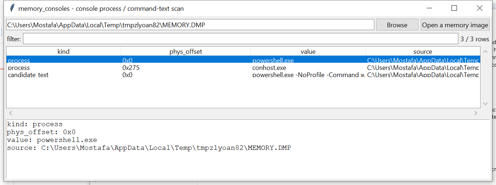

# memory_consoles

**Which console-hosting processes existed, and command-line-shaped
text found anywhere in RAM — reported separately, never claimed to be
correlated.**

## ⚠️ Confidence & Validation — read before relying on this

Console screen/history buffers are `conhost.exe`/`csrss.exe`
**user-mode** constructs (`CONSOLE_INFORMATION` and its history-buffer
chain), unlike every other pool-tag-scan tool in this suite. Their
internal layout is documented nowhere publicly; the closest public
prior art (Volatility's `consoles`/`cmdscan` plugins) works from
hand-maintained, per-Windows-build offset tables this project does not
have reliably memorized — fabricating one would risk confidently
-wrong output.

**So v0.1 does not attempt `CONSOLE_INFORMATION` decoding at all.**
Instead it reports two separate, honestly-bounded signals:

- **`process` rows** — `_EPROCESS`-shaped regions whose
  `ImageFileName` field is an **exact, literal match** for a known
  console-host/shell image name (`conhost.exe`, `cmd.exe`,
  `powershell.exe`, `pwsh.exe`). Matching a specific known string is
  effectively unambiguous, unlike a guessed numeric field offset — no
  separate verification step is needed the way this batch's other
  tools need one.
- **`candidate_text` rows** — generic printable-string carving across
  the whole image, filtered to a light "looks command-line-shaped"
  heuristic (starts with a word character, contains a space plus a
  path separator/flag/`.exe`, plausible length).

**These two signals are never correlated with each other** — a carved
string is not claimed to belong to any specific process's console
buffer.

## Usage

```
memory_consoles MEMORY.DMP
memory_consoles MEMORY.DMP --no-carve
memory_consoles --gui
```



| flag | effect |
|------|--------|
| `--no-carve` | only report processes, skip string carving |
| `--csv` / `--json` | UTF-8-with-BOM, formula-injection-safe output |

## Why it matters

Even without decoding the console buffer format itself, knowing which
shell/console processes were running — and finding plausible command
-line text anywhere in the image — is real triage value ahead of a
more targeted, tool-assisted manual review.

## Limitations (v0.1)

- No `CONSOLE_INFORMATION`/history-buffer decoding — see above.
- Process discovery is name-based only, limited to the four image
  names listed above.
- String carving is a blind heuristic over the whole image — expect
  both false positives (text that merely looks command-shaped) and
  false negatives (real command text that doesn't match the heuristic).
- No association between a carved string and any specific process.

## Tests

Covers exact-name process matching for all four known image names, a
coincidental-longer-name false positive correctly rejected (`conhost.
exemplary` is not `conhost.exe`), unrelated process names correctly
ignored, **two adjacent processes correctly distinguished rather than
one process's window reporting the other's name** (a real cross
-contamination bug caught during screenshot verification and fixed by
picking the earliest-occurring match by position, not by iteration
order, plus a tightened scan window), the command-shaped heuristic's
positive/negative cases, string carving finding an embedded command and
skipping plain noise, and the CLI.

```
cd memory/memory_consoles && python -m pytest -q
```
