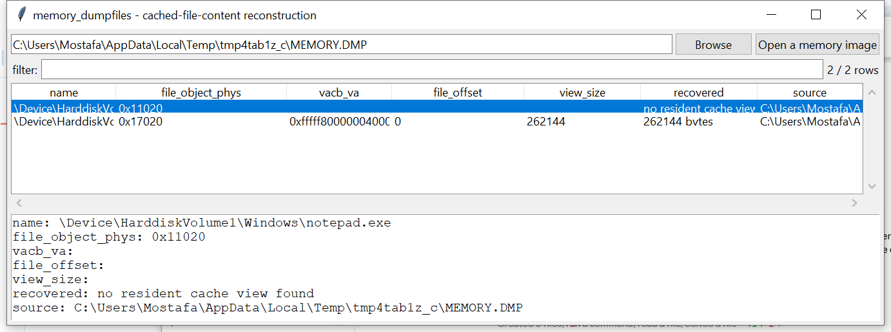

# memory_dumpfiles

**Recover still-cache-resident file content from a Windows memory
image — with field-offset uncertainty bounded by self-verification,
not hidden.**

## ⚠️ Confidence & Validation — read before relying on this

Locating `_FILE_OBJECT` structures by the `File` pool tag and reading
the name field (reused from `memory_filescan`) is the same moderate
-good-confidence technique the rest of this suite's pool-tag-scan
tools use. Walking onward — `_FILE_OBJECT.SectionObjectPointer` →
`_SECTION_OBJECT_POINTERS.SharedCacheMap` →
`_SHARED_CACHE_MAP.InitialVacbs[4]` → each `_VACB.BaseAddress` — needs
field **offsets this project has no symbol server to resolve exactly**,
and that have genuinely drifted across Windows versions in the public
literature this project's recollection draws on.

Rather than hardcode one guessed offset per field (fragile, silently
wrong on the next build), **each step scans a plausible offset window
and keeps only a candidate that self-verifies**: a `_VACB` is only
accepted if its own back-pointer field actually points at the
`_SHARED_CACHE_MAP` it came from — the same self-referential
consistency check `pagemap.py` already uses to confirm a
directory-table-base guess (Windows maps its own PML4 into itself; a
wrong guess fails that check near-certainly). A `_VACB` passing that
check is a strong signal, not just a plausible one — verified in tests
by constructing a deliberately-wrong back-pointer and confirming it's
rejected.

## Usage

```
memory_dumpfiles MEMORY.DMP
memory_dumpfiles MEMORY.DMP --dump-dir recovered/
memory_dumpfiles --gui
```



| flag | effect |
|------|--------|
| `--dump-dir DIR` | write each recovered cache view to a file |
| `--csv` / `--json` | UTF-8-with-BOM, formula-injection-safe output |

## What it reports

One row per `_FILE_OBJECT` found, per resident VACB view — or a single
"no resident cache view found" row for a file whose chain didn't
self-verify (not cache-mapped, already fully written back and
released, or on a build this offset-window scan doesn't happen to
cover). **Gaps in a file's cached ranges are reported as gaps, never
zero-filled and presented as real content** — only what the Cache
Manager still genuinely has resident is recoverable this way, and each
VACB view covers a fixed 256 KiB window, not necessarily the whole
file.

## Why it matters

A file's cached content can survive in the Cache Manager's VACB views
well after the file itself was deleted, overwritten on disk, or the
handle closed — this recovers exactly that, from RAM, with the same
"verify, don't guess" posture the rest of this batch's less-certain
tools use.

## Limitations (v0.1)

- x64 Windows images only.
- The offset-window scan is bounded, not exhaustive — a build whose
  relevant fields sit meaningfully outside the windows this project
  scans won't self-verify, and will be reported as "no resident cache
  view found" rather than a false positive (the intended trade-off).
- No reassembly across VACB views into a single contiguous file — each
  recovered 256 KiB view is reported (and dumped) independently.
- Only the Cache Manager's VACB path — no `_MM_AVL_TABLE`/prototype-PTE
  paged-out-content recovery.

## Tests

`tests/_mem.py` builds a real, working x64 page-table hierarchy (the
same self-referential-PML4 technique `memory_filescan`/`memory_timers`
validate against) plus a fully self-consistent SectionObjectPointers→
SharedCacheMap→VACB chain with genuine content behind it. Tests cover:
a file with no cache chain (name-only), a file with a verified chain
recovering its exact content, **a VACB with a deliberately wrong back
-pointer being rejected** (the core risk-bounding mechanism this
tool's confidence rests on), multiple independent file objects,
`--dump-dir` writing real files, and the CLI.

```
cd memory/memory_dumpfiles && python -m pytest -q
```
